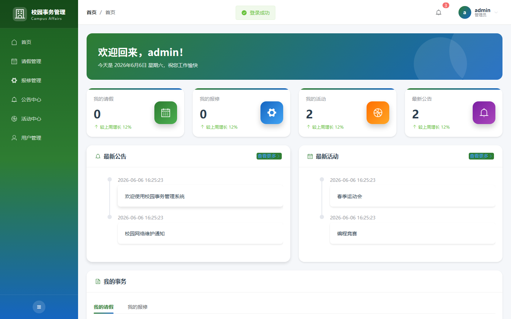
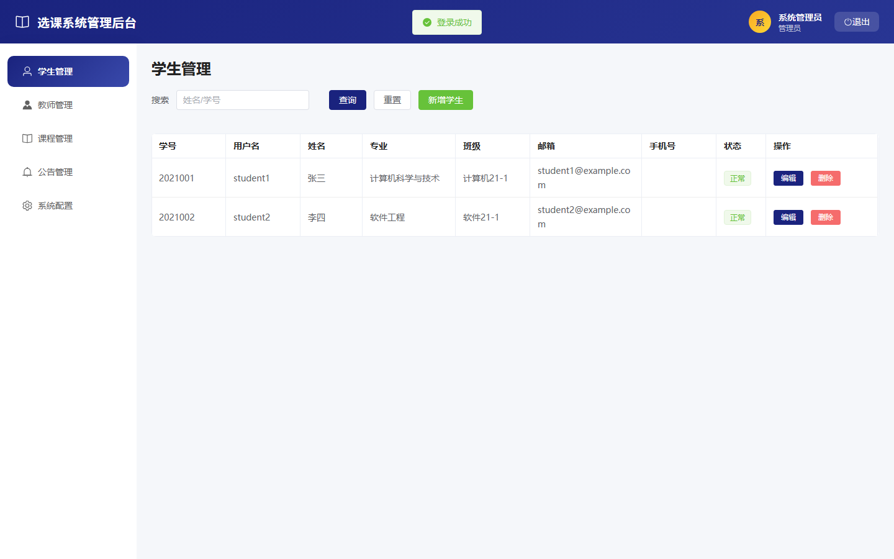
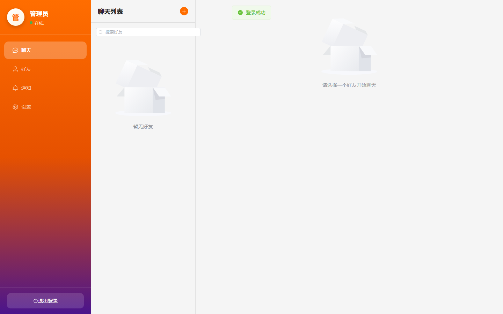
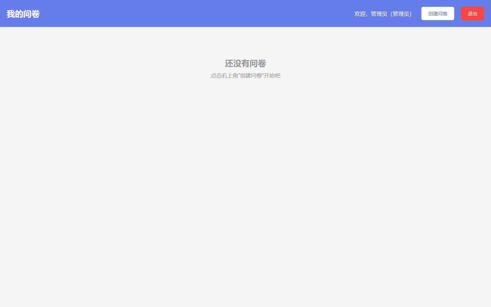
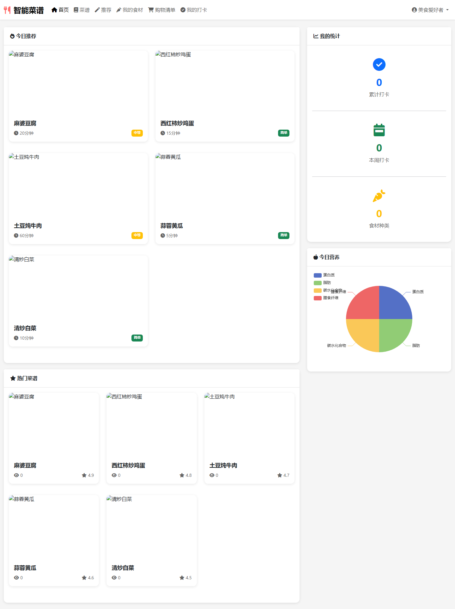
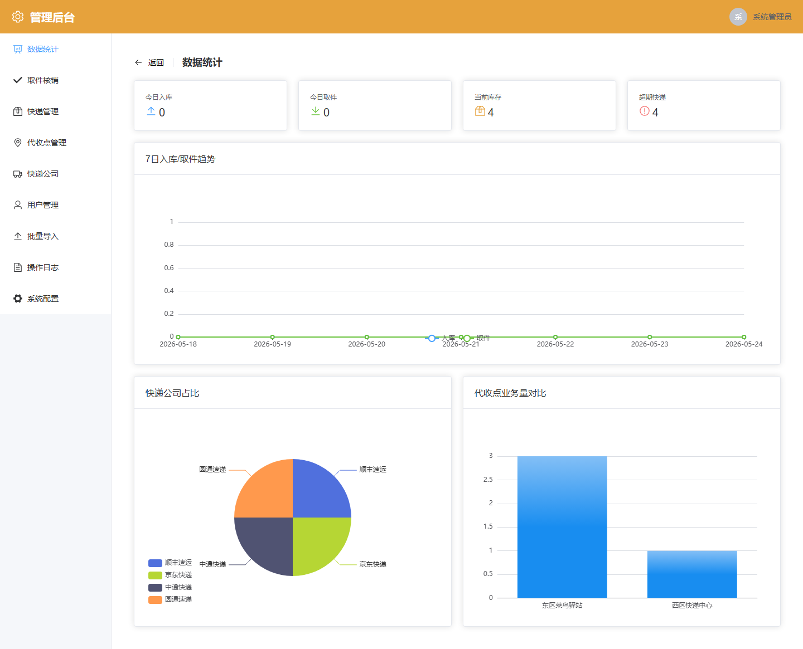
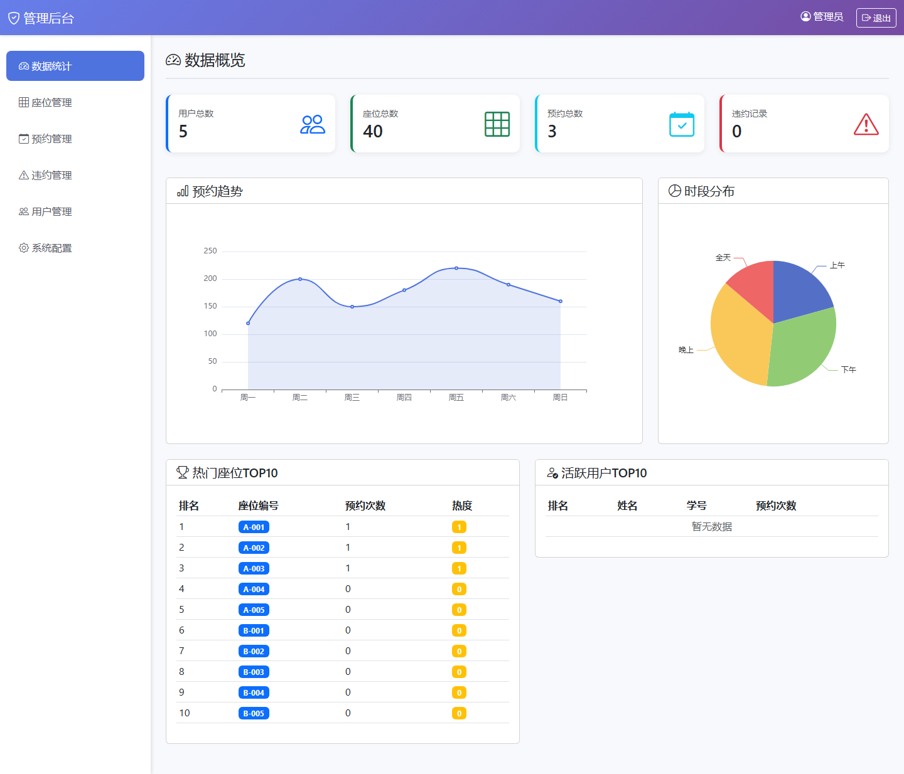

# 项目预览 001-010

## 项目索引

### 001 - 校园事务管理系统

- 组件类型：`backend, frontend`
- 详览页：[001.md](../projects/001.md)
- 封面图：

### 002 - 在线选课与成绩管理系统

- 组件类型：`backend, frontend`
- 详览页：[002.md](../projects/002.md)
- 封面图：

### 003 - 助农精准扶贫平台

- 组件类型：`backend`
- 详览页：[003.md](../projects/003.md)
- 封面图：

### 004 - 实时聊天与通知系统

- 组件类型：`backend, frontend`
- 详览页：[004.md](../projects/004.md)
- 封面图：

### 005 - 在线问卷调查与数据分析系统

- 组件类型：`backend`
- 详览页：[005.md](../projects/005.md)
- 封面图：

### 006 - 校园失物招领系统

- 组件类型：`backend`
- 详览页：[006.md](../projects/006.md)
- 封面图：

### 007 - 志愿活动管理与积分激励平台

- 组件类型：`backend, frontend`
- 详览页：[007.md](../projects/007.md)
- 封面图：

### 008 - 智能菜谱推荐系统

- 组件类型：`backend`
- 详览页：[008.md](../projects/008.md)
- 封面图：

### 009 - 校园快递代收管理系统

- 组件类型：`backend, frontend`
- 详览页：[009.md](../projects/009.md)
- 封面图：

### 010 - 图书馆座位预约系统

- 组件类型：`backend`
- 详览页：[010.md](../projects/010.md)
- 封面图：

