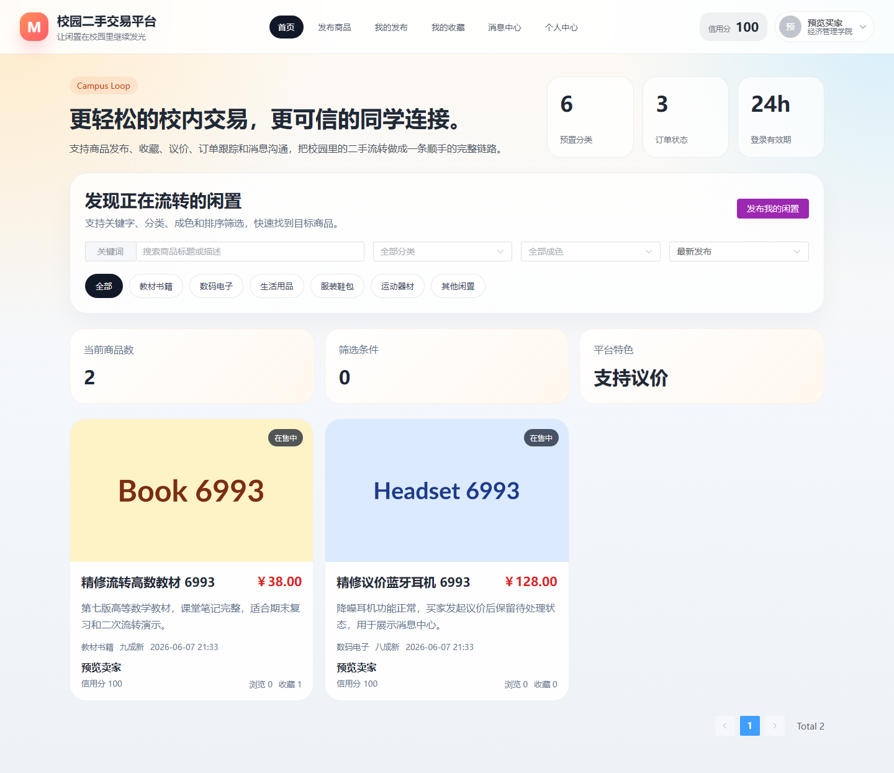
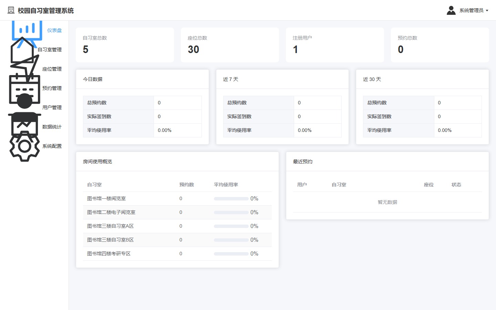
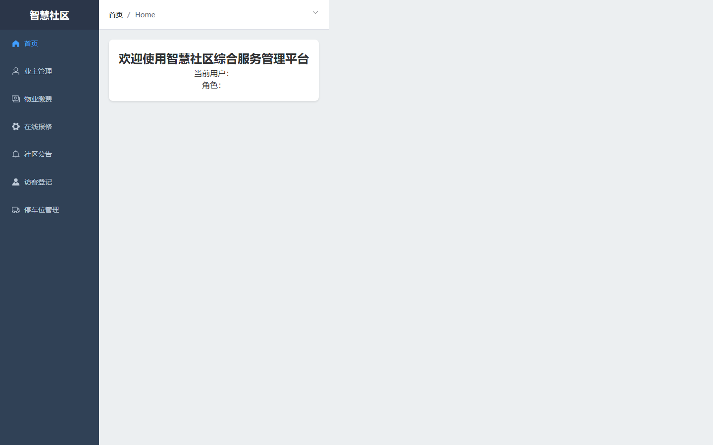
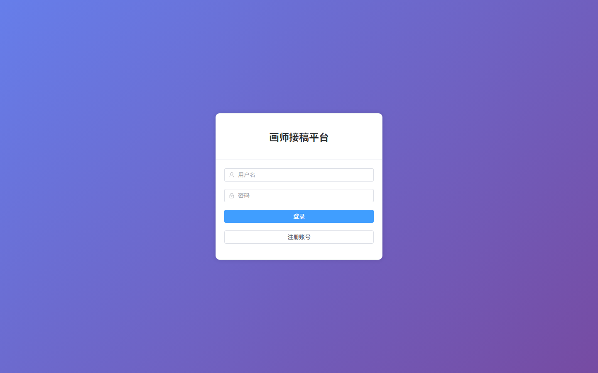
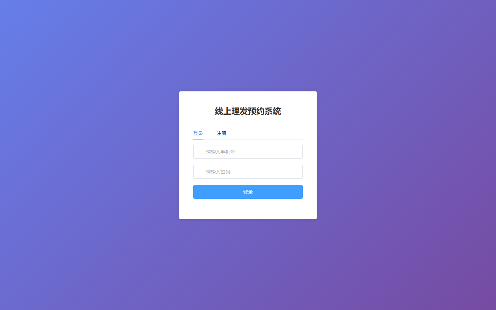
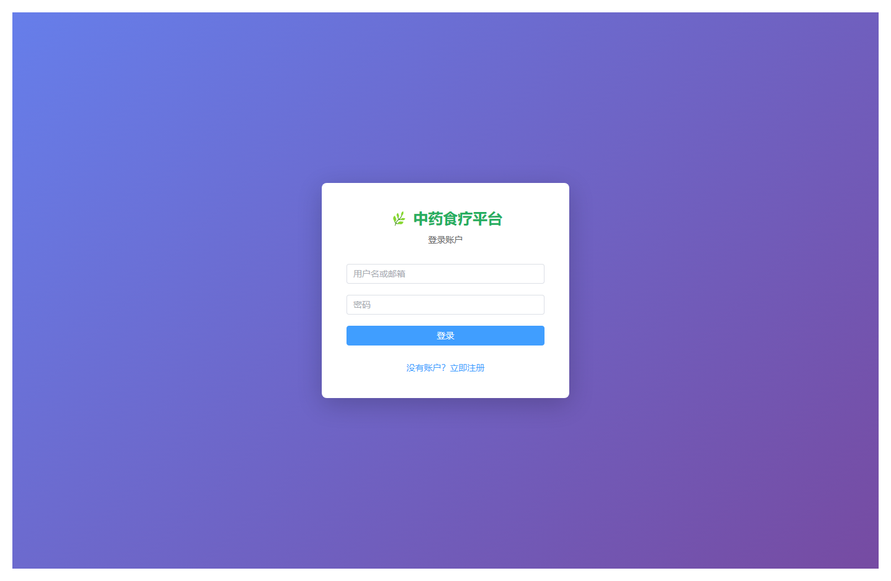

# 项目预览 021-030

## 项目索引

### 021 - 校园二手交易平台 🔥最新

- 组件类型：`backend, frontend`
- 详览页：[021.md](../projects/021.md)
- 封面图：

### 022 - 校园自习室座位预约系统 🔥最新

- 组件类型：`backend, frontend`
- 详览页：[022.md](../projects/022.md)
- 封面图：

### 023 - AI智能学习助手与个性化教育平台 🔥最新

- 组件类型：`backend`
- 详览页：[023.md](../projects/023.md)
- 封面图：

### 024 - 流浪动物领养与救助平台 🔥最新

- 组件类型：`backend, frontend`
- 详览页：[024.md](../projects/024.md)
- 封面图：

### 025 - 智慧社区综合服务管理平台 🔥最新

- 组件类型：`backend, frontend`
- 详览页：[025.md](../projects/025.md)
- 封面图：

### 026 - 画师接稿平台

- 组件类型：`backend, frontend`
- 详览页：[026.md](../projects/026.md)
- 封面图：

### 027 - 线上理发预约系统 🔥最新

- 组件类型：`backend, frontend`
- 详览页：[027.md](../projects/027.md)
- 封面图：

### 028 - 校园共享自行车租赁系统 🔥最新

- 组件类型：`backend, frontend`
- 详览页：[028.md](../projects/028.md)
- 封面图：

### 029 - 中药食疗推荐交流平台 🔥最新

- 组件类型：`backend, frontend`
- 详览页：[029.md](../projects/029.md)
- 封面图：

### 030 - 居民智能健康管理平台 🔥最新

- 组件类型：`backend, frontend`
- 详览页：[030.md](../projects/030.md)
- 封面图：

