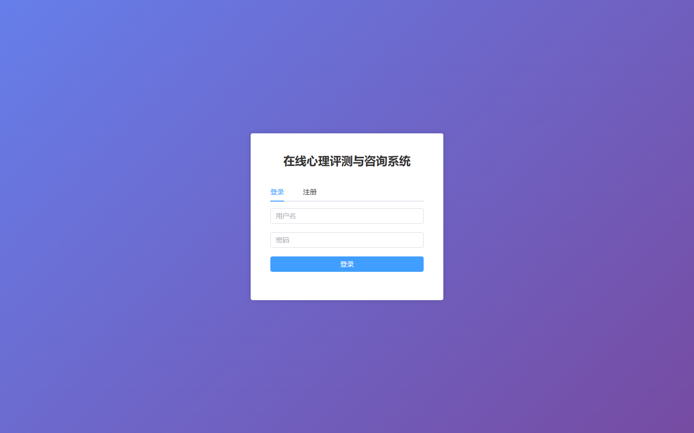
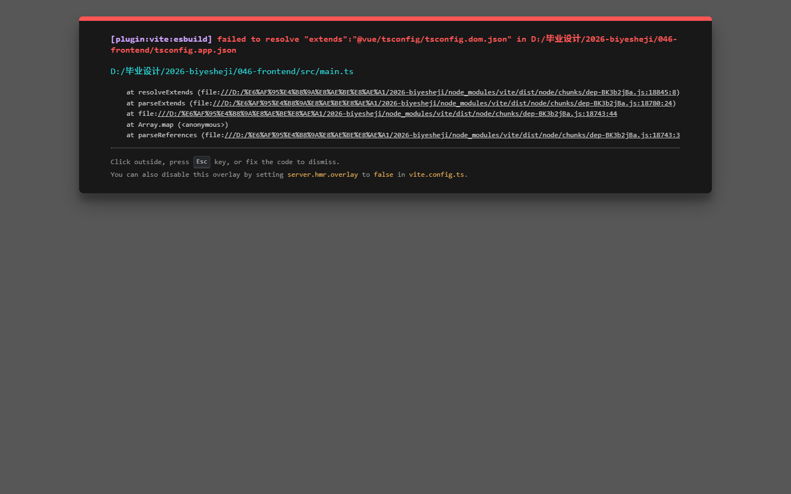

# 项目预览 041-050

## 项目索引

### 041 - 在线心理评测与咨询系统 🔥最新

- 组件类型：`backend, frontend`
- 详览页：[041.md](../projects/041.md)
- 封面图：

### 042 - 房屋租赁管理系统 🔥最新

- 组件类型：`backend, frontend`
- 详览页：[042.md](../projects/042.md)
- 封面图：

### 043 - 宠物寄养服务系统 🔥最新

- 组件类型：`backend, frontend`
- 详览页：[043.md](../projects/043.md)
- 封面图：

### 044 - 特色民宿预订平台 🔥最新

- 组件类型：`backend, frontend`
- 详览页：[044.md](../projects/044.md)
- 封面图：

### 045 - 养老院管理系统 🔥

- 组件类型：`backend, frontend`
- 详览页：[045.md](../projects/045.md)
- 封面图：

### 046 - 垃圾回收服务系统 🔥

- 组件类型：`backend, frontend`
- 详览页：[046.md](../projects/046.md)
- 封面图：

### 047 - 剧本杀创作与预约平台 🔥

- 组件类型：`backend, frontend`
- 详览页：[047.md](../projects/047.md)
- 封面图：

### 048 - 博物馆文物数字化管理平台 🔥

- 组件类型：`backend, frontend`
- 详览页：[048.md](../projects/048.md)
- 封面图：

### 049 - 微信小程序考研学习系统 🔥

- 组件类型：`backend, miniapp`
- 详览页：[049.md](../projects/049.md)
- 封面图：

### 050 - 微信小程序课堂考勤签到APP 🔥最新

- 组件类型：`backend, miniapp`
- 详览页：[050.md](../projects/050.md)
- 封面图：

