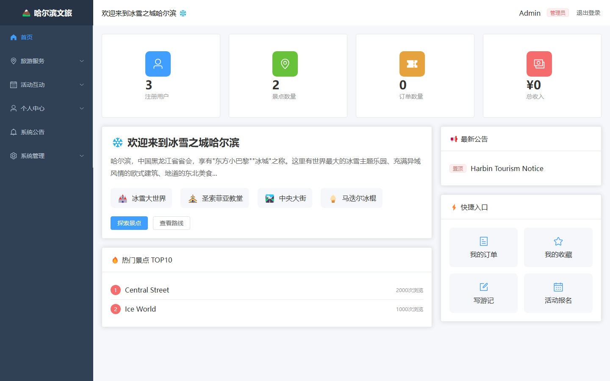
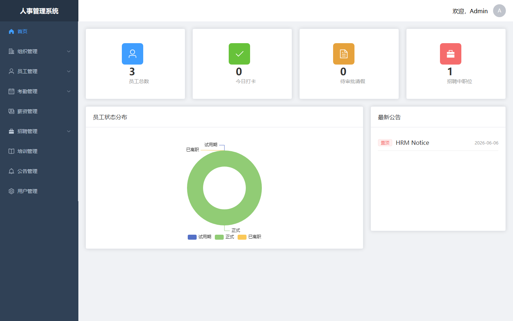
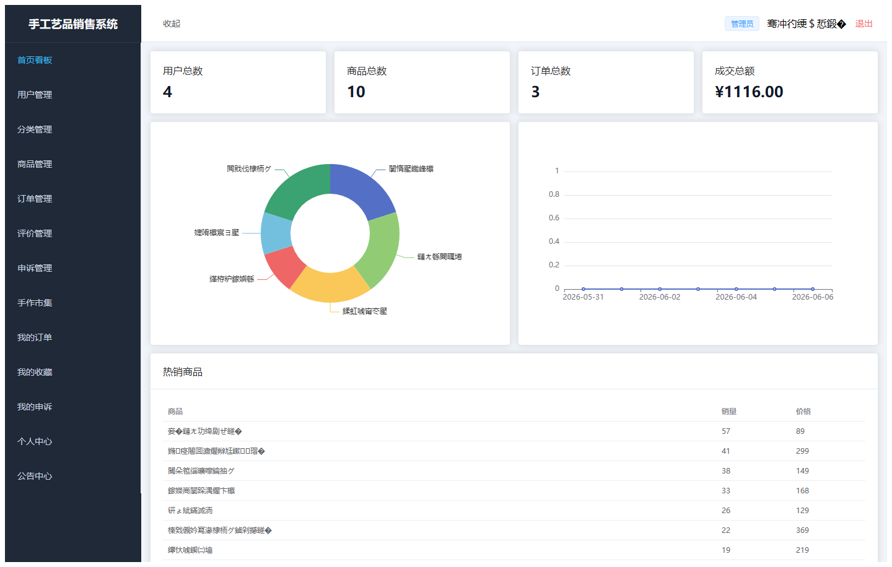
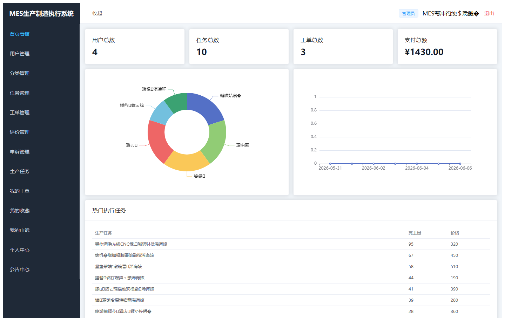
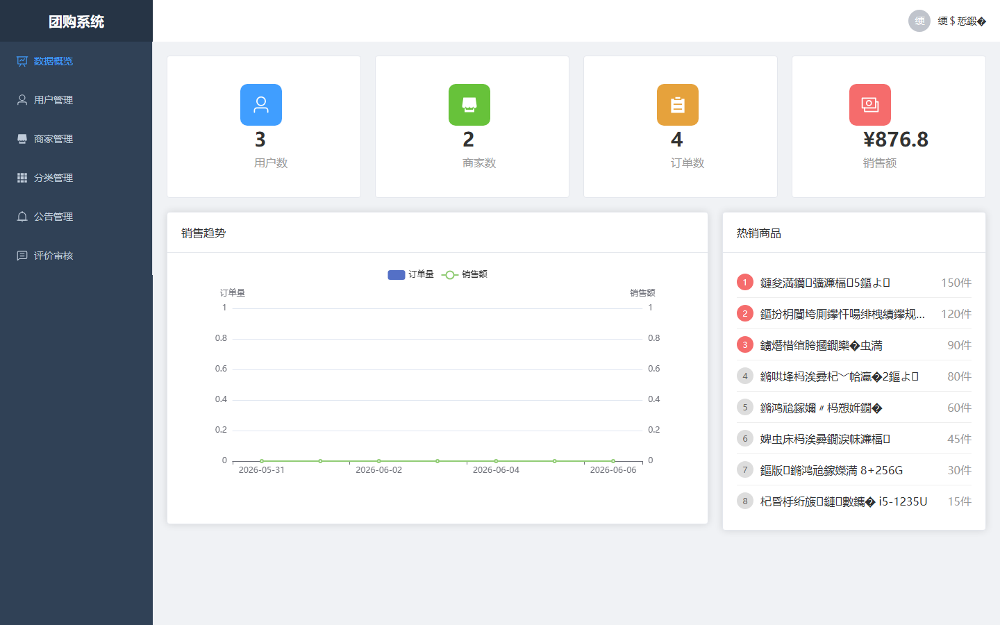
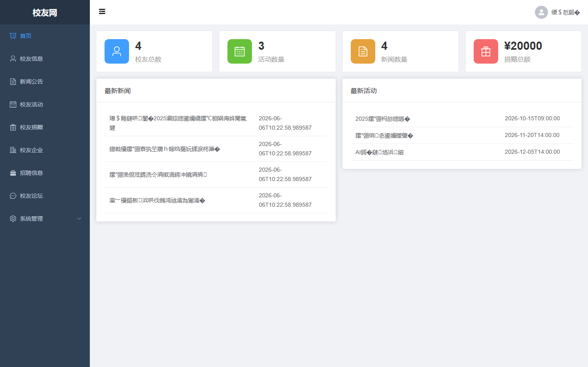

# 项目预览 071-080

## 项目索引

### 071 - 基于SpringBoot和Vue的共享单车系统

- 组件类型：`backend, frontend`
- 详览页：[071.md](../projects/071.md)
- 封面图：

### 072 - 基于SpringBoot和Vue的哈尔滨文旅系统

- 组件类型：`backend, frontend`
- 详览页：[072.md](../projects/072.md)
- 封面图：

### 073 - 基于SpringBoot和Vue的人事管理系统 🔥最新

- 组件类型：`backend, frontend`
- 详览页：[073.md](../projects/073.md)
- 封面图：

### 074 - 基于SpringBoot和Vue的手工艺品销售系统 🔥最新

- 组件类型：`backend, frontend`
- 详览页：[074.md](../projects/074.md)
- 封面图：

### 075 - 基于SpringBoot和Vue的汽车维修预约服务系统 🔥最新

- 组件类型：`backend, frontend`
- 详览页：[075.md](../projects/075.md)
- 封面图：

### 076 - 基于SpringBoot和Vue的企业信息管理系统 🔥最新

- 组件类型：`backend, frontend`
- 详览页：[076.md](../projects/076.md)
- 封面图：

### 077 - 基于Vue的MES生产制造执行系统 🔥最新

- 组件类型：`backend, frontend`
- 详览页：[077.md](../projects/077.md)
- 封面图：

### 078 - 网上团购系统 🔥最新

- 组件类型：`backend, frontend`
- 详览页：[078.md](../projects/078.md)
- 封面图：

### 079 - 计算机学院校友网 🔥最新

- 组件类型：`backend, frontend`
- 详览页：[079.md](../projects/079.md)
- 封面图：

### 080 - 贫困地区儿童资助网站 🔥最新

- 组件类型：`backend, frontend`
- 详览页：[080.md](../projects/080.md)
- 封面图：

