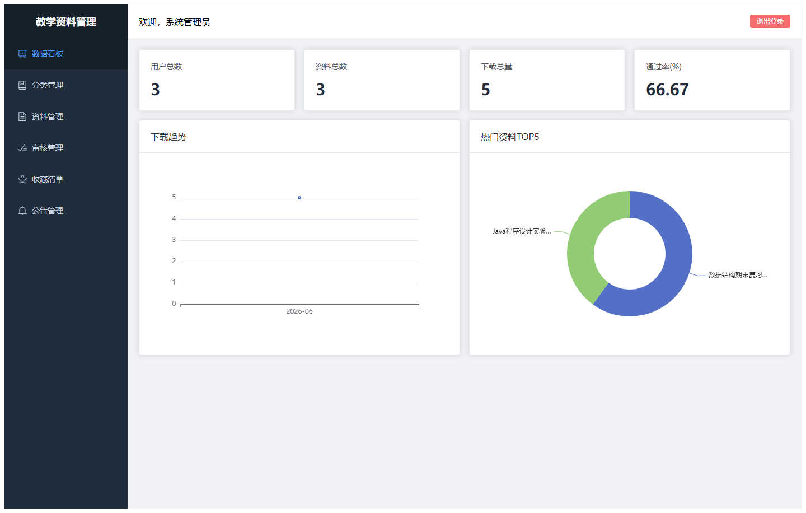
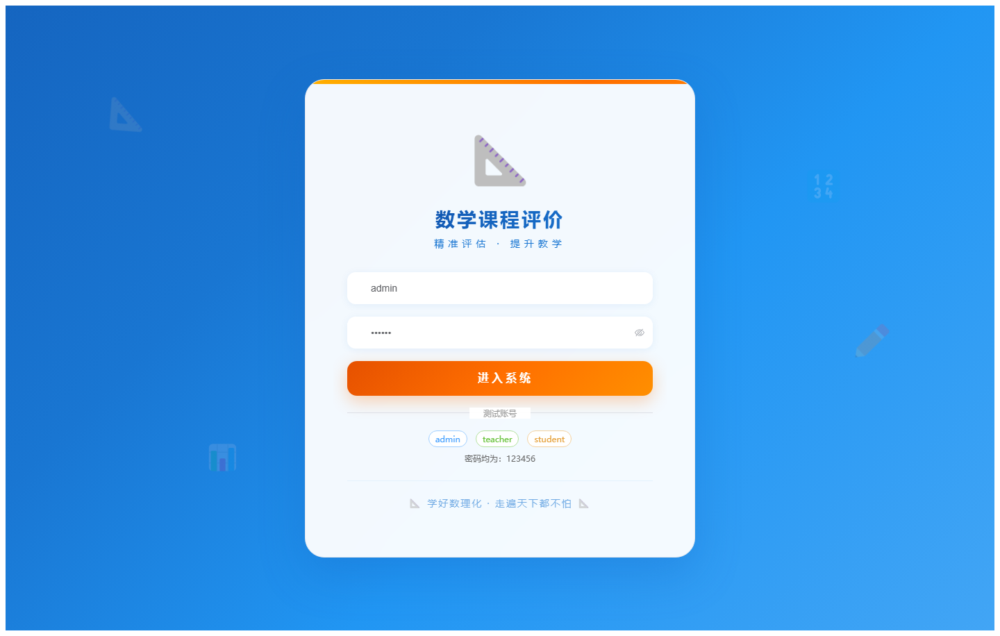
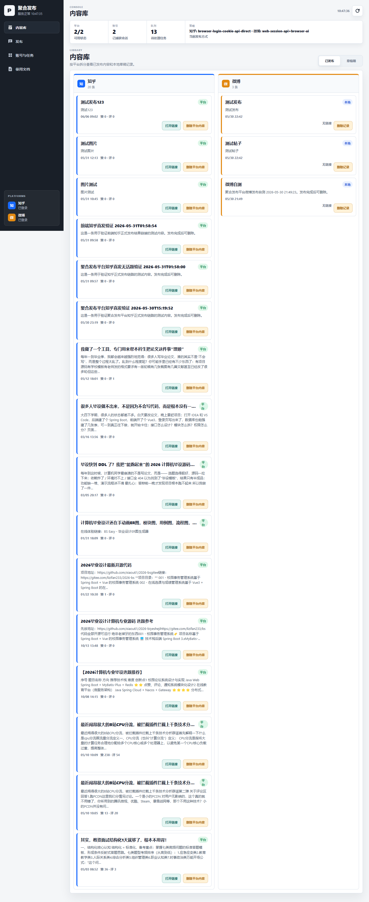

# 项目预览 081-090

## 项目索引

### 081 - 电器维修系统小程序 🔥最新

- 组件类型：`backend, frontend, miniapp`
- 详览页：[081.md](../projects/081.md)
- 封面图：

### 082 - 公考学习平台 🔥最新

- 组件类型：`backend, frontend`
- 详览页：[082.md](../projects/082.md)
- 封面图：

### 083 - 基于B/S的老年人体检管理系统 🔥最新

- 组件类型：`backend, frontend`
- 详览页：[083.md](../projects/083.md)
- 封面图：

### 084 - 教学资料管理系统 🔥最新

- 组件类型：`backend, frontend`
- 详览页：[084.md](../projects/084.md)
- 封面图：

### 085 - 数学课程评价系统 🔥最新

- 组件类型：`backend, frontend`
- 详览页：[085.md](../projects/085.md)
- 封面图：

### 086 - 高清壁纸社区网站

- 组件类型：`backend, frontend`
- 详览页：[086.md](../projects/086.md)
- 封面图：

### 087 - 课程管理系统

- 组件类型：`backend, frontend`
- 详览页：[087.md](../projects/087.md)
- 封面图：

### 088 - 孩童收养信息管理系统 🔥最新

- 组件类型：`backend, frontend`
- 详览页：[088.md](../projects/088.md)
- 封面图：

### 089 - 铁路订票平台 🔥最新

- 组件类型：`backend, frontend`
- 详览页：[089.md](../projects/089.md)
- 封面图：

### 090 - 戏曲文化苑系统 🔥最新

- 组件类型：`backend, frontend`
- 详览页：[090.md](../projects/090.md)
- 封面图：

