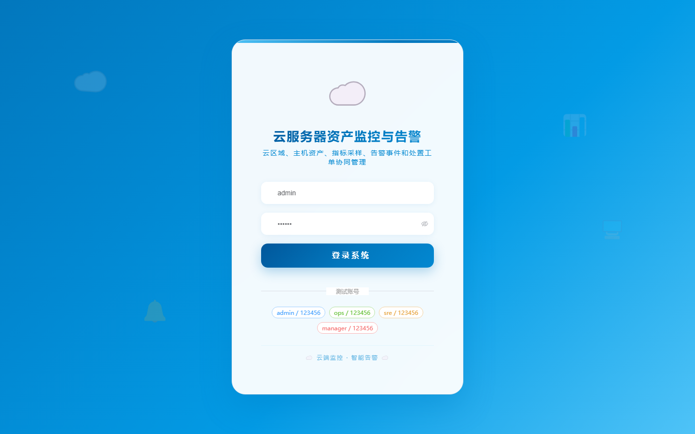

# 项目预览 101-110

## 项目索引

### 101 - 多模态招聘材料解析与岗位匹配系统

- 组件类型：`backend, frontend`
- 详览页：[101.md](../projects/101.md)
- 封面图：

### 102 - 法律咨询案件进度与智能文书管理系统

- 组件类型：`backend, frontend`
- 详览页：[102.md](../projects/102.md)
- 封面图：

### 103 - 智能客服工单质检与知识推荐系统

- 组件类型：`backend, frontend`
- 详览页：[103.md](../projects/103.md)
- 封面图：

### 104 - 开源许可证合规扫描与项目台账系统

- 组件类型：`backend, frontend`
- 详览页：[104.md](../projects/104.md)
- 封面图：

### 105 - API 接口文档生成与测试用例管理平台

- 组件类型：`backend, frontend`
- 详览页：[105.md](../projects/105.md)
- 封面图：

### 106 - DevOps 发布审批与回滚管理系统

- 组件类型：`backend, frontend`
- 详览页：[106.md](../projects/106.md)
- 封面图：

### 107 - 云服务器资产监控与告警平台

- 组件类型：`backend, frontend`
- 详览页：[107.md](../projects/107.md)
- 封面图：

### 108 - 云原生成本分析与资源优化平台

- 组件类型：`backend, frontend`
- 详览页：[108.md](../projects/108.md)
- 封面图：

### 109 - 数据脱敏与敏感信息识别平台

- 组件类型：`backend, frontend`
- 详览页：[109.md](../projects/109.md)
- 封面图：

### 110 - 个人数据隐私授权与访问审计平台

- 组件类型：`backend, frontend`
- 详览页：[110.md](../projects/110.md)
- 封面图：

