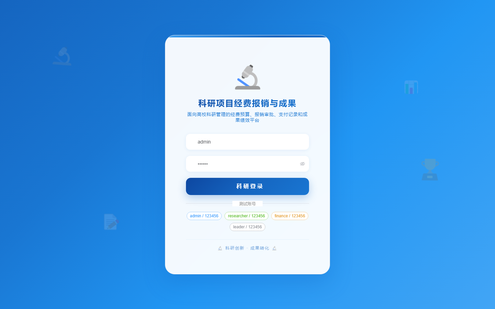
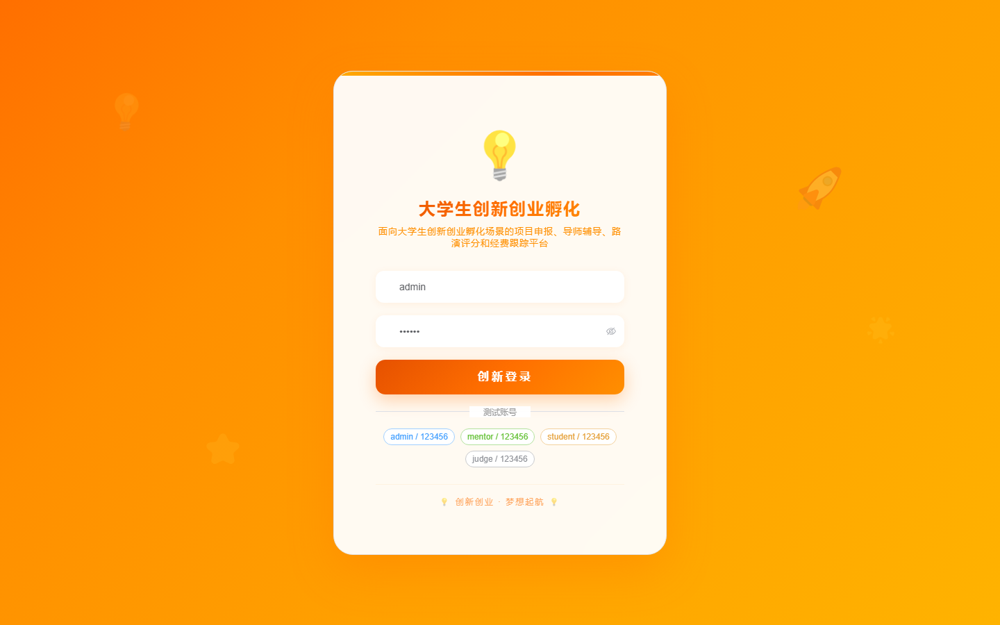
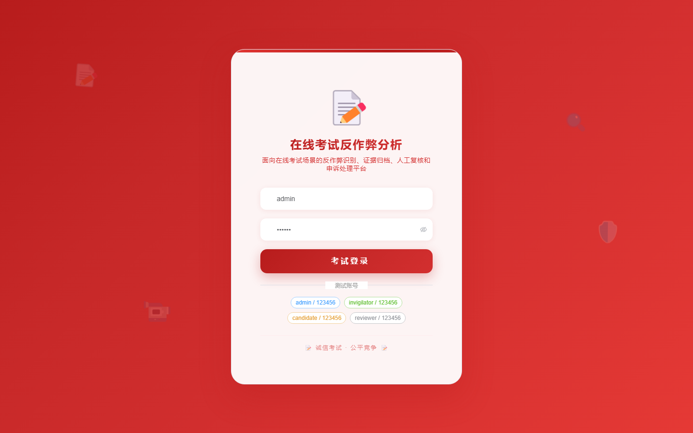

# 项目预览 131-140

## 项目索引

### 131 - 药品不良反应上报与随访管理系统

- 组件类型：`backend, frontend`
- 详览页：[131.md](../projects/131.md)
- 封面图：

### 132 - 医疗器械借用消毒与追踪管理系统

- 组件类型：`backend, frontend`
- 详览页：[132.md](../projects/132.md)
- 封面图：

### 133 - 实验室耗材采购审批与库存预警系统

- 组件类型：`backend, frontend`
- 详览页：[133.md](../projects/133.md)
- 封面图：

### 134 - 科研项目经费报销与成果管理系统

- 组件类型：`backend, frontend`
- 详览页：[134.md](../projects/134.md)
- 封面图：

### 135 - 学术会议投稿评审与日程管理系统

- 组件类型：`backend, frontend`
- 详览页：[135.md](../projects/135.md)
- 封面图：

### 136 - 导师课题双选与开题过程管理系统

- 组件类型：`backend, frontend`
- 详览页：[136.md](../projects/136.md)
- 封面图：

### 137 - 大学生创新创业项目孵化管理平台

- 组件类型：`backend, frontend`
- 详览页：[137.md](../projects/137.md)
- 封面图：

### 138 - 在线考试反作弊行为分析与证据管理系统

- 组件类型：`backend, frontend`
- 详览页：[138.md](../projects/138.md)
- 封面图：

### 139 - 企业培训学习路径与能力画像系统

- 组件类型：`backend, frontend`
- 详览页：[139.md](../projects/139.md)
- 封面图：

### 140 - 电子合同签署与印章审批管理系统

- 组件类型：`backend, frontend`
- 详览页：[140.md](../projects/140.md)
- 封面图：

