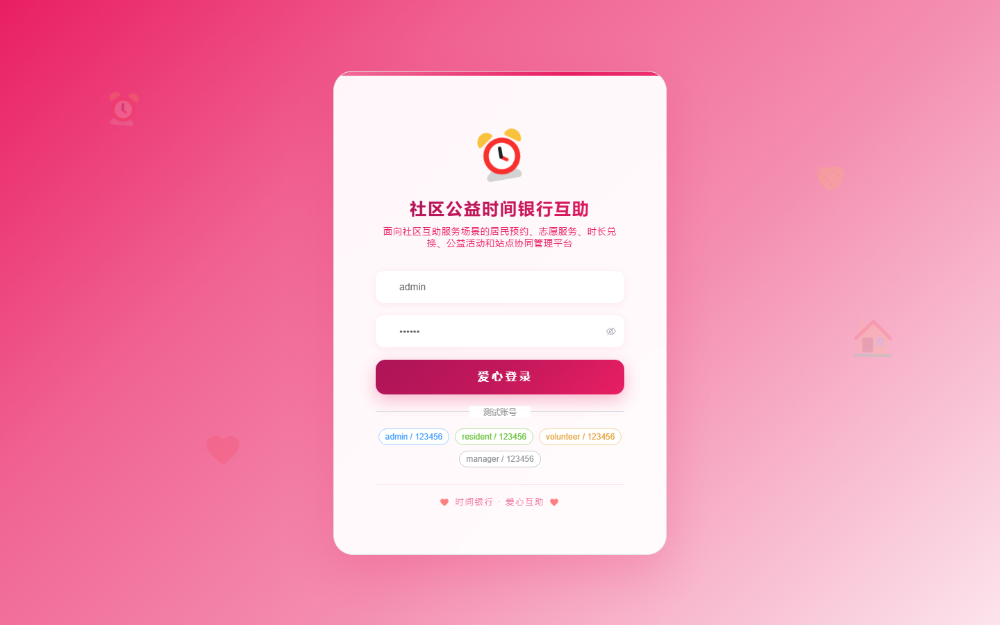
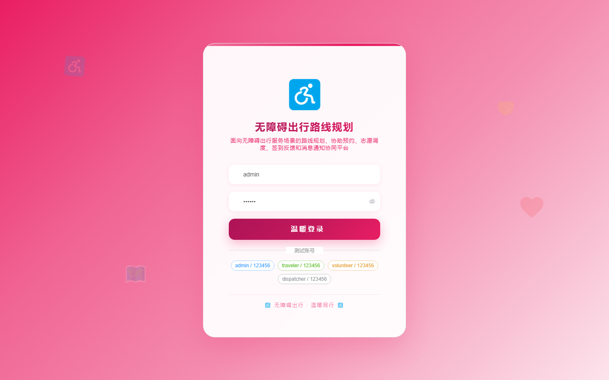
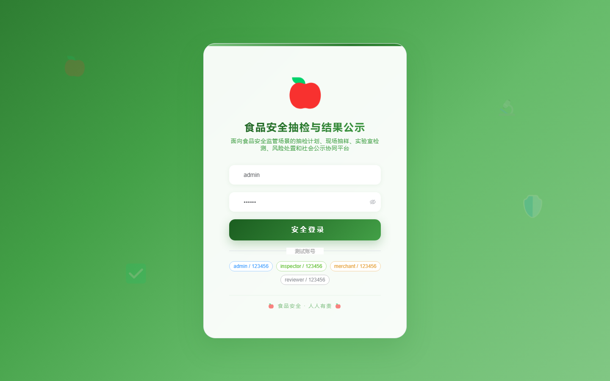
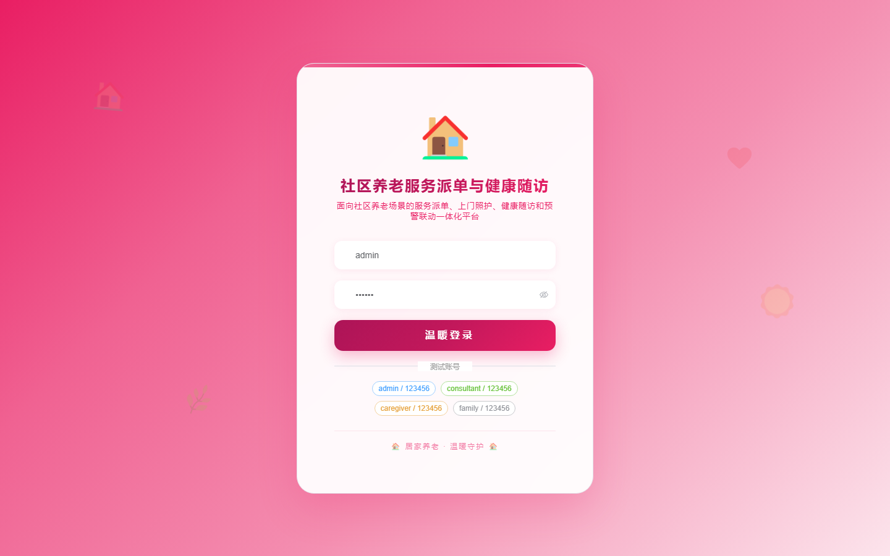
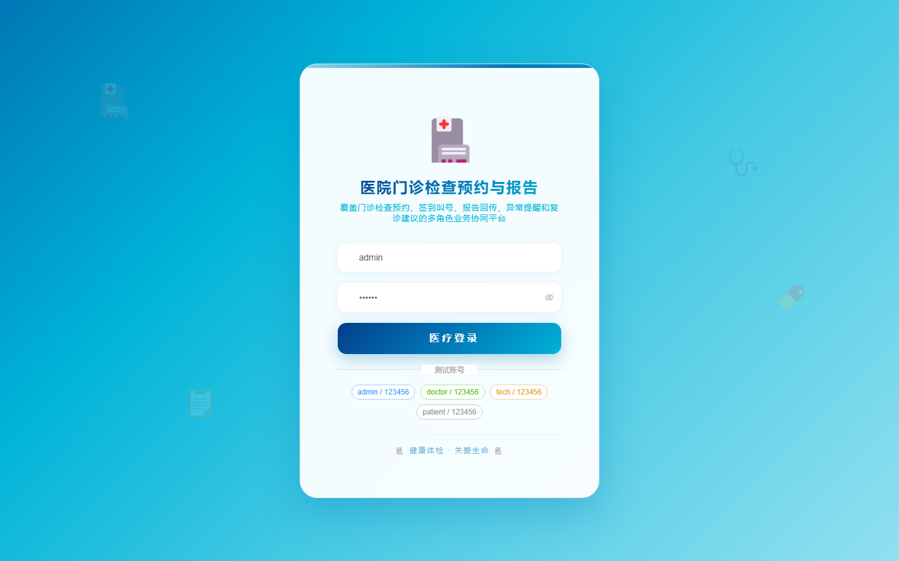

# 项目预览 141-150

## 项目索引

### 141 - 固定资产 RFID 盘点与借用归还系统

- 组件类型：`backend, frontend`
- 详览页：[141.md](../projects/141.md)
- 封面图：

### 142 - 车辆保险理赔材料审核与进度跟踪系统

- 组件类型：`backend, frontend`
- 详览页：[142.md](../projects/142.md)
- 封面图：

### 143 - 社区公益时间银行互助服务平台

- 组件类型：`backend, frontend`
- 详览页：[143.md](../projects/143.md)
- 封面图：

### 144 - 无障碍出行路线规划与志愿协助平台

- 组件类型：`backend, frontend`
- 详览页：[144.md](../projects/144.md)
- 封面图：

### 145 - 城市噪声投诉监测与执法协同平台

- 组件类型：`backend, frontend`
- 详览页：[145.md](../projects/145.md)
- 封面图：

### 146 - 食品安全抽检任务与结果公示平台

- 组件类型：`backend, frontend`
- 详览页：[146.md](../projects/146.md)
- 封面图：

### 147 - 校园心理咨询预约与危机干预管理系统

- 组件类型：`backend, frontend`
- 详览页：[147.md](../projects/147.md)
- 封面图：

### 148 - 社区养老服务派单与健康随访管理系统

- 组件类型：`backend, frontend`
- 详览页：[148.md](../projects/148.md)
- 封面图：

### 149 - 高校实验设备共享预约与违规使用追踪系统

- 组件类型：`backend, frontend`
- 详览页：[149.md](../projects/149.md)
- 封面图：

### 150 - 医院门诊检查预约与报告回传管理系统

- 组件类型：`backend, frontend`
- 详览页：[150.md](../projects/150.md)
- 封面图：

