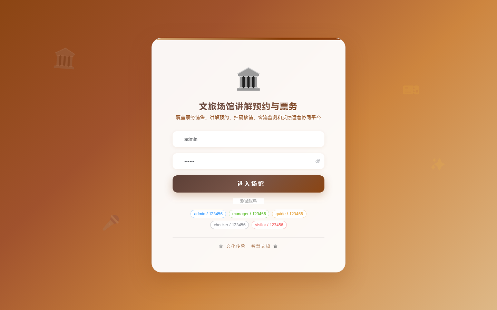

# 项目预览 151-160

## 项目索引

### 151 - 文旅场馆讲解预约与票务核销管理平台

- 组件类型：`backend, frontend`
- 详览页：[151.md](../projects/151.md)
- 封面图：

### 152 - 工厂危险作业审批与监护巡检管理系统

- 组件类型：`backend, frontend`
- 详览页：[152.md](../projects/152.md)
- 封面图：

### 153 - 校园二手物品寄卖与信用评价系统

- 组件类型：`backend, frontend`
- 详览页：[153.md](../projects/153.md)
- 封面图：

### 154 - 宠物医院接诊排班与疫苗随访管理系统

- 组件类型：`backend, frontend`
- 详览页：[154.md](../projects/154.md)
- 封面图：

### 155 - 社区党建活动报名与积分激励平台

- 组件类型：`backend, frontend`
- 详览页：[155.md](../projects/155.md)
- 封面图：

### 156 - 校园宿舍能耗监测与节能排名系统

- 组件类型：`backend, frontend`
- 详览页：[156.md](../projects/156.md)
- 封面图：

### 157 - 物流园区车辆入场预约与道口调度平台

- 组件类型：`backend, frontend`
- 详览页：[157.md](../projects/157.md)
- 封面图：

### 158 - 校外培训机构课消统计与退费审批系统

- 组件类型：`backend, frontend`
- 详览页：[158.md](../projects/158.md)
- 封面图：

### 159 - 医疗废弃物收运联单与闭环监管系统

- 组件类型：`backend, frontend`
- 详览页：[159.md](../projects/159.md)
- 封面图：

### 160 - 校园社团活动预算报销与物资借用系统

- 组件类型：`backend, frontend`
- 详览页：[160.md](../projects/160.md)
- 封面图：

