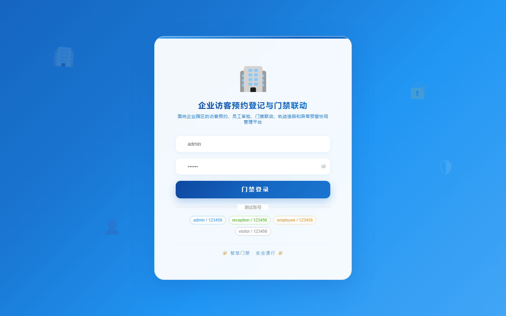

# 项目预览 161-170

## 项目索引

### 161 - 景区失物招领与游客寻回协同平台

- 组件类型：`backend, frontend`
- 详览页：[161.md](../projects/161.md)
- 封面图：

### 162 - 生鲜门店临期商品预警与促销处置系统

- 组件类型：`backend, frontend`
- 详览页：[162.md](../projects/162.md)
- 封面图：

### 163 - 医学实习轮转考核与病例学习管理系统

- 组件类型：`backend, frontend`
- 详览页：[163.md](../projects/163.md)
- 封面图：

### 164 - 校园体育赛事报名编排与裁判评分系统

- 组件类型：`backend, frontend`
- 详览页：[164.md](../projects/164.md)
- 封面图：

### 165 - 企业访客预约登记与门禁联动管理系统

- 组件类型：`backend, frontend`
- 详览页：[165.md](../projects/165.md)
- 封面图：

### 166 - 农贸市场摊位巡检与食品追溯台账系统

- 组件类型：`backend, frontend`
- 详览页：[166.md](../projects/166.md)
- 封面图：

### 167 - 社区垃圾分类督导与积分兑换平台

- 组件类型：`backend, frontend`
- 详览页：[167.md](../projects/167.md)
- 封面图：

### 168 - 在线职业培训证书考试与续证提醒系统

- 组件类型：`backend, frontend`
- 详览页：[168.md](../projects/168.md)
- 封面图：

### 169 - 校车乘车预约与学生上下车核验系统

- 组件类型：`backend, frontend`
- 详览页：[169.md](../projects/169.md)
- 封面图：

### 170 - 养老机构床位分配与护理记录管理系统

- 组件类型：`backend, frontend`
- 详览页：[170.md](../projects/170.md)
- 封面图：

