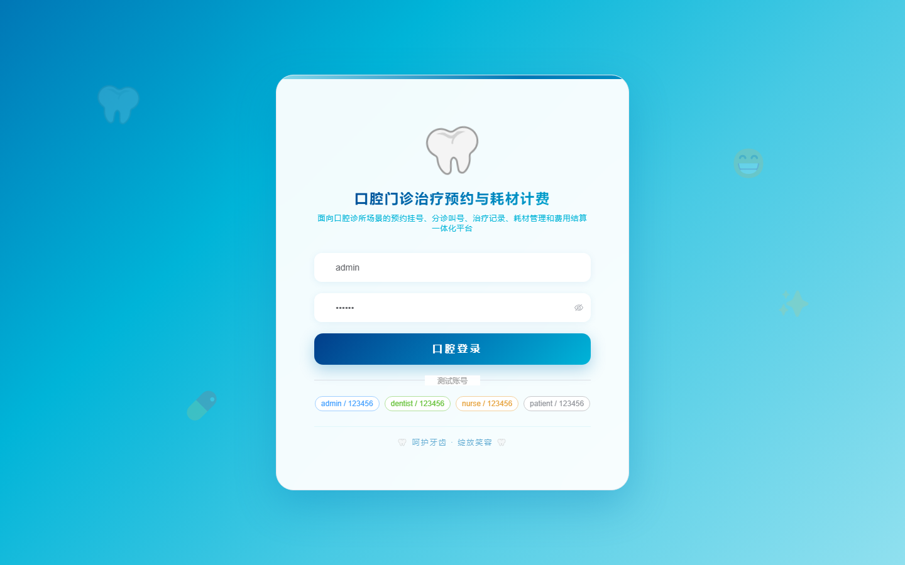

# 项目预览 171-180

## 项目索引

### 171 - 应急物资储备盘点与调拨审批平台

- 组件类型：`backend, frontend`
- 详览页：[171.md](../projects/171.md)
- 封面图：

### 172 - 口腔门诊治疗预约与耗材计费管理系统

- 组件类型：`backend, frontend`
- 详览页：[172.md](../projects/172.md)
- 封面图：

### 173 - 高校毕业去向填报与就业帮扶跟踪系统

- 组件类型：`backend, frontend`
- 详览页：[173.md](../projects/173.md)
- 封面图：

### 174 - 社区慢病档案随访与服药依从性管理系统

- 组件类型：`backend, frontend`
- 详览页：[174.md](../projects/174.md)
- 封面图：

### 175 - 校园图书漂流借阅与读书打卡平台

- 组件类型：`backend, frontend`
- 详览页：[175.md](../projects/175.md)
- 封面图：

### 176 - 水务巡线工单与阀门检修协同管理系统

- 组件类型：`backend, frontend`
- 详览页：[176.md](../projects/176.md)
- 封面图：

### 177 - 直播基地主播排班与选品样品管理系统

- 组件类型：`backend, frontend`
- 详览页：[177.md](../projects/177.md)
- 封面图：

### 178 - 医院手术室器械包追踪与灭菌放行系统

- 组件类型：`backend, frontend`
- 详览页：[178.md](../projects/178.md)
- 封面图：

### 179 - 高校考勤异常申诉与课堂巡查管理系统

- 组件类型：`backend, frontend`
- 详览页：[179.md](../projects/179.md)
- 封面图：

### 180 - 物业报修派单与服务满意度评价平台

- 组件类型：`backend, frontend`
- 详览页：[180.md](../projects/180.md)
- 封面图：

