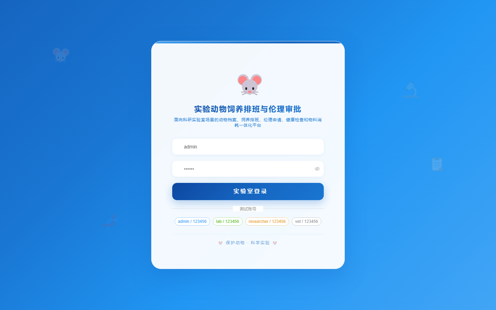
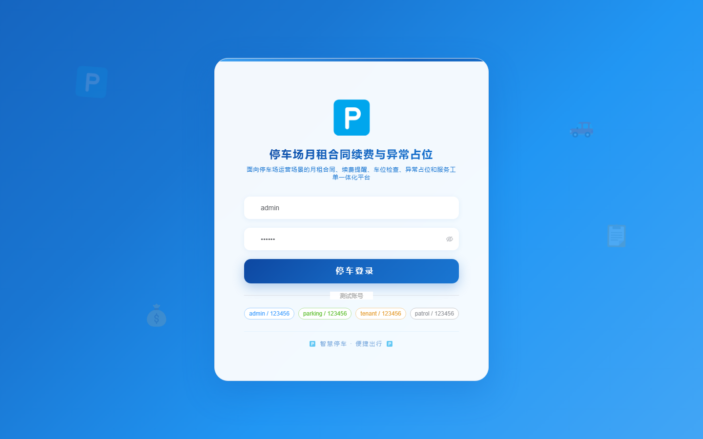
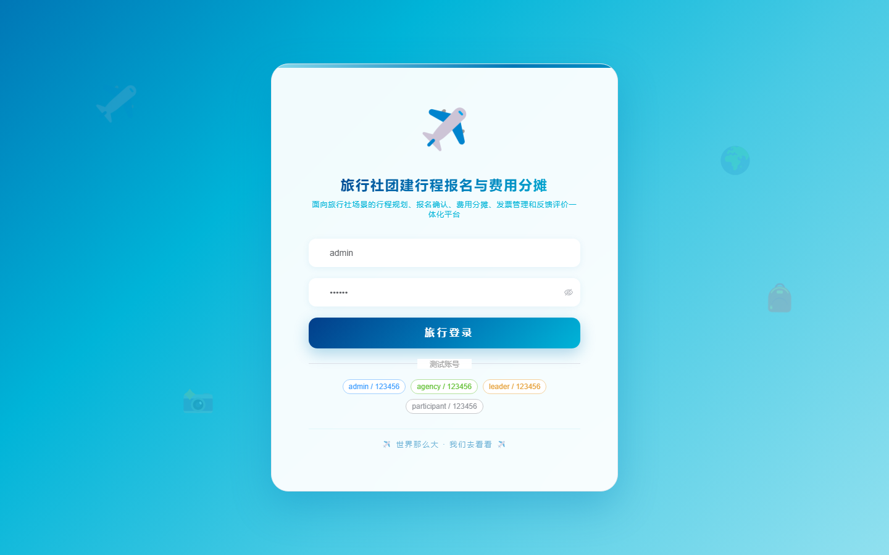
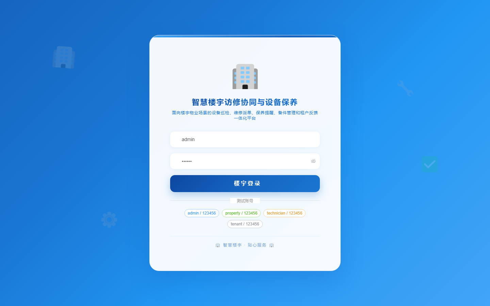

# 项目预览 181-190

## 项目索引

### 181 - 社区儿童托管签到接送与安全告警系统

- 组件类型：`backend, frontend`
- 详览页：[181.md](../projects/181.md)
- 封面图：

### 182 - 养老助餐配送排线与营养套餐管理系统

- 组件类型：`backend, frontend`
- 详览页：[182.md](../projects/182.md)
- 封面图：

### 183 - 实验动物饲养排班与伦理审批管理系统

- 组件类型：`backend, frontend`
- 详览页：[183.md](../projects/183.md)
- 封面图：

### 184 - 停车场月租合同续费与异常占位管理系统

- 组件类型：`backend, frontend`
- 详览页：[184.md](../projects/184.md)
- 封面图：

### 185 - 城市公厕巡检保洁与耗材补给调度系统

- 组件类型：`backend, frontend`
- 详览页：[185.md](../projects/185.md)
- 封面图：

### 186 - 校园餐厅后厨留样与卫生巡检台账系统

- 组件类型：`backend, frontend`
- 详览页：[186.md](../projects/186.md)
- 封面图：

### 187 - 旅行社团建行程报名与费用分摊管理平台

- 组件类型：`backend, frontend`
- 详览页：[187.md](../projects/187.md)
- 封面图：

### 188 - 医疗护理培训签到考核与技能档案系统

- 组件类型：`backend, frontend`
- 详览页：[188.md](../projects/188.md)
- 封面图：

### 189 - 乡镇农机作业预约与维修保养跟踪平台

- 组件类型：`backend, frontend`
- 详览页：[189.md](../projects/189.md)
- 封面图：

### 190 - 智慧楼宇访修协同与设备保养提醒系统

- 组件类型：`backend, frontend`
- 详览页：[190.md](../projects/190.md)
- 封面图：

