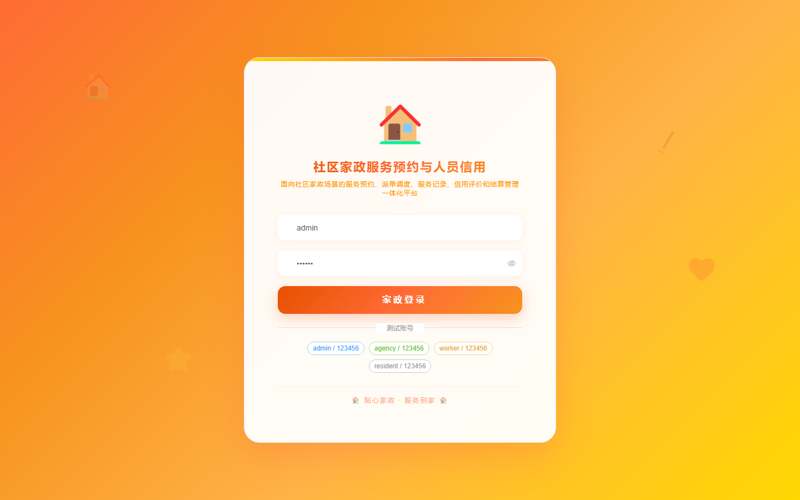

# 项目预览 191-200

## 项目索引

### 191 - 社区助残器具借用与康复随访平台

- 组件类型：`backend, frontend`
- 详览页：[191.md](../projects/191.md)
- 封面图：

### 192 - 医院陪护服务预约与护工评价管理系统

- 组件类型：`backend, frontend`
- 详览页：[192.md](../projects/192.md)
- 封面图：

### 193 - 校园创新实验班选拔与导师跟踪管理系统

- 组件类型：`backend, frontend`
- 详览页：[193.md](../projects/193.md)
- 封面图：

### 194 - 工业园区危废暂存与转运联动监管平台

- 组件类型：`backend, frontend`
- 详览页：[194.md](../projects/194.md)
- 封面图：

### 195 - 便民服务中心事项预约与窗口评价平台

- 组件类型：`backend, frontend`
- 详览页：[195.md](../projects/195.md)
- 封面图：

### 196 - 药店处方审核与慢病续方提醒管理系统

- 组件类型：`backend, frontend`
- 详览页：[196.md](../projects/196.md)
- 封面图：

### 197 - 社区家政服务预约与人员信用评价系统

- 组件类型：`backend, frontend`
- 详览页：[197.md](../projects/197.md)
- 封面图：

### 198 - 城市共享充电宝投放巡检与收益结算系统

- 组件类型：`backend, frontend`
- 详览页：[198.md](../projects/198.md)
- 封面图：

### 199 - 运动康复训练计划与体测评估管理系统

- 组件类型：`backend, frontend`
- 详览页：[199.md](../projects/199.md)
- 封面图：

### 200 - 非遗工坊课程预约与作品展销平台 🔥最新

- 组件类型：`backend, frontend`
- 详览页：[200.md](../projects/200.md)
- 封面图：

