# 004 - 实时聊天与通知系统

## 项目信息

- 项目编号：`004`
- 组件类型：`backend, frontend`
- 后端入口：`http://127.0.0.1:8004`
- 前端入口：`http://127.0.0.1:5004`
- 账号来源：004-backend\ACCOUNTS.md
- 已收录截图：`20` 张

## 默认账号

- `管理员`：`admin` / `123456`
- `用户`：`zhangsan` / `123456`
- `用户`：`lisi` / `123456`
- `用户`：`wangwu` / `123456`

## 预览截图

### admin

#### admin-01-chat-list

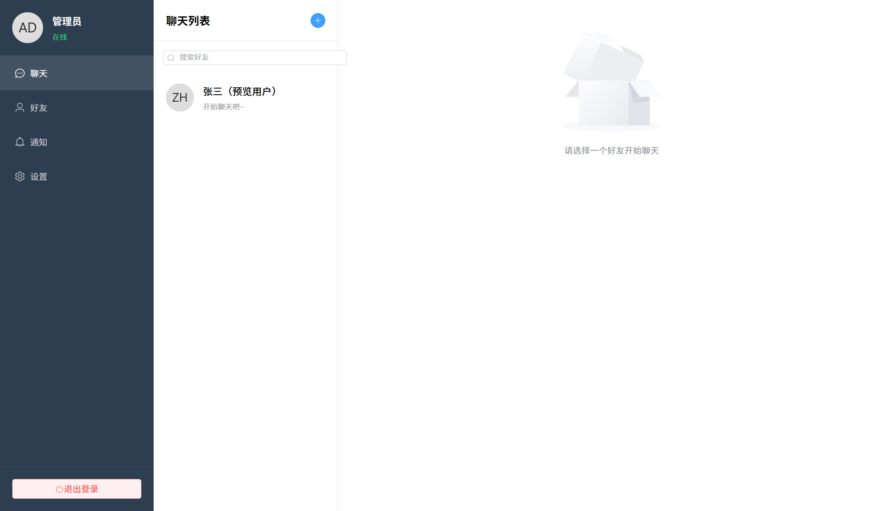

#### admin-02-friends

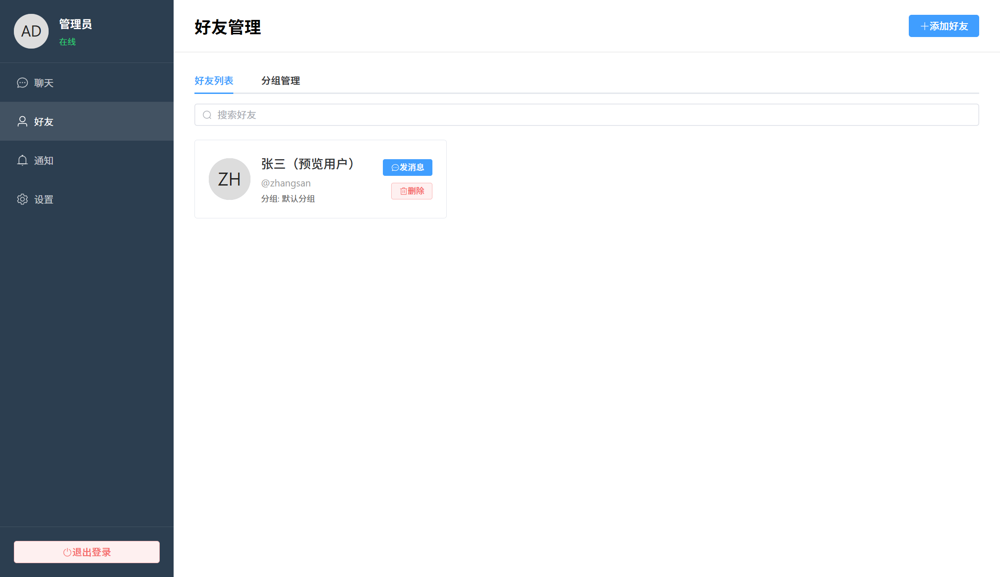

### guest

#### guest-01-login

#### guest-02-register

### lisi

#### lisi-01-chat-received

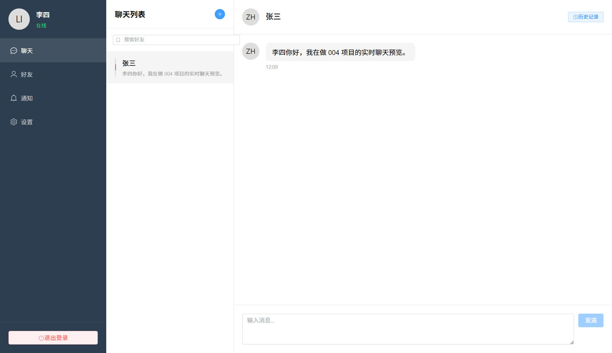

#### lisi-02-chat-replied

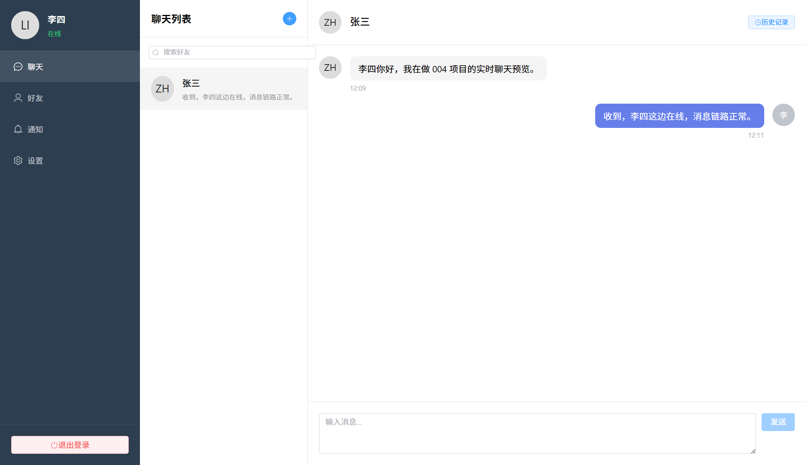

#### lisi-03-notifications-all

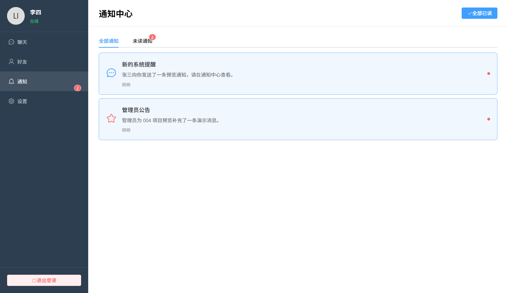

#### lisi-04-notifications-unread

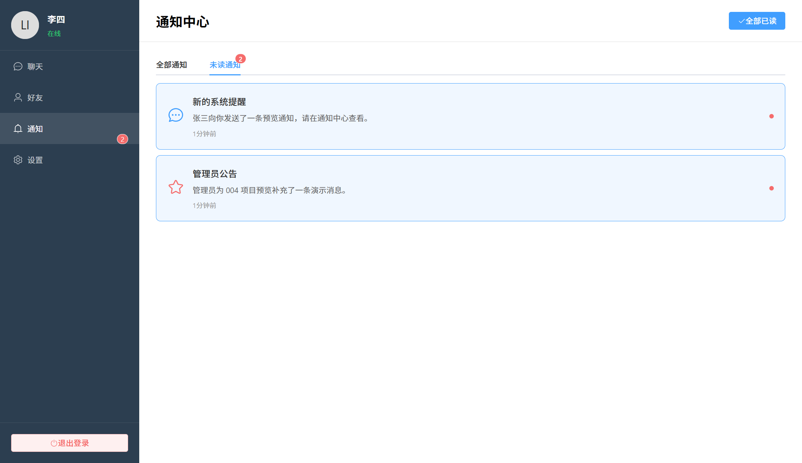

#### lisi-05-notifications-read-all

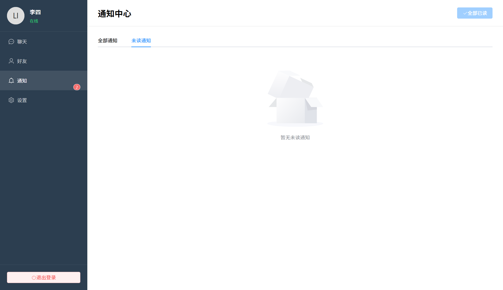

### zhangsan

#### zhangsan-01-chat-empty

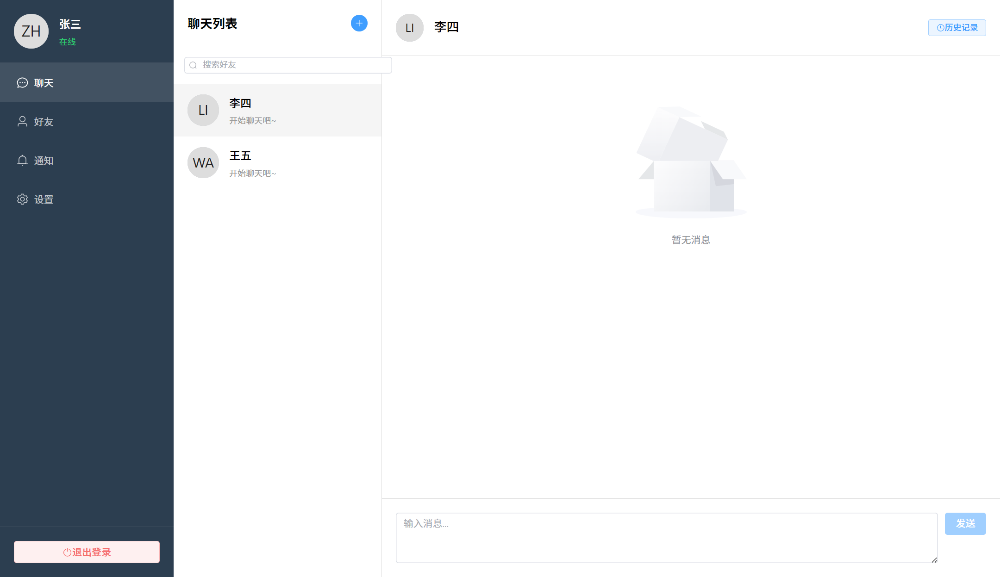

#### zhangsan-02-chat-sent

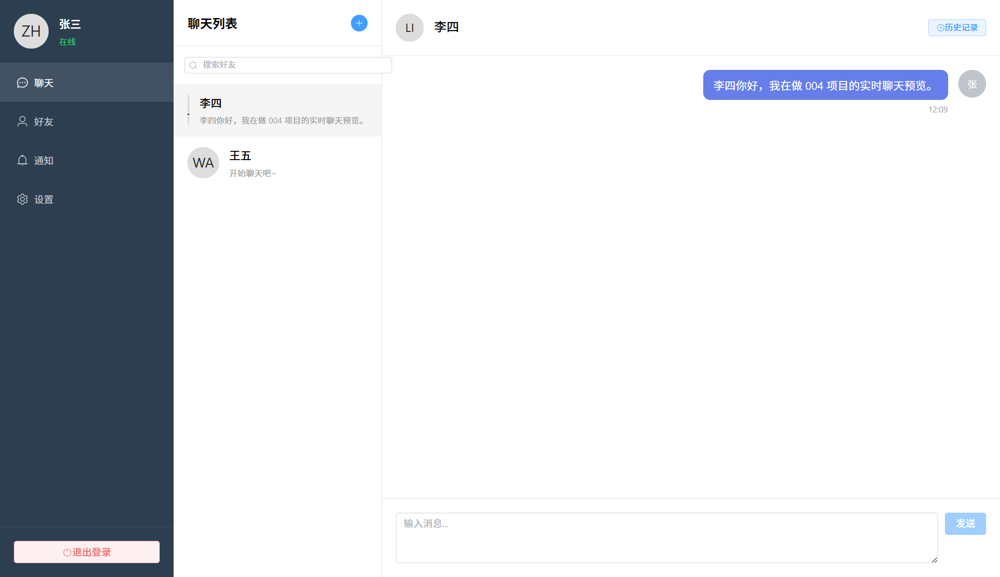

#### zhangsan-03-chat-history

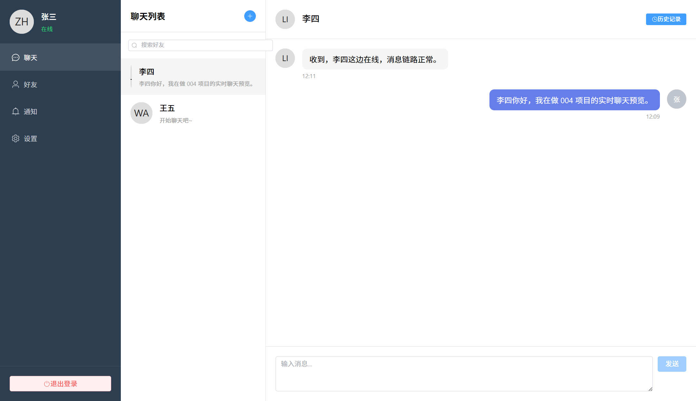

#### zhangsan-04-friends-list

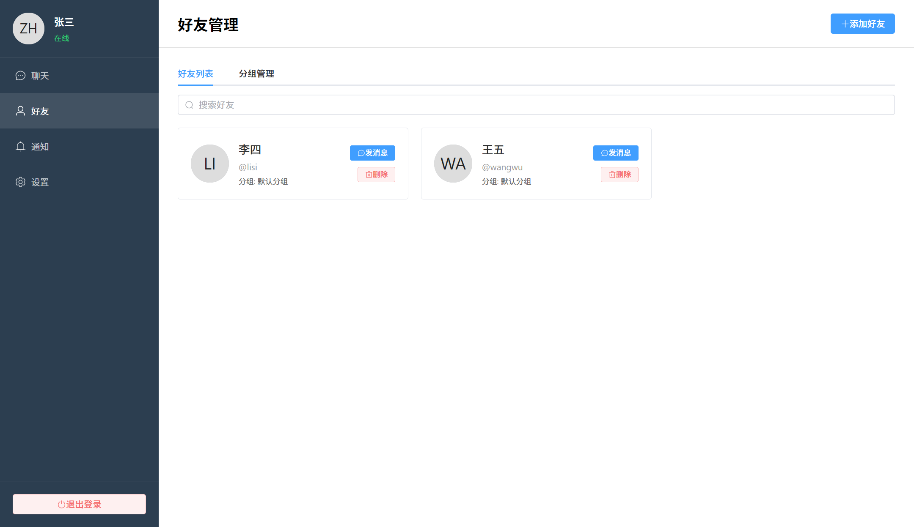

#### zhangsan-05-add-friend-search

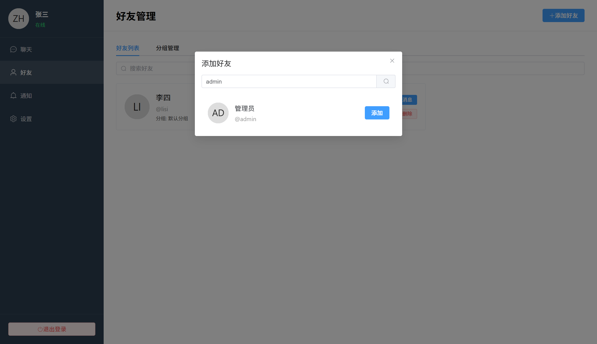

#### zhangsan-06-friend-added

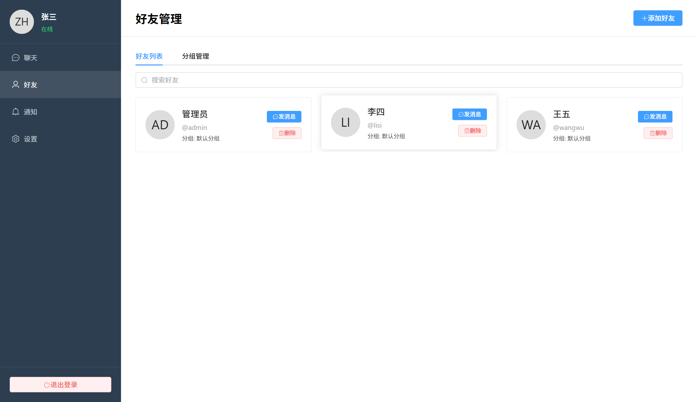

#### zhangsan-07-groups

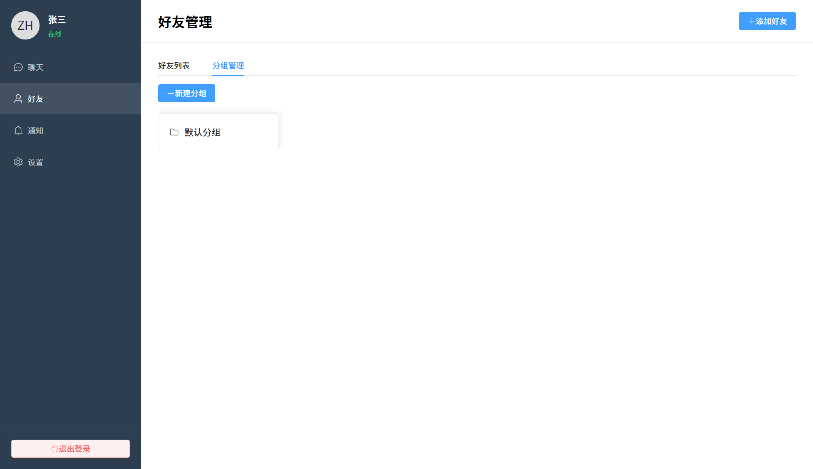

#### zhangsan-08-group-dialog

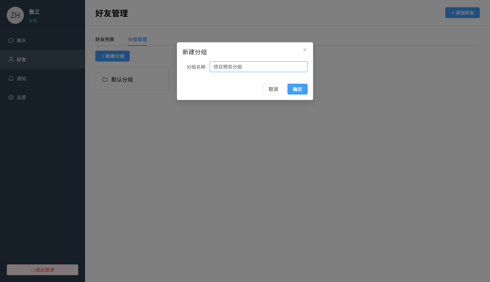

#### zhangsan-09-group-created

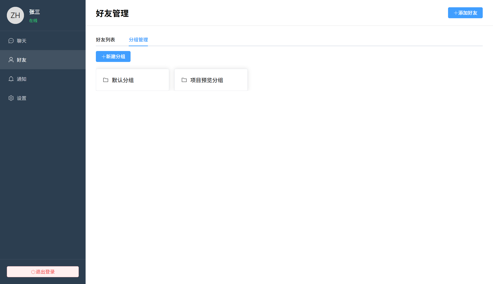

#### zhangsan-10-profile

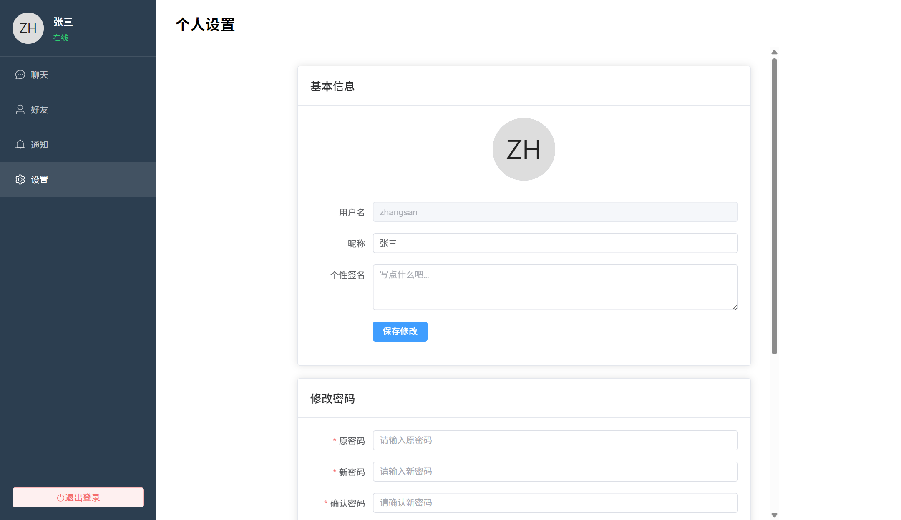

#### zhangsan-11-profile-updated

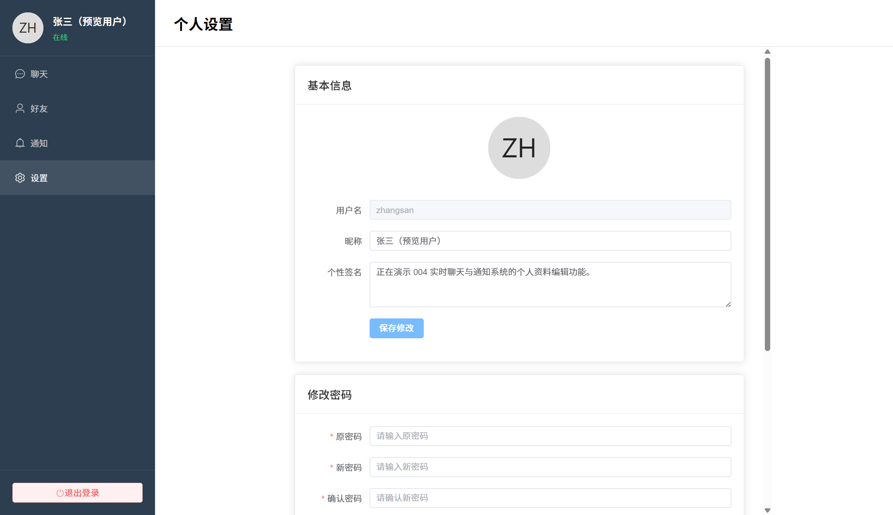
