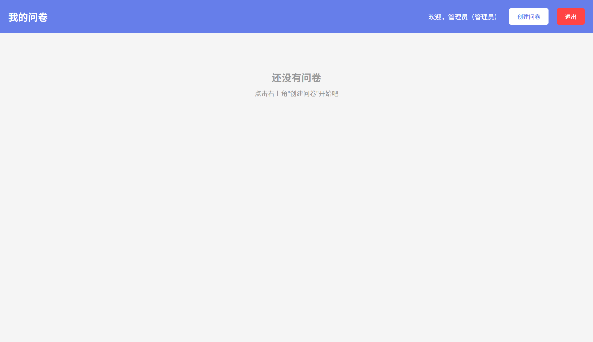
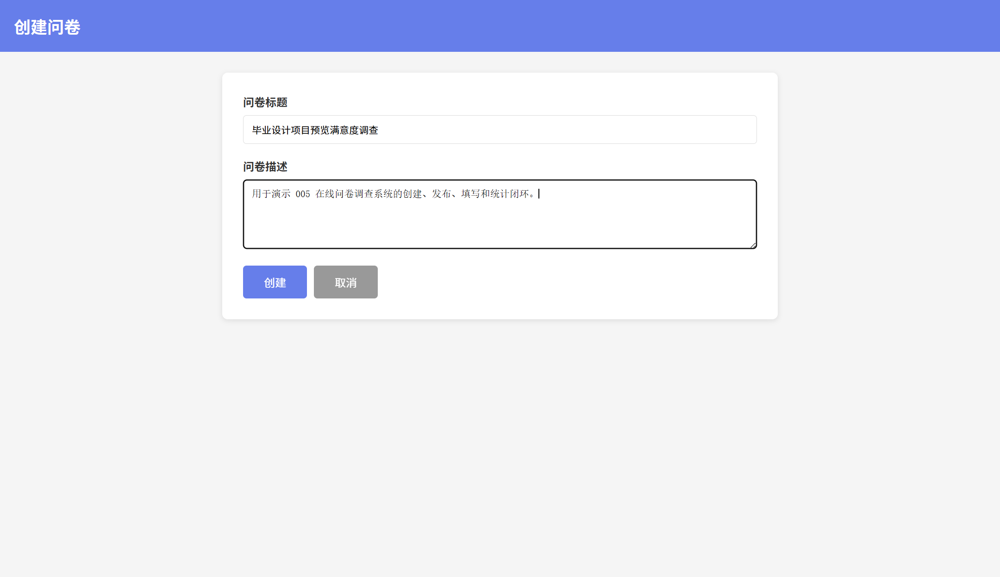
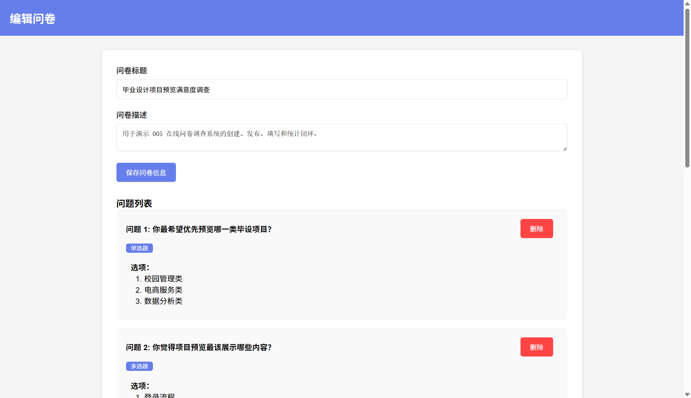
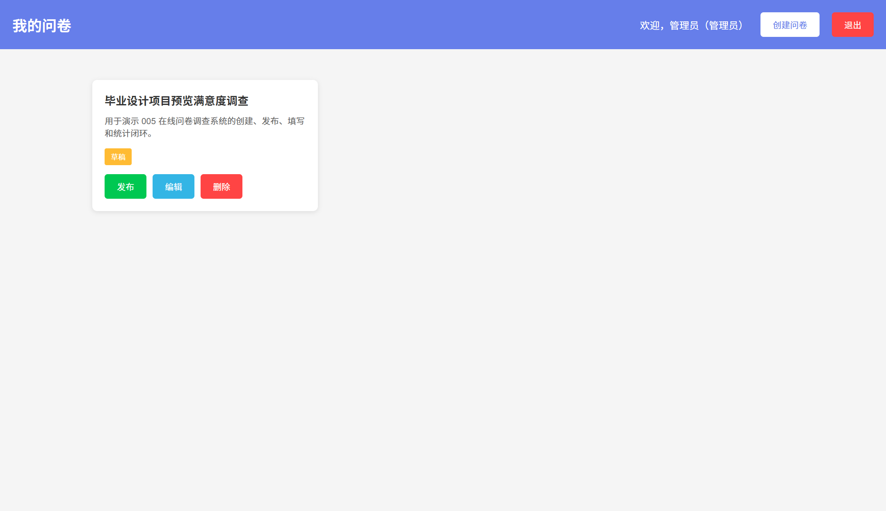
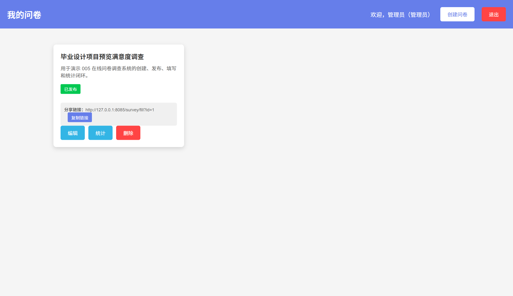
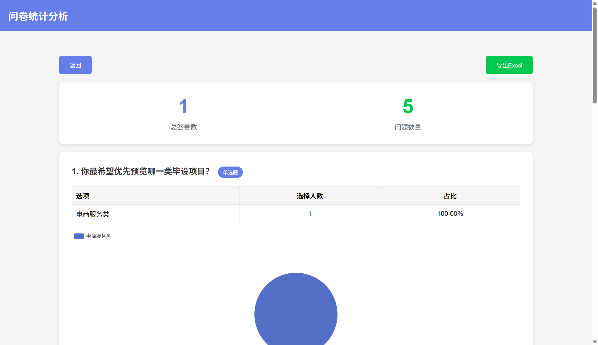
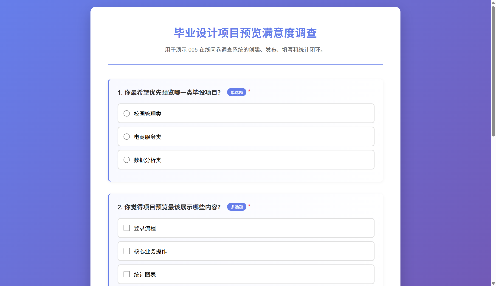
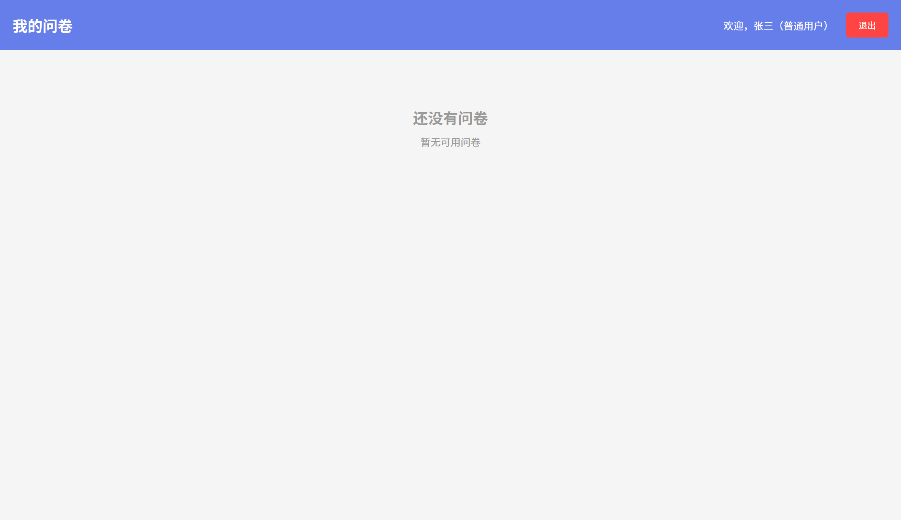

# 005 - 在线问卷调查与数据分析系统

## 项目信息

- 项目编号：`005`
- 组件类型：`backend`
- 后端入口：`http://127.0.0.1:8085`
- 前端入口：`未启动`
- 账号来源：005-backend\ACCOUNTS.md
- 已收录截图：`15` 张

## 默认账号

- `管理员`：`admin` / `123456`
- `普通用户`：`user1` / `123456`
- `普通用户`：`user2` / `123456`

## 预览截图

### admin

#### admin-01-dashboard-empty

#### admin-02-create-form

#### admin-03-dashboard-draft

#### admin-04-edit-questions

#### admin-05-dashboard-before-publish

#### admin-06-dashboard-published

#### admin-07-statistics

### guest

#### guest-01-login

#### guest-02-home

#### guest-03-register

#### guest-04-fill-form

#### guest-05-fill-answered

#### guest-06-fill-submitted

### user1

#### user1-01-dashboard-empty

#### user1-02-statistics-direct

