# 005 - 在线问卷调查与数据分析系统

## 项目信息

- 项目编号：`005`
- 组件类型：`backend`
- 后端入口：`http://127.0.0.1:8085`
- 前端入口：`未启动`
- 账号来源：005-backend\ACCOUNTS.md
- 已收录截图：`17` 张

## 默认账号

- `管理员`：`admin` / `123456`
- `普通用户`：`user1` / `123456`
- `普通用户`：`user2` / `123456`

## 预览截图

### admin

#### admin-01-dashboard

#### admin-02-创建问卷

#### admin-10-create-form

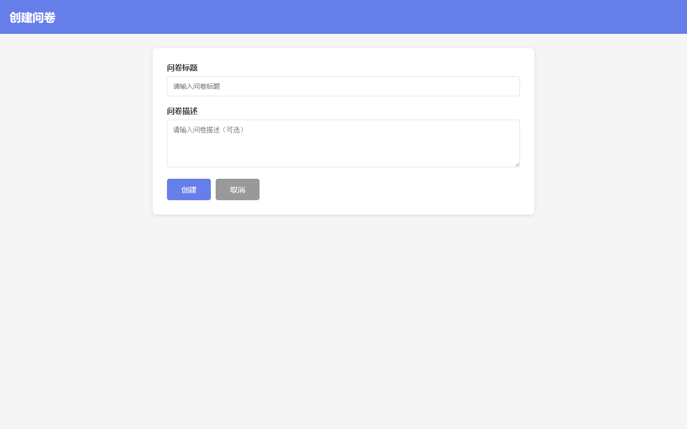

#### admin-11-dashboard-draft

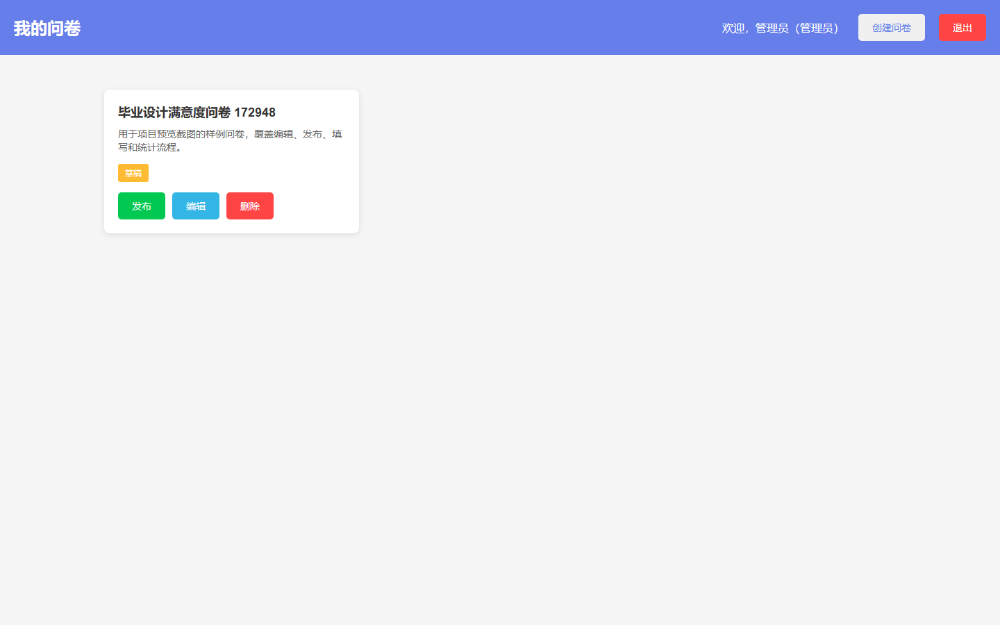

#### admin-12-edit-questions

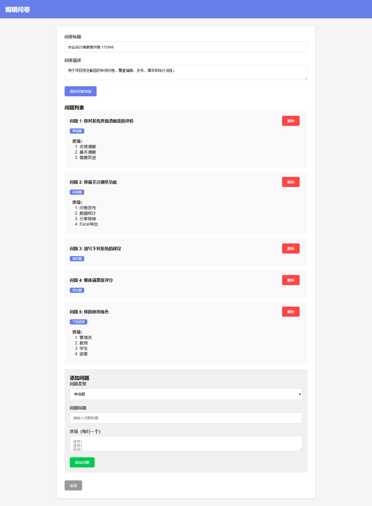

#### admin-13-dashboard-published

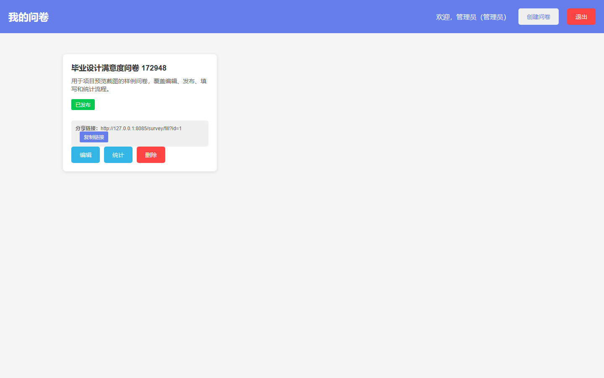

#### admin-14-statistics

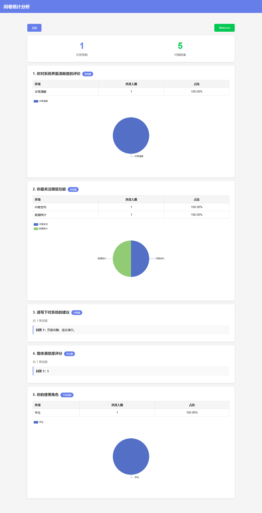

### guest

#### guest-01-login

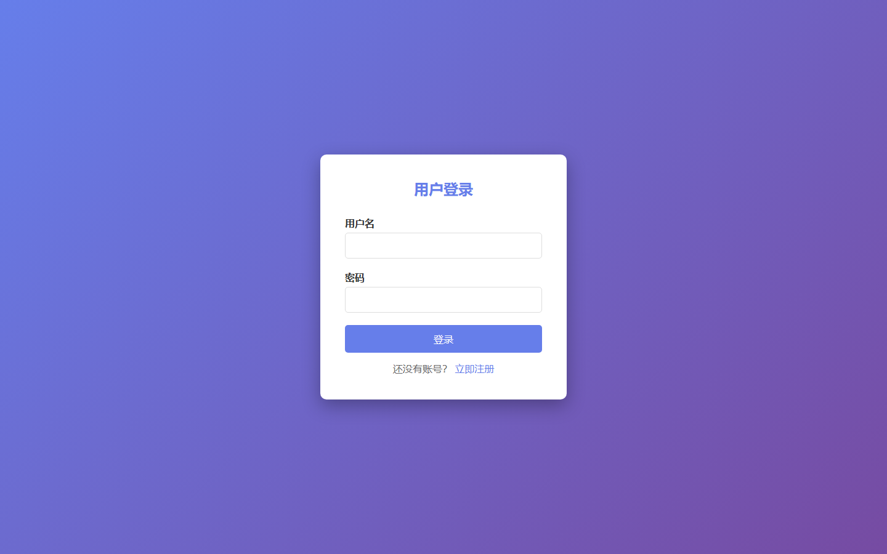

#### guest-02-login

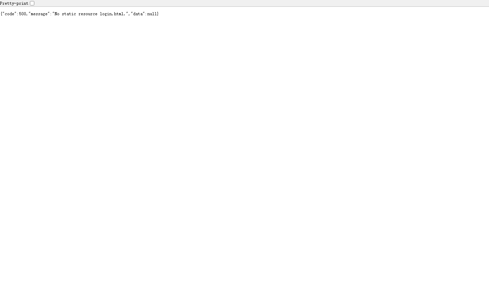

#### guest-03-register

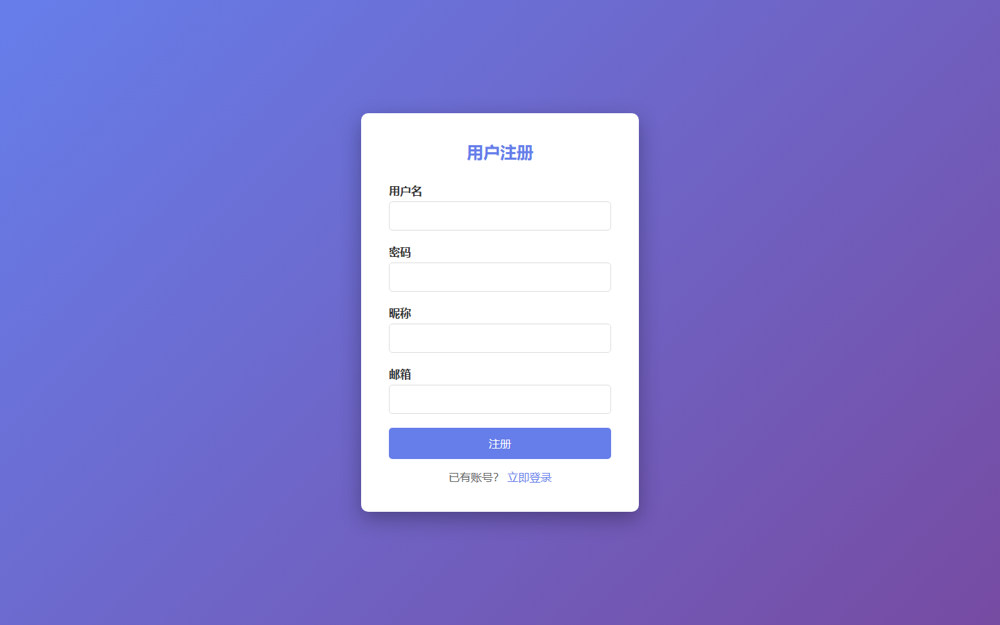

#### guest-04-register

#### guest-05-home

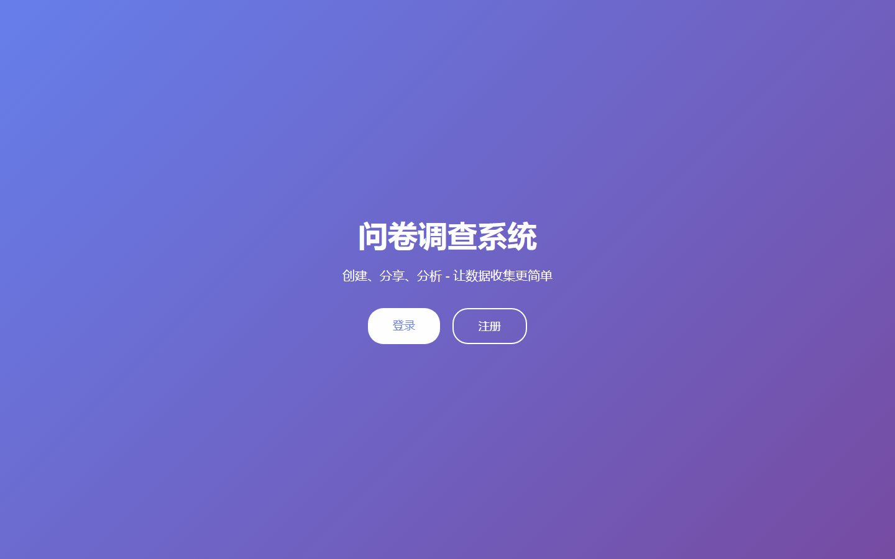

#### guest-06-products

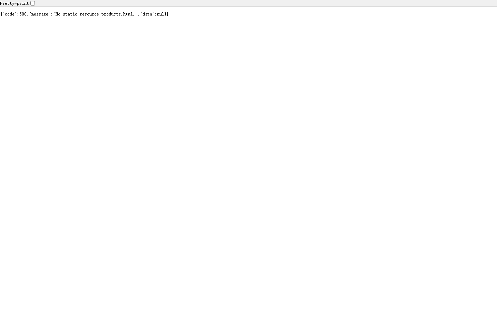

#### guest-10-fill-form

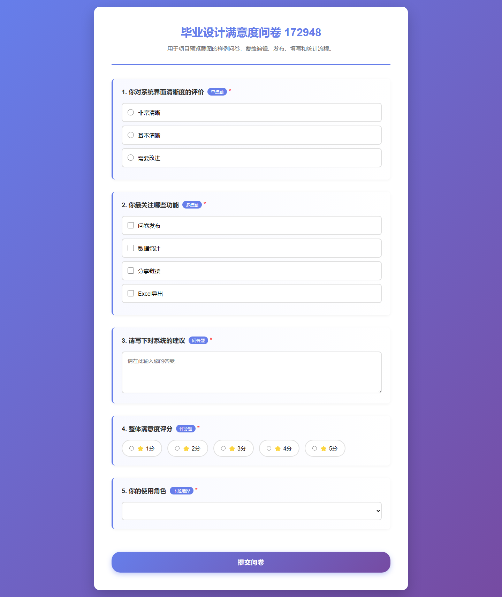

### user

#### user-user1-01-dashboard

#### user-user1-10-dashboard-after-publish

#### user-user2-01-dashboard

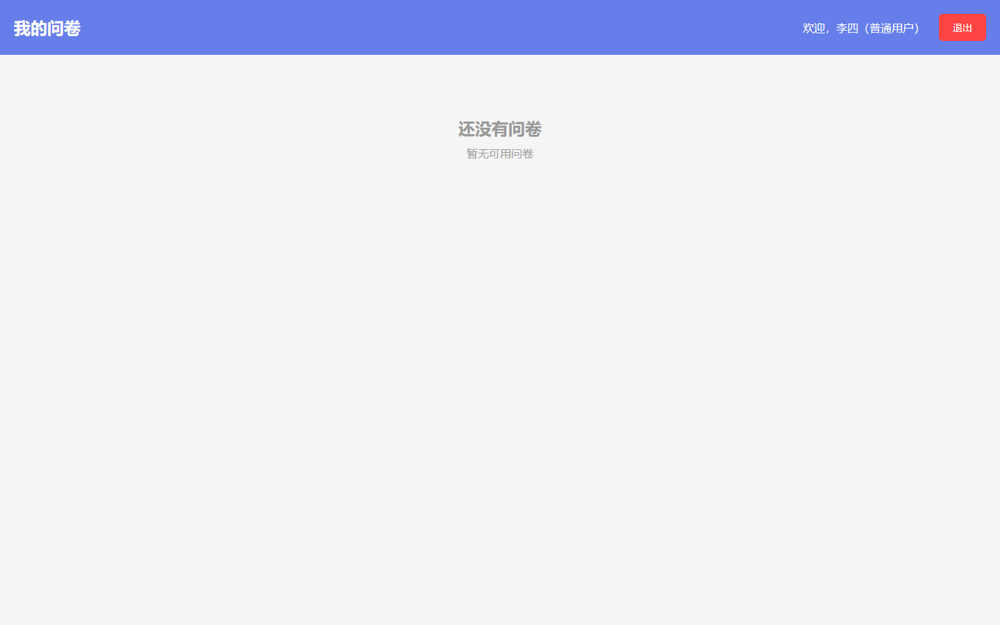
