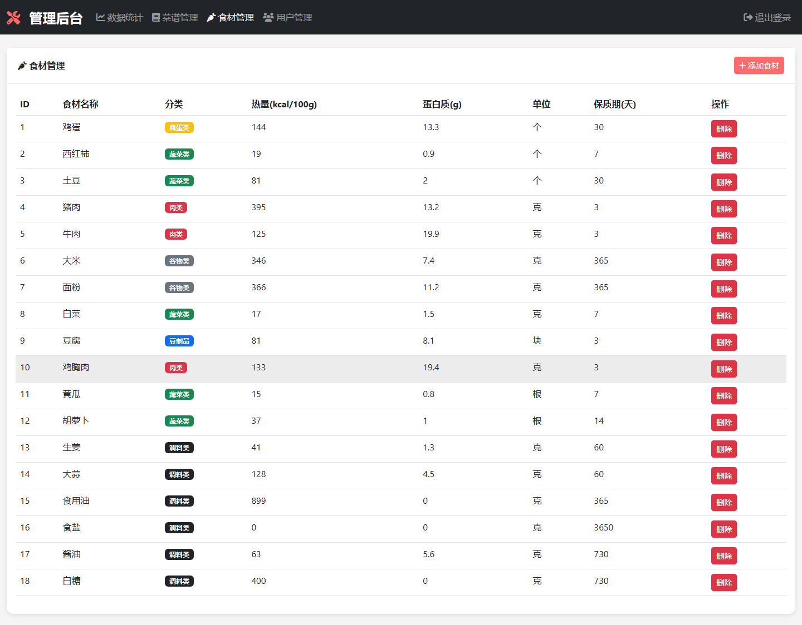
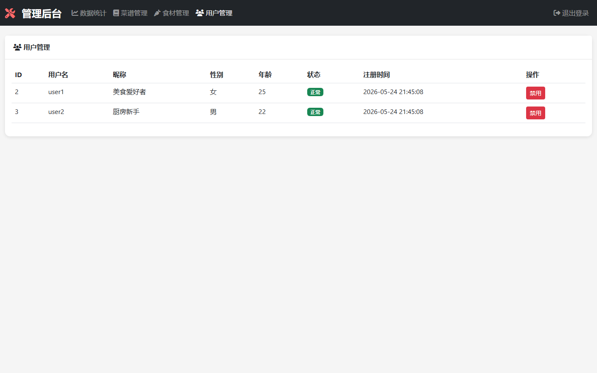
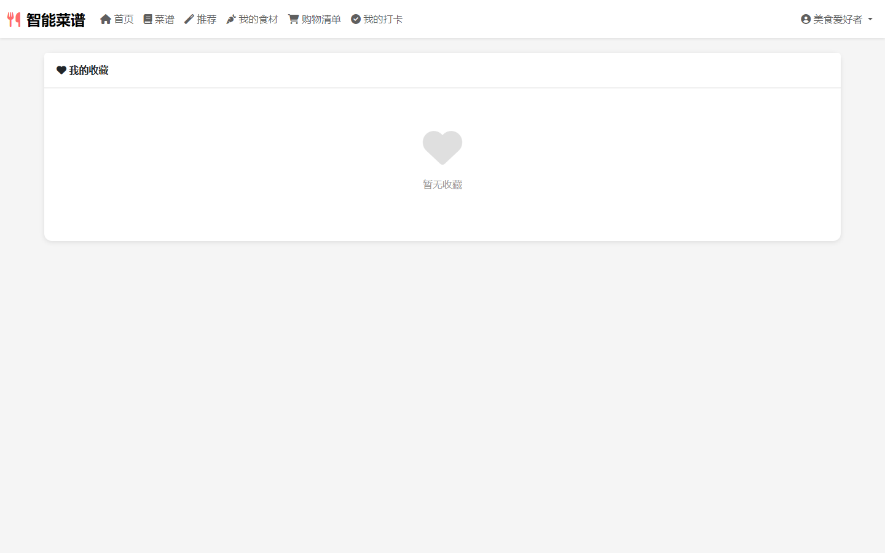
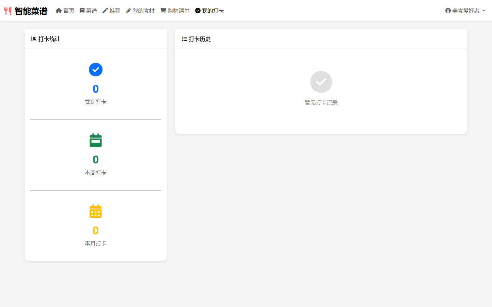
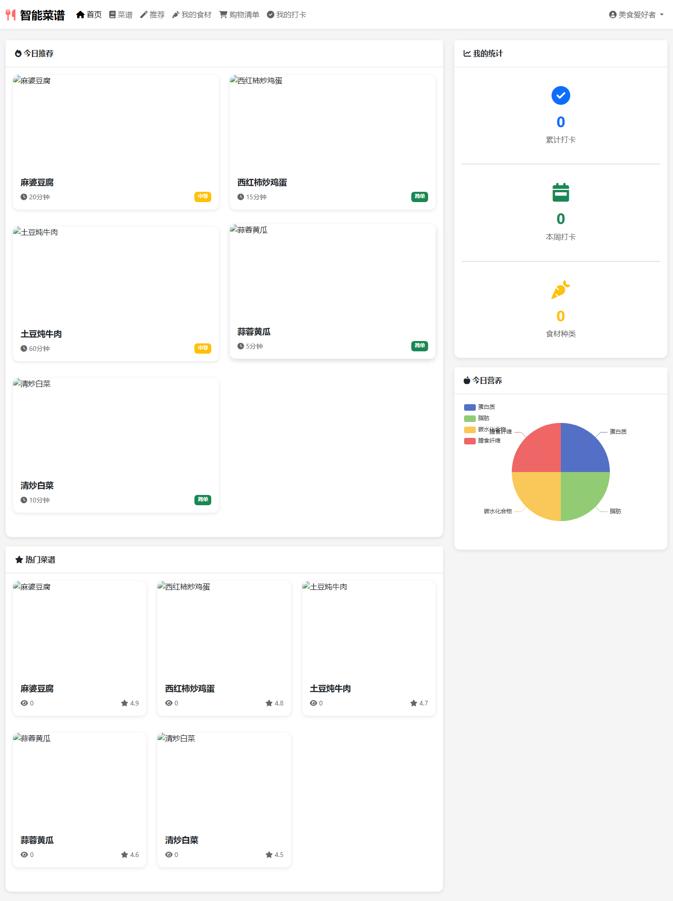
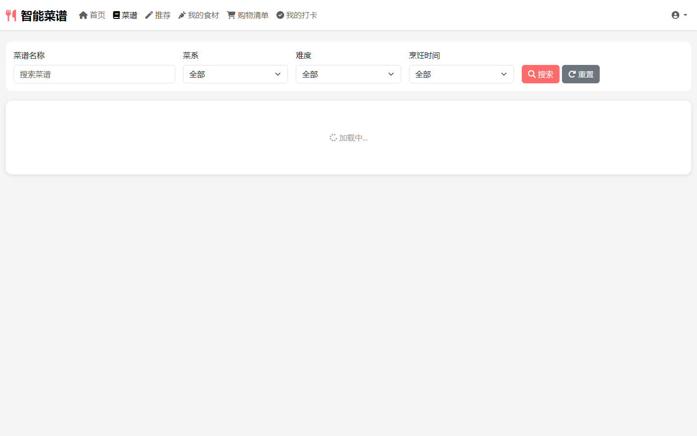
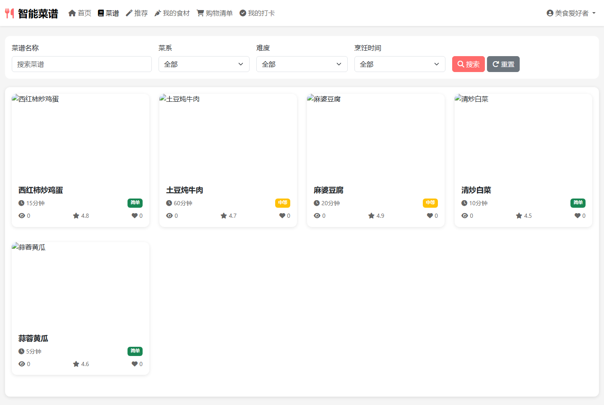
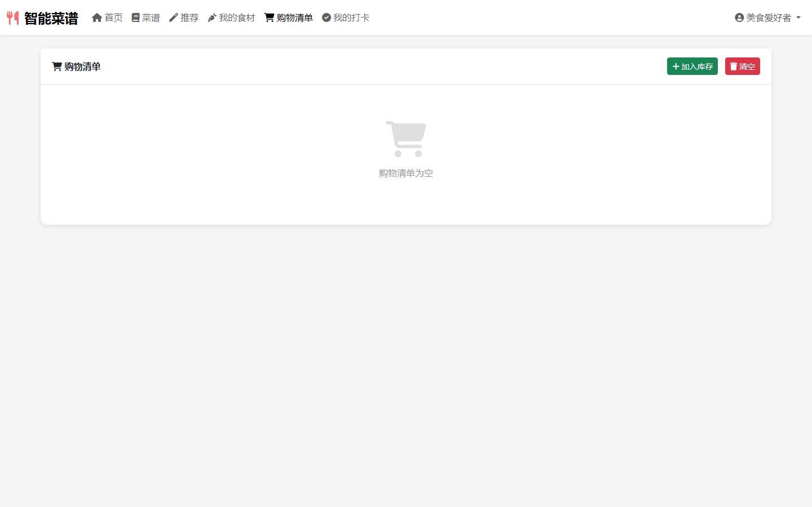

# 008 - 智能菜谱推荐系统

## 项目信息

- 项目编号：`008`
- 组件类型：`backend`
- 后端入口：`http://127.0.0.1:8008`
- 前端入口：`未启动`
- 账号来源：008-backend\README.md
- 已收录截图：`14` 张

## 默认账号

- `管理员`：`admin` / `123456`
- `用户1`：`user1` / `123456`
- `用户2`：`user2` / `123456`

## 预览截图

### admin

#### admin-01-index-html

#### admin-02-ingredients-html

#### admin-03-recipes-html

#### admin-04-users-html

### guest

#### guest-01-home

### user

#### user-01-collect-html

#### user-02-cooking-html

#### user-03-index-html

#### user-04-ingredients-html

#### user-05-profile-html

#### user-06-recipe-detail-html

#### user-07-recipes-html

#### user-08-recommend-html

#### user-09-shopping-html

