# 008 - 智能菜谱推荐系统

## 项目信息

- 项目编号：`008`
- 组件类型：`backend`
- 后端入口：`http://127.0.0.1:8008`
- 前端入口：`未启动`
- 账号来源：008-backend\README.md
- 已收录截图：`35` 张

## 默认账号

- `管理员`：`admin` / `123456`
- `用户1`：`user1` / `123456`
- `用户2`：`user2` / `123456`

## 预览截图

### 1

#### 1-user1-01-dashboard

#### 1-user1-02-智能菜谱

#### 1-user1-03-首页

#### 1-user1-04-菜谱

#### 1-user1-05-推荐

#### 1-user1-06-我的食材

#### 1-user1-07-我的食材-添加食材-dialog

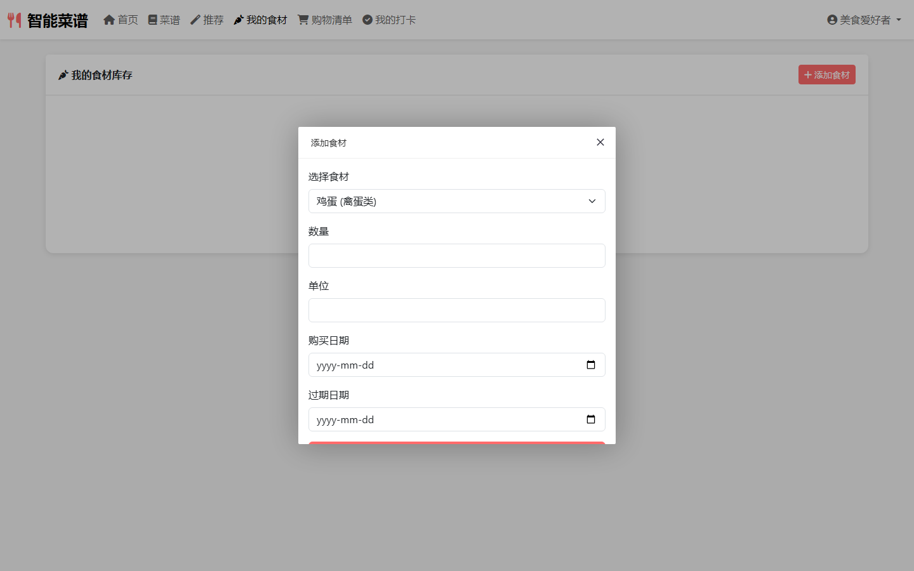

### 2

#### 2-user2-01-dashboard

#### 2-user2-02-智能菜谱

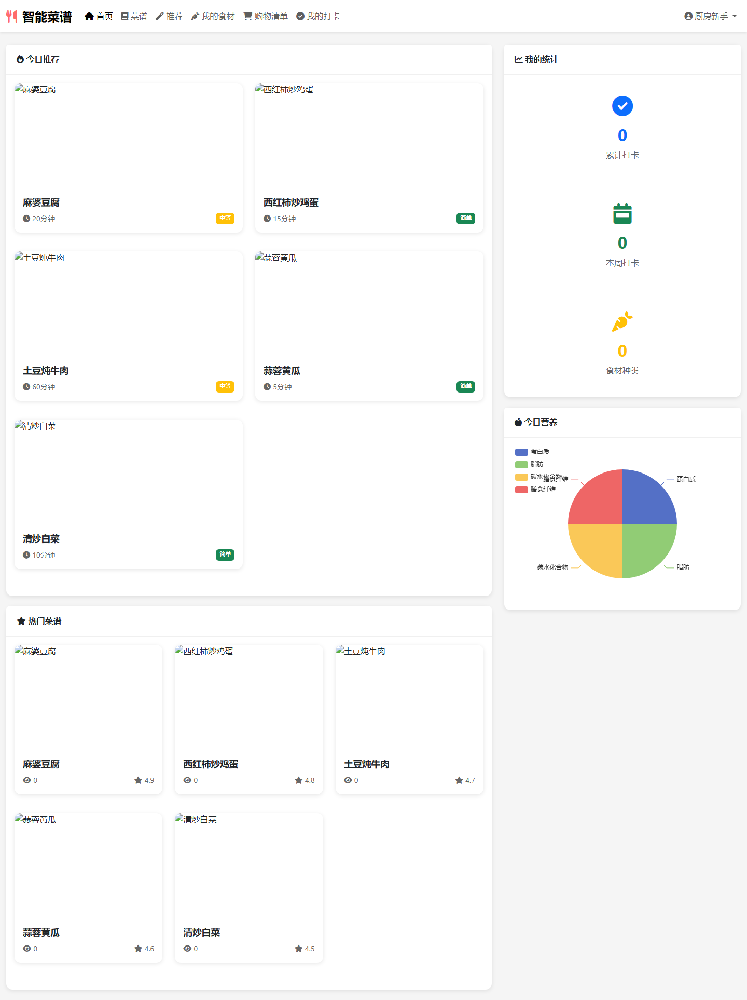

#### 2-user2-03-首页

#### 2-user2-04-菜谱

#### 2-user2-05-推荐

#### 2-user2-06-我的食材

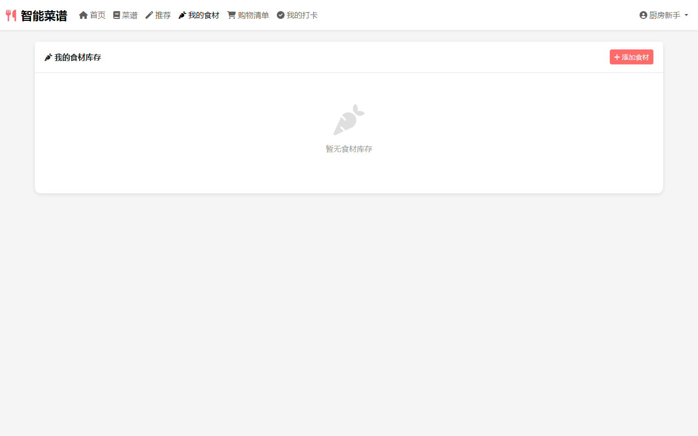

#### 2-user2-07-我的食材-添加食材-dialog

### admin

#### admin-01-dashboard

#### admin-02-管理后台

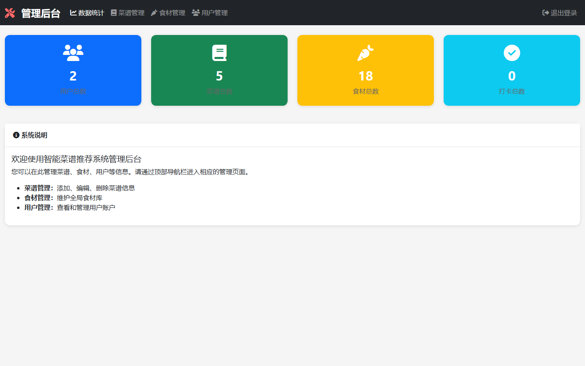

#### admin-03-数据统计

#### admin-04-菜谱管理

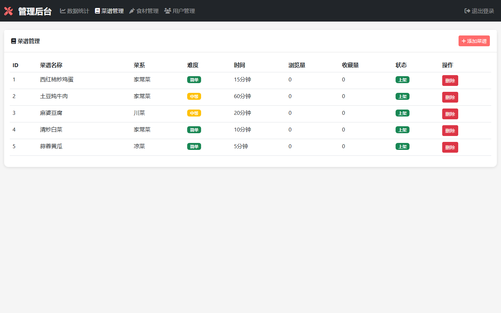

#### admin-05-食材管理

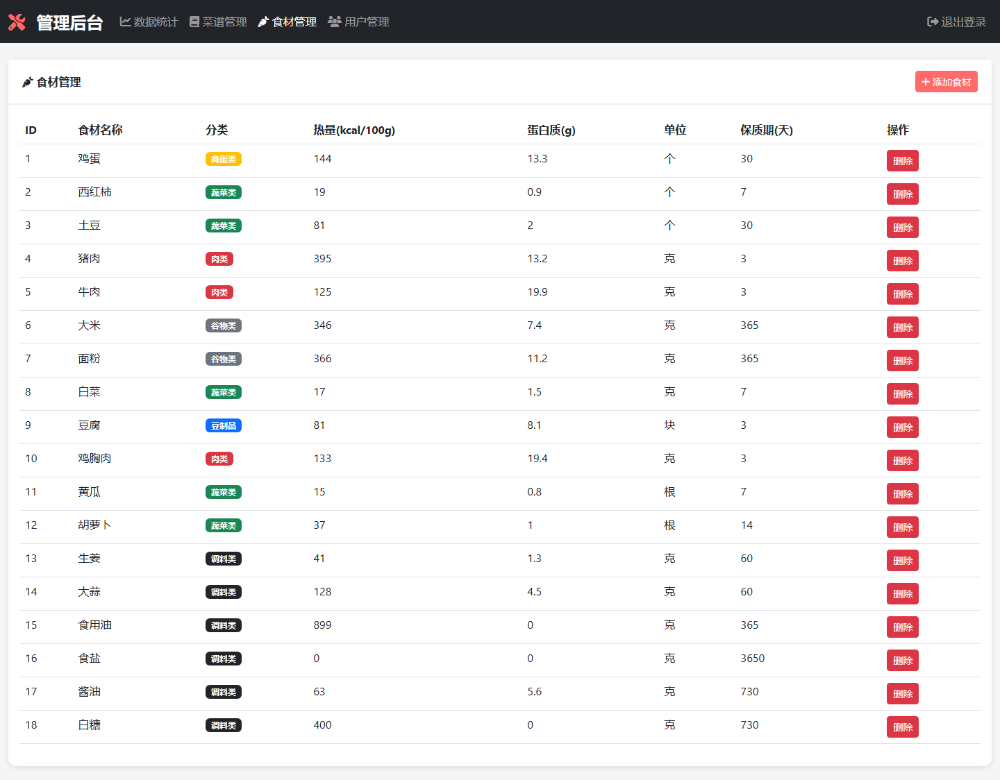

#### admin-06-用户管理

#### admin-10-dashboard

#### admin-11-recipes

#### admin-12-ingredients

#### admin-13-users

### guest

#### guest-01-index

#### guest-02-home

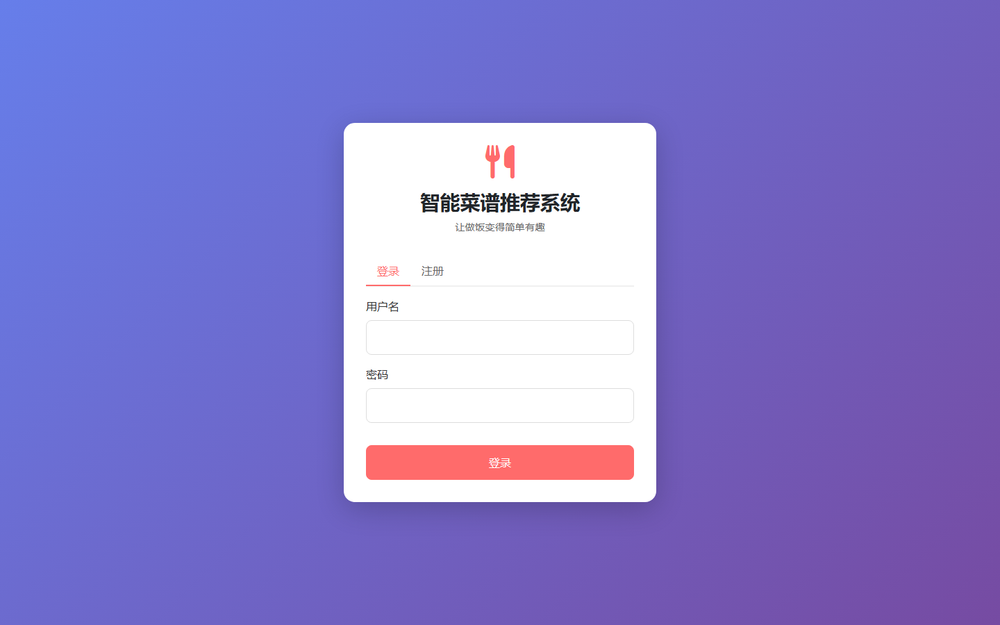

### user

#### user-user1-10-home

#### user-user1-11-recipes

#### user-user1-12-recommend

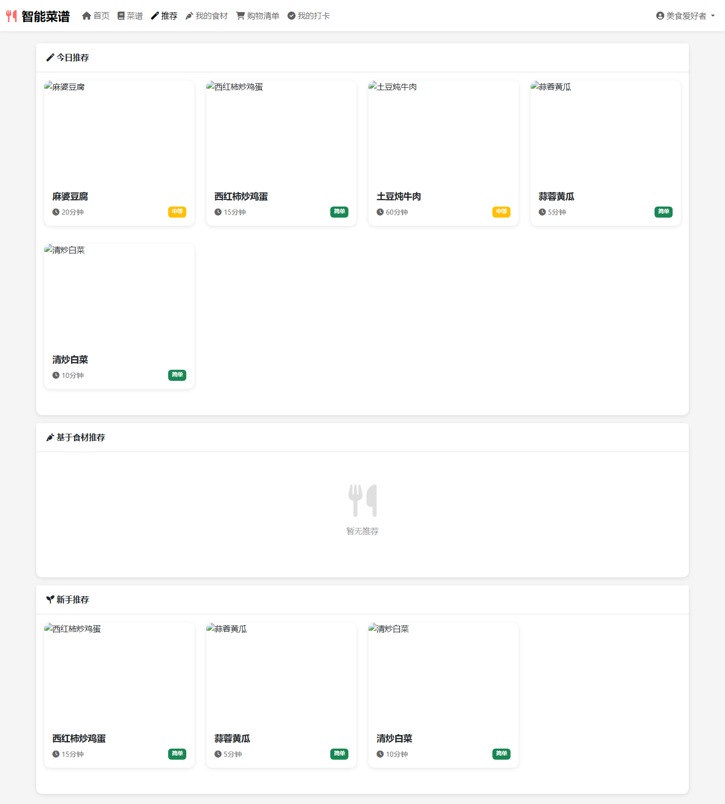

#### user-user1-13-ingredients

#### user-user1-14-shopping

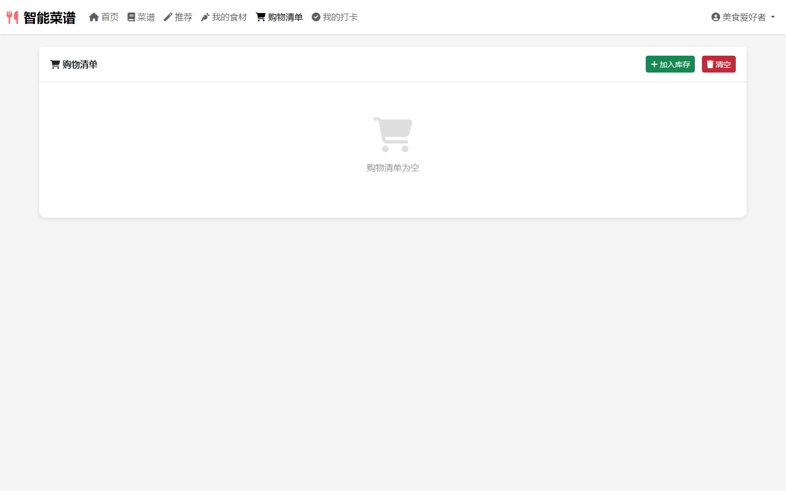

#### user-user1-15-cooking

#### user-user1-16-collect

#### user-user1-17-profile

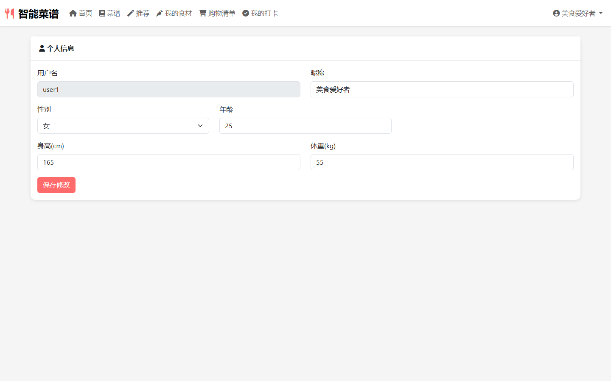

#### user-user1-18-recipe-detail

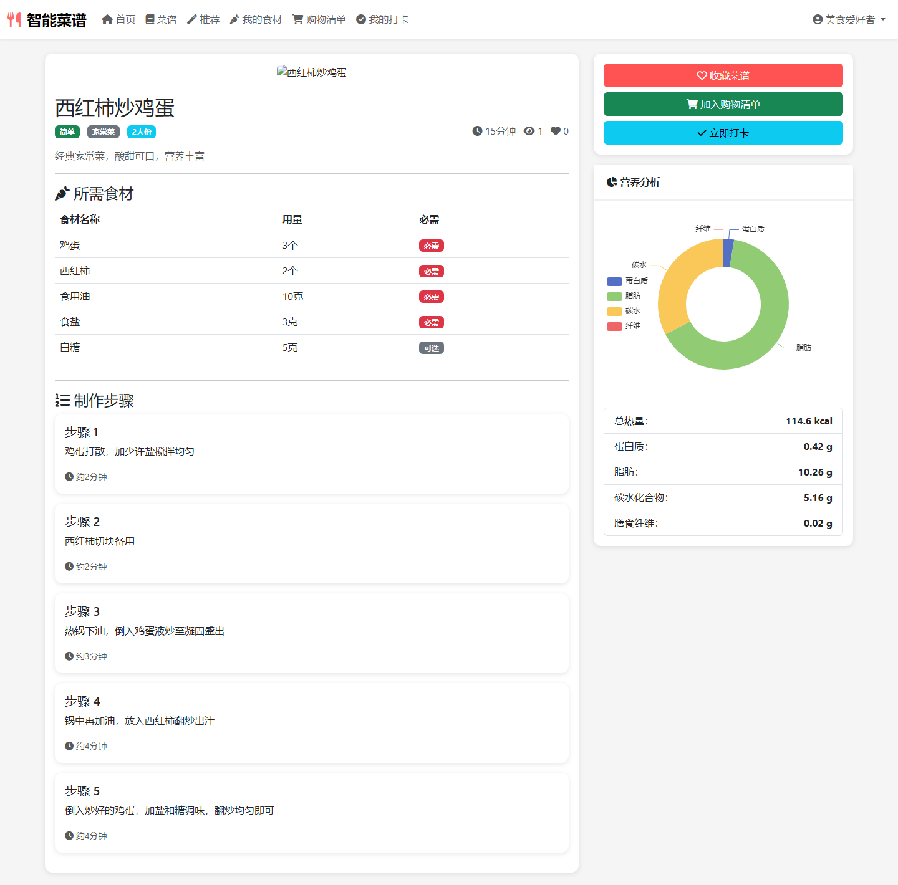
