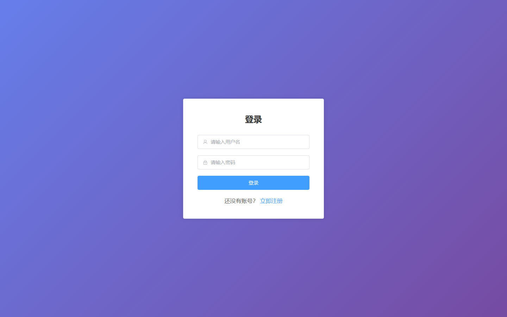
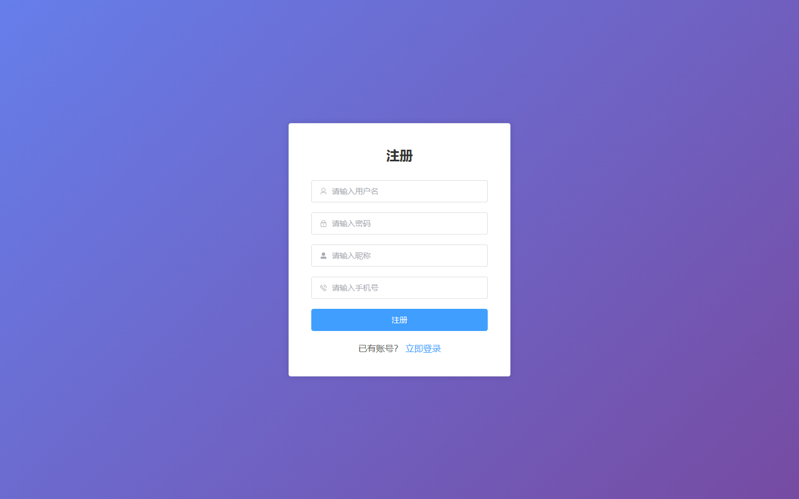

# 011 - 校园短视频创作与分享平台 🔥最新

## 项目信息

- 项目编号：`011`
- 组件类型：`backend, frontend`
- 后端入口：`http://127.0.0.1:8011`
- 前端入口：`http://127.0.0.1:5173`
- 账号来源：011-backend\ACCOUNTS.md
- 已收录截图：`10` 张

## 默认账号

- `ADMIN`：`admin` / `123456`
- `USER`：`test1` / `123456`
- `USER`：`test2` / `123456`
- `USER`：`test3` / `123456`
- `USER`：`test4` / `123456`

## 预览截图

### guest

#### guest-01-following

#### guest-02-publish

#### guest-03-notification

#### guest-04-profile

#### guest-05-drafts

#### guest-06-creator-center

#### guest-07-points-mall

#### guest-08-search

#### guest-09-login

#### guest-10-register

