# 015 - 校园表白墙与匿名社交平台 🔥最新

## 项目信息

- 项目编号：`015`
- 组件类型：`backend`
- 后端入口：`http://127.0.0.1:8080`
- 前端入口：`未启动`
- 账号来源：015-backend\ACCOUNTS.md, 015-backend\README.md
- 已收录截图：`23` 张

## 默认账号

- `用户`：`admin` / `admin123`
- `用户`：`20210001` / `123456`
- `用户`：`20210002` / `123456`
- `超级管理员`：`admin` / `admin123`

## 预览截图

### admin

#### admin-10-dashboard

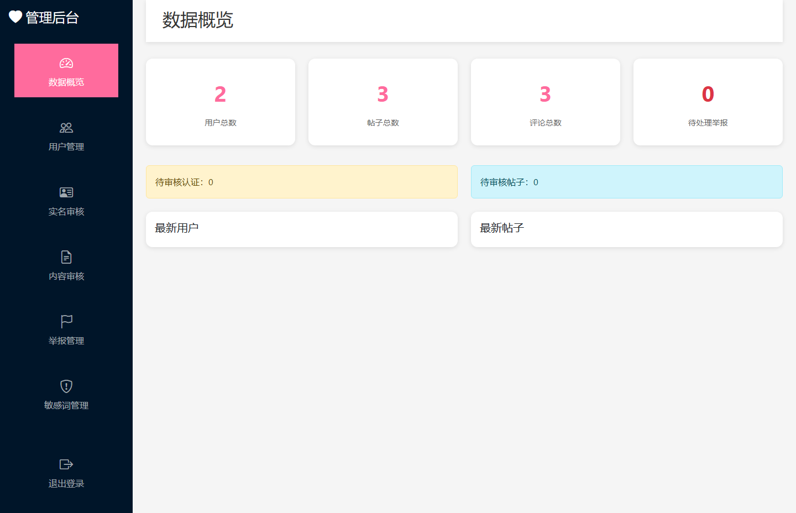

#### admin-11-users

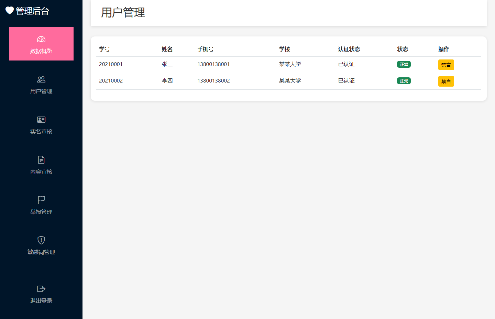

#### admin-12-auth-audit

#### admin-13-post-audit

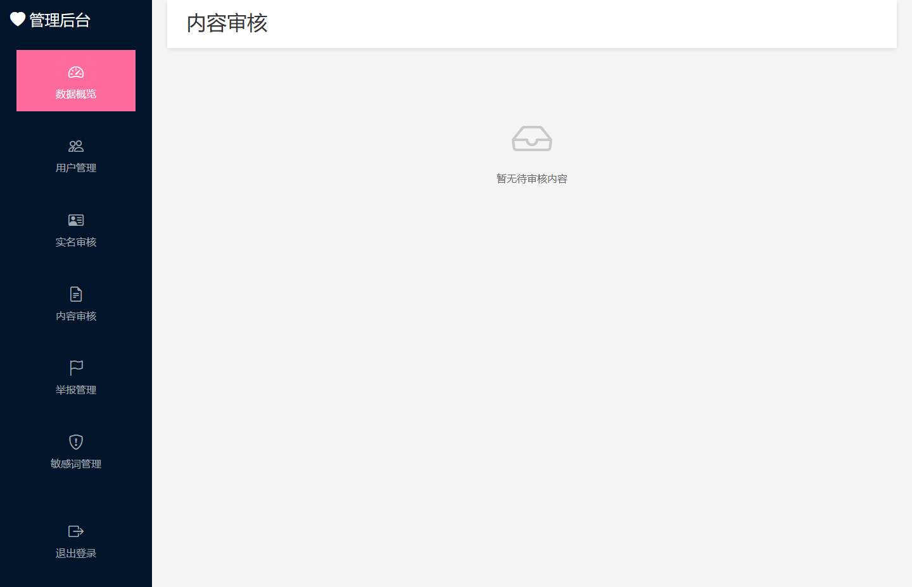

#### admin-14-report-management

#### admin-15-sensitive-words

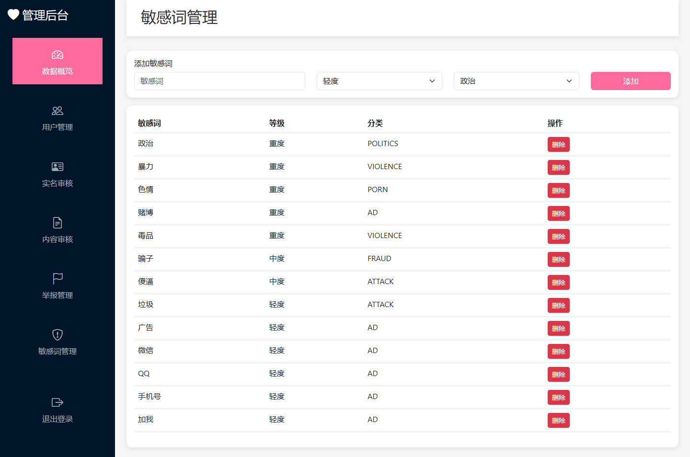

### guest

#### guest-01-index

### user

#### user-20210001-01-dashboard

#### user-20210001-02-校园表白墙

#### user-20210001-10-home

#### user-20210001-11-post-detail

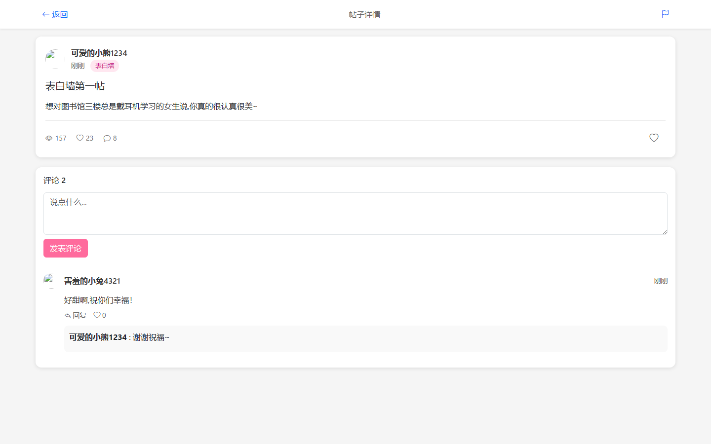

#### user-20210001-12-create-post

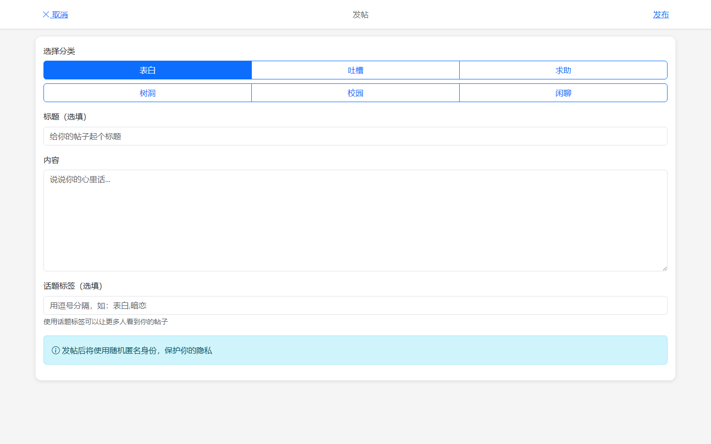

#### user-20210001-13-search

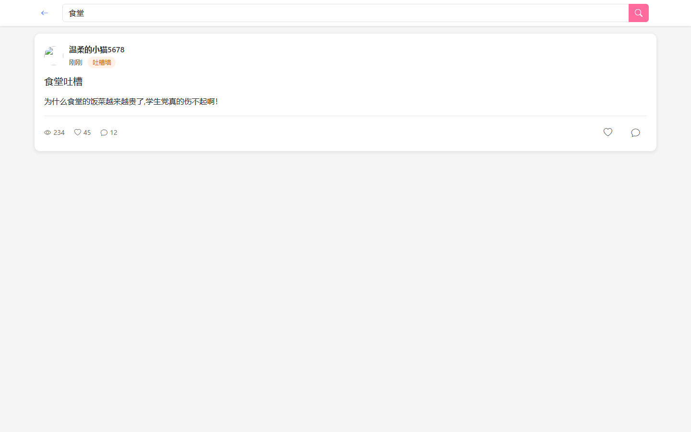

#### user-20210001-14-messages

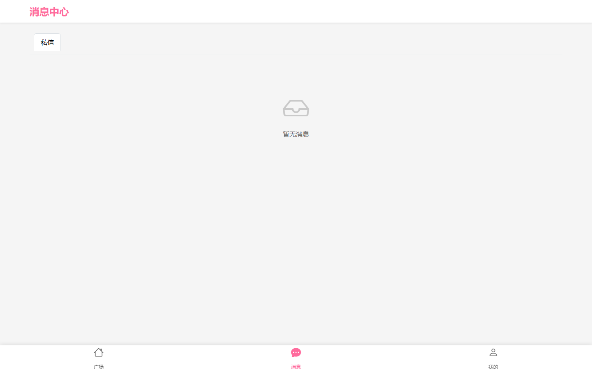

#### user-20210001-15-profile

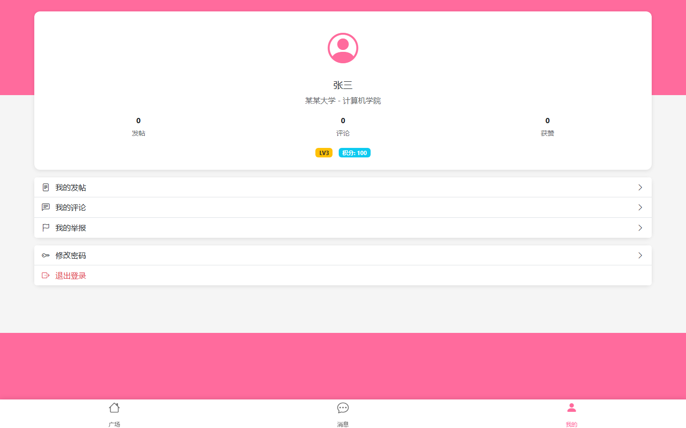

#### user-20210001-16-my-posts

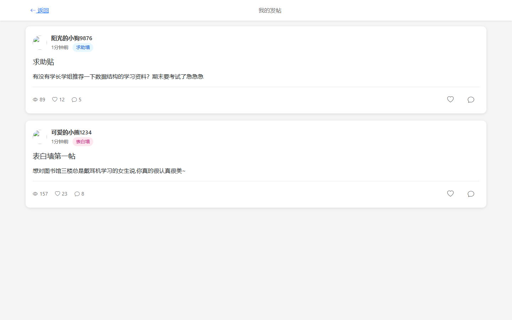

#### user-20210001-17-my-comments

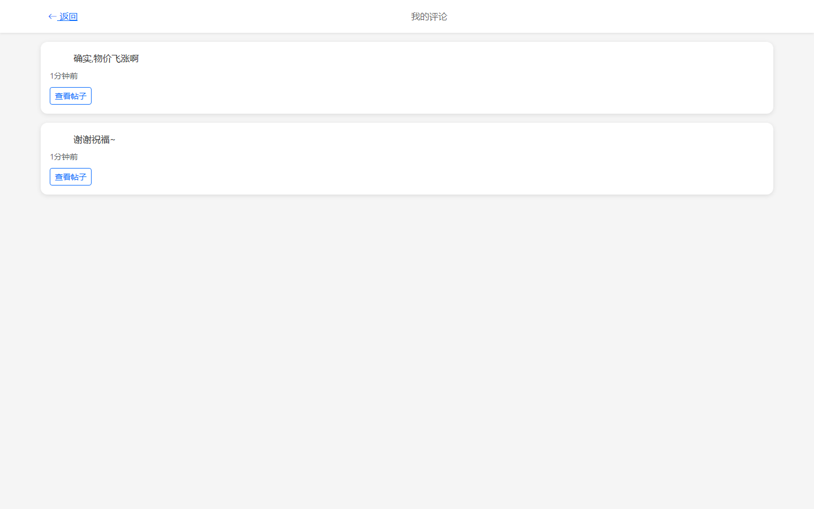

#### user-20210001-18-my-reports

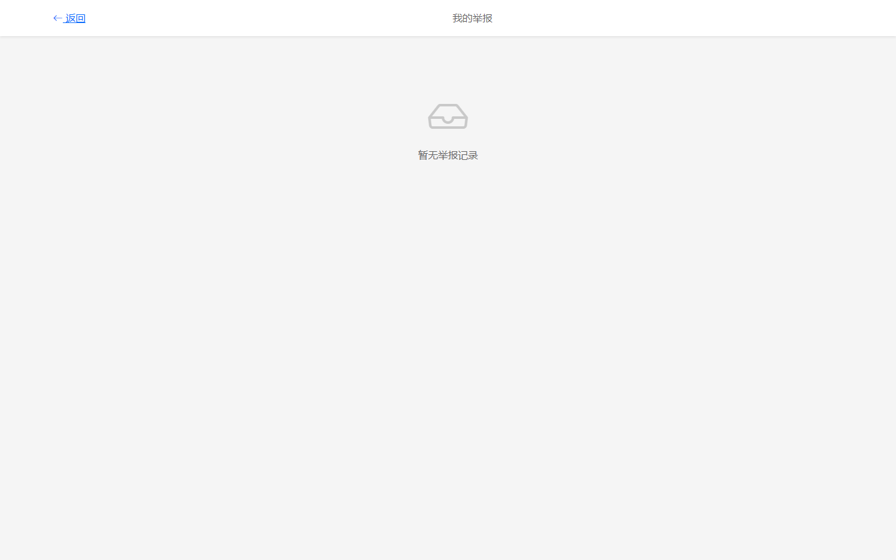

#### user-20210001-19-create-post-filled

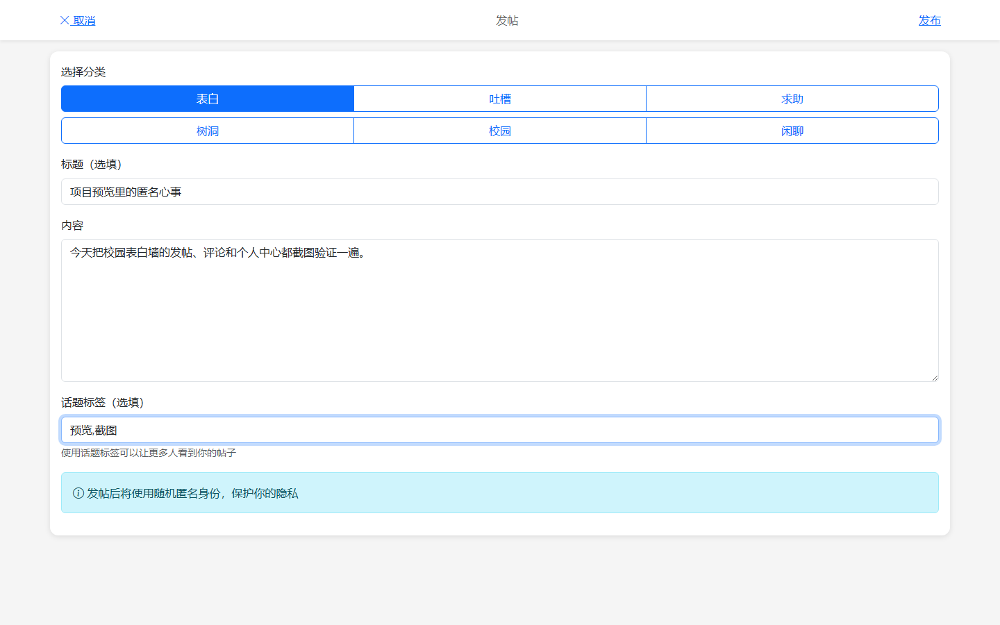

#### user-20210001-20-password-dialog

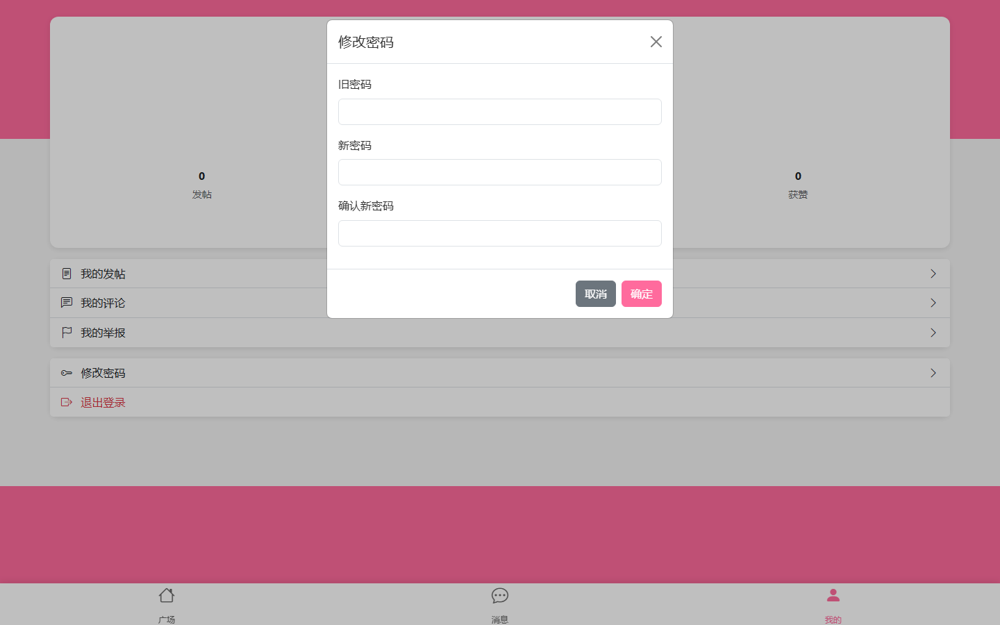

#### user-20210001-21-comment-form

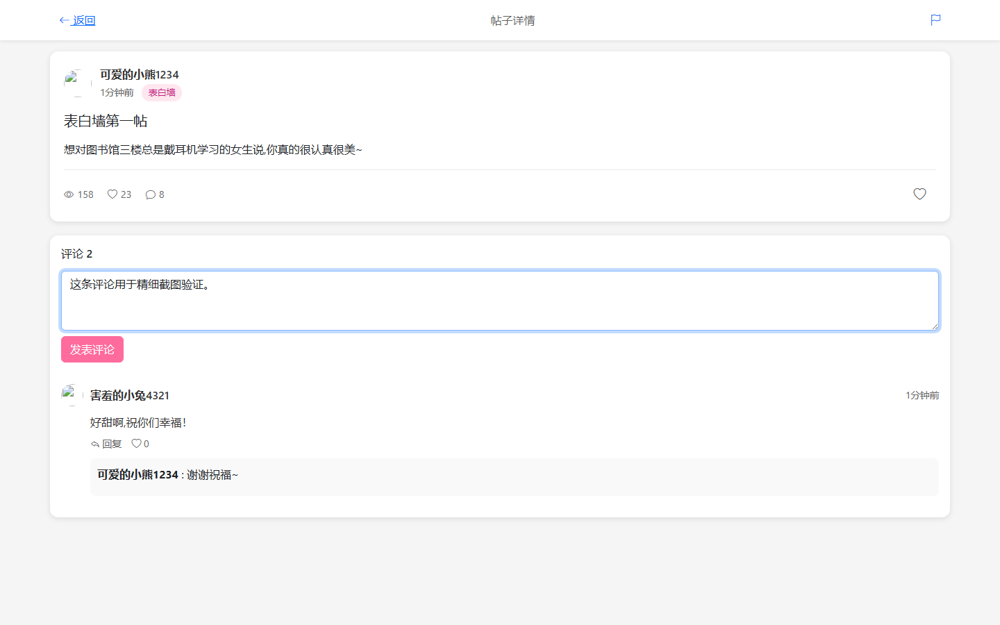

#### user-20210002-01-dashboard

#### user-20210002-02-校园表白墙

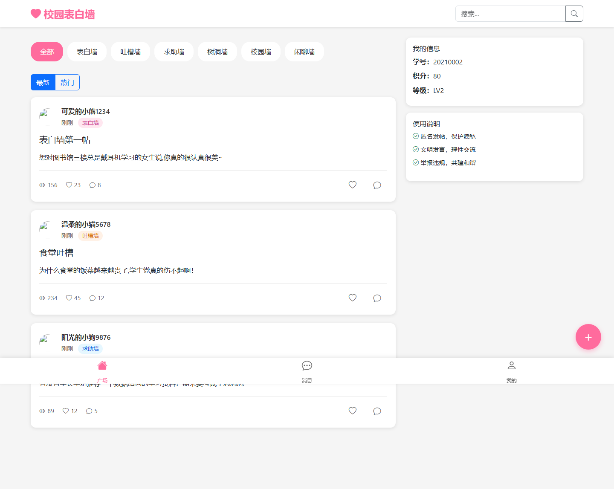
