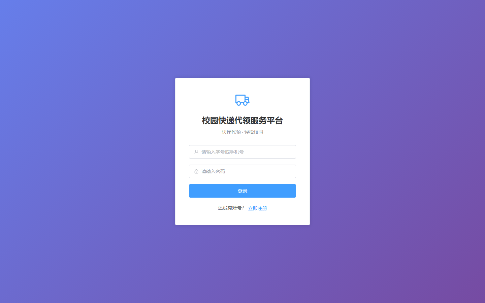
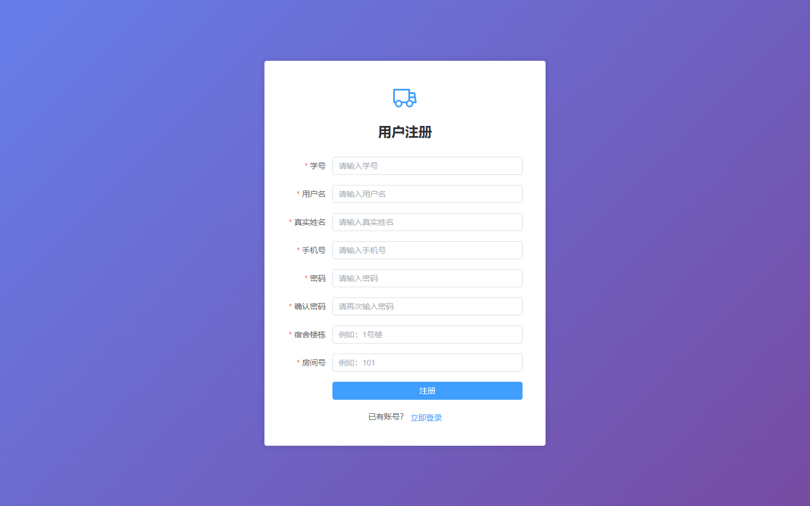

# 016 - 校园快递代领服务平台 🔥最新

## 项目信息

- 项目编号：`016`
- 组件类型：`backend, frontend`
- 后端入口：`http://127.0.0.1:8080`
- 前端入口：`http://127.0.0.1:5173`
- 账号来源：016-backend\ACCOUNTS.md
- 已收录截图：`8` 张

## 默认账号

- `管理员`：`admin` / `admin123`
- `用户`：`user001` / `123456`
- `用户`：`user002` / `123456`

## 预览截图

### guest

#### guest-01-home

#### guest-02-publish

#### guest-03-my-orders

#### guest-04-wallet

#### guest-05-profile

#### guest-06-notifications

#### guest-07-login

#### guest-08-register

