# 016 - 校园快递代领服务平台 🔥最新

## 项目信息

- 项目编号：`016`
- 组件类型：`backend, frontend`
- 后端入口：`http://127.0.0.1:8080`
- 前端入口：`http://127.0.0.1:5173`
- 账号来源：016-backend\ACCOUNTS.md
- 已收录截图：`17` 张

## 默认账号

- `管理员`：`admin` / `admin123`
- `用户`：`user001` / `123456`
- `用户`：`user002` / `123456`

## 预览截图

### admin

#### admin-10-dashboard

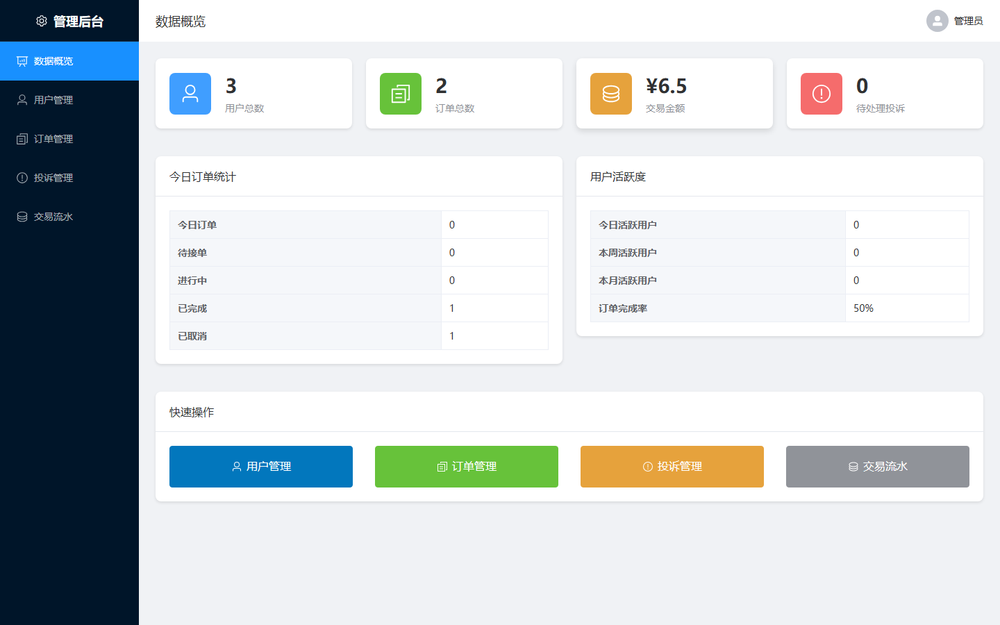

#### admin-11-users

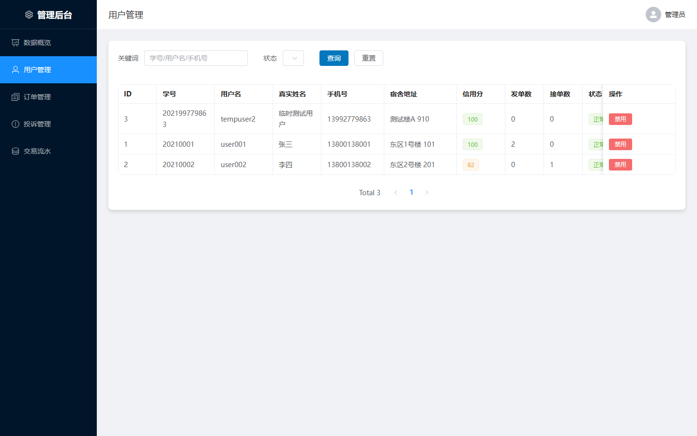

#### admin-12-orders

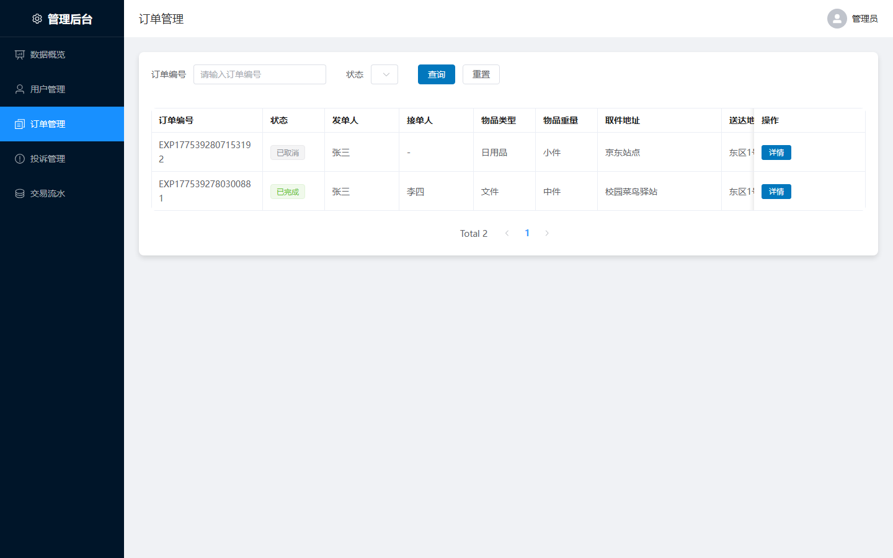

#### admin-13-complaints

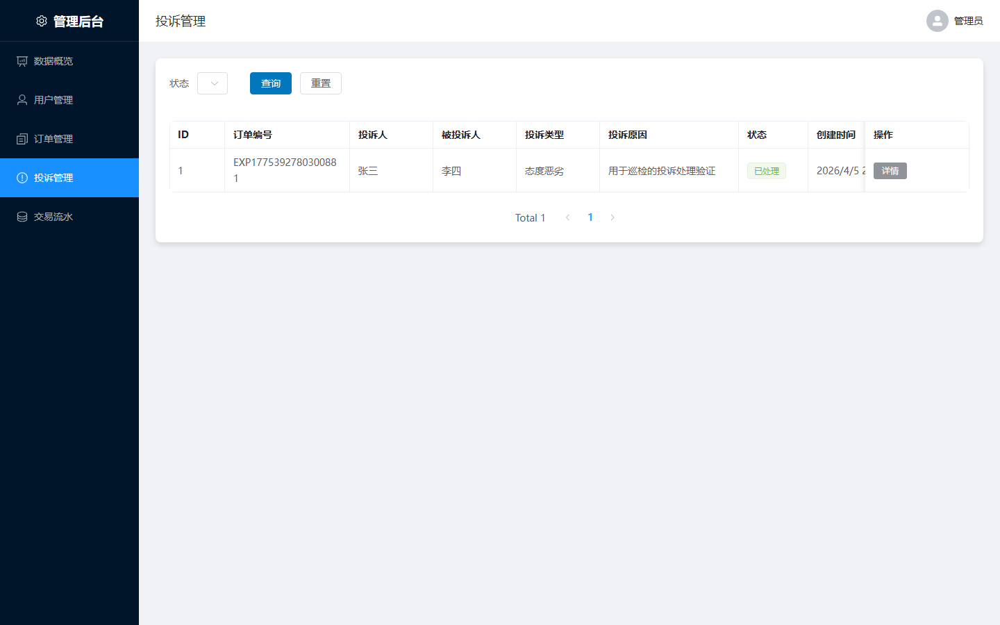

#### admin-14-transactions

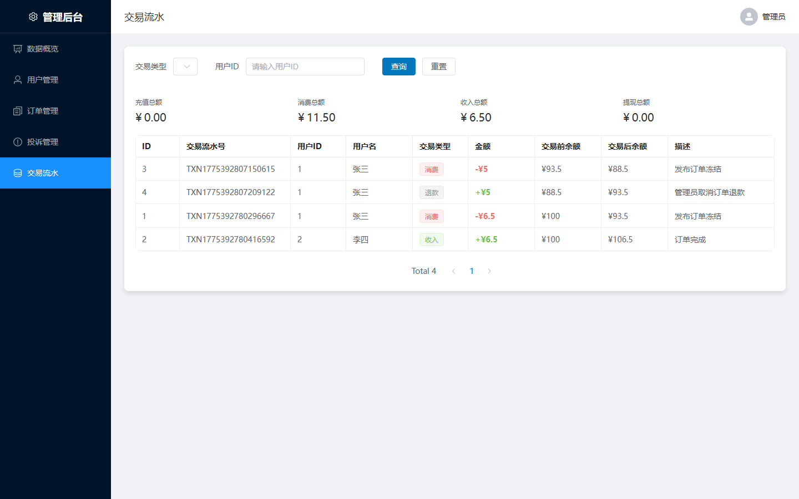

### guest

#### guest-01-index

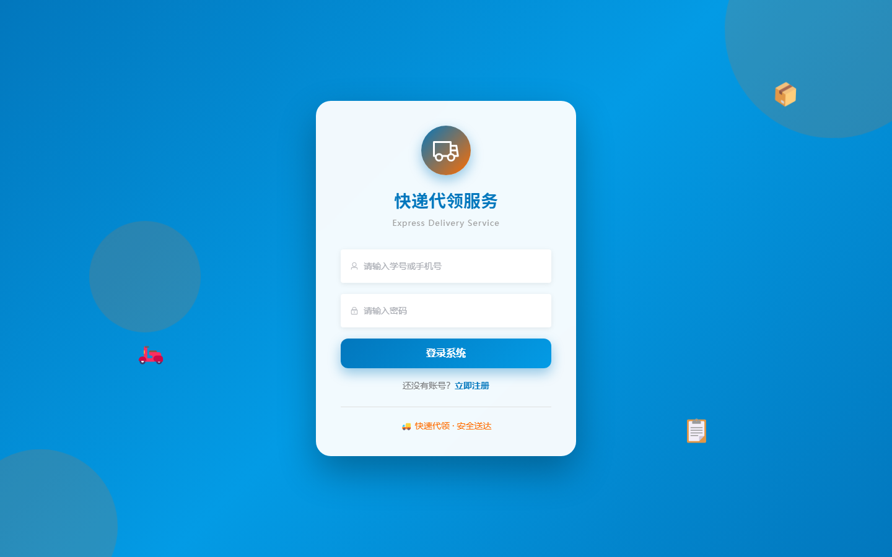

#### guest-02-login

#### guest-03-register

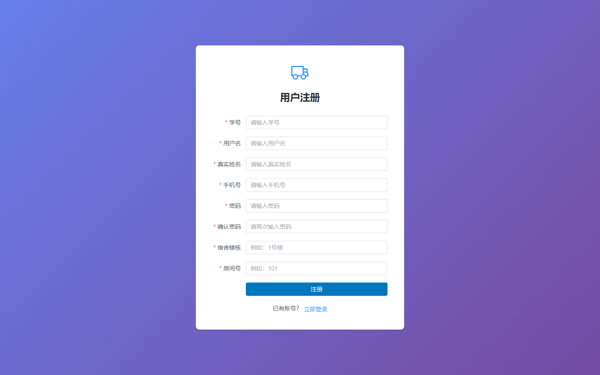

#### guest-04-register

#### guest-05-products

### user

#### user-user001-10-home

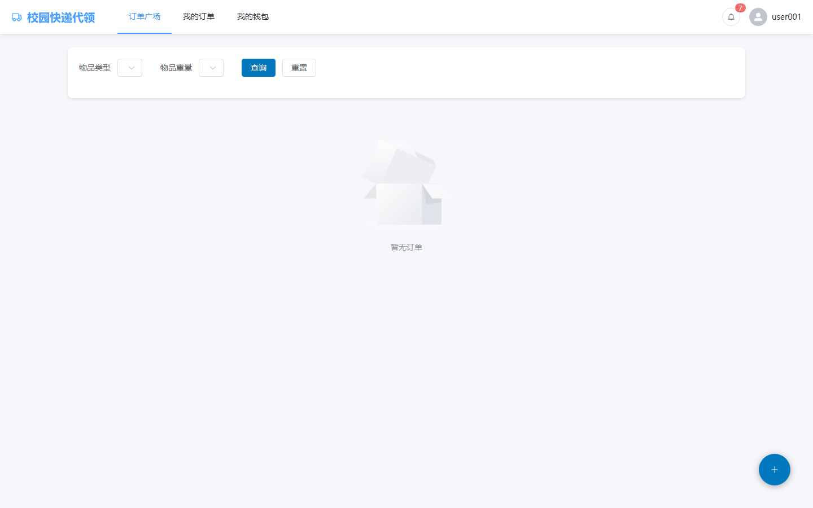

#### user-user001-11-publish

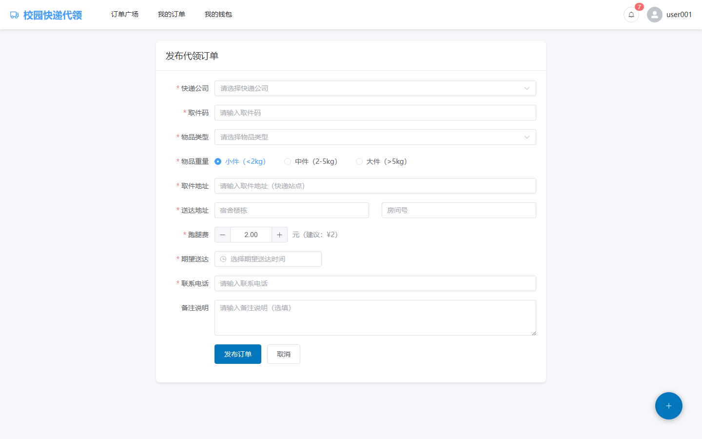

#### user-user001-12-my-orders

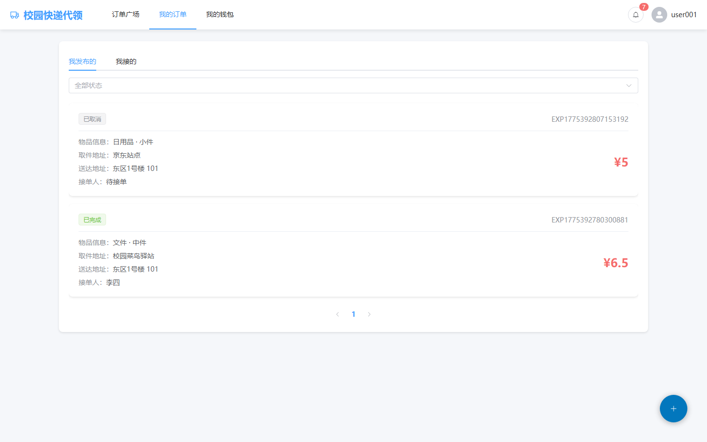

#### user-user001-13-wallet

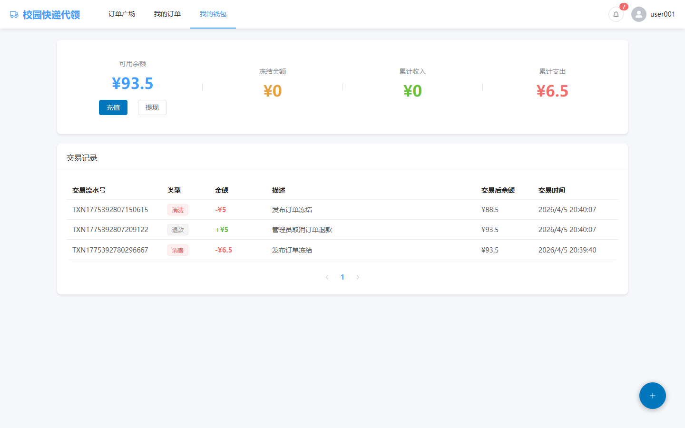

#### user-user001-14-notifications

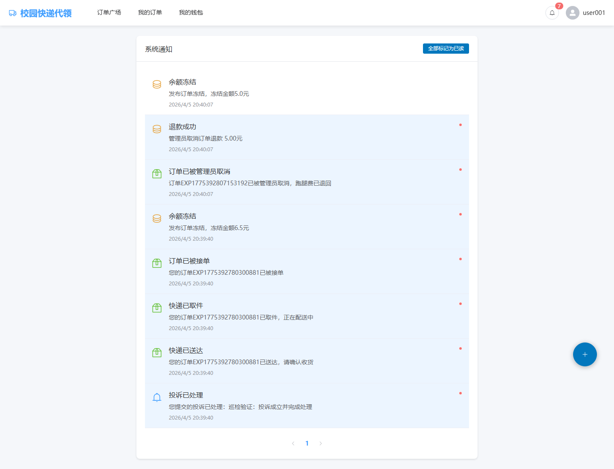

#### user-user001-15-profile

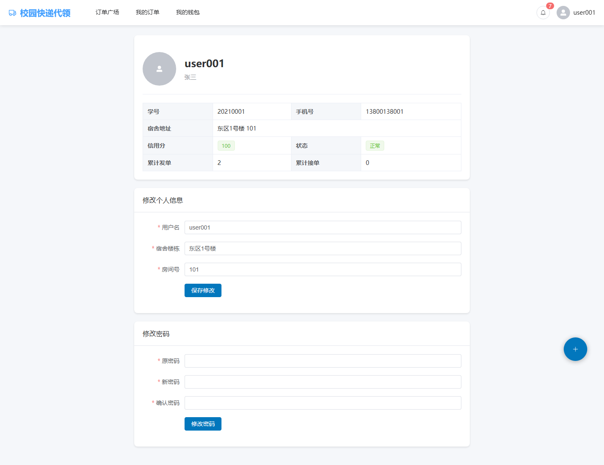

#### user-user001-17-recharge-dialog

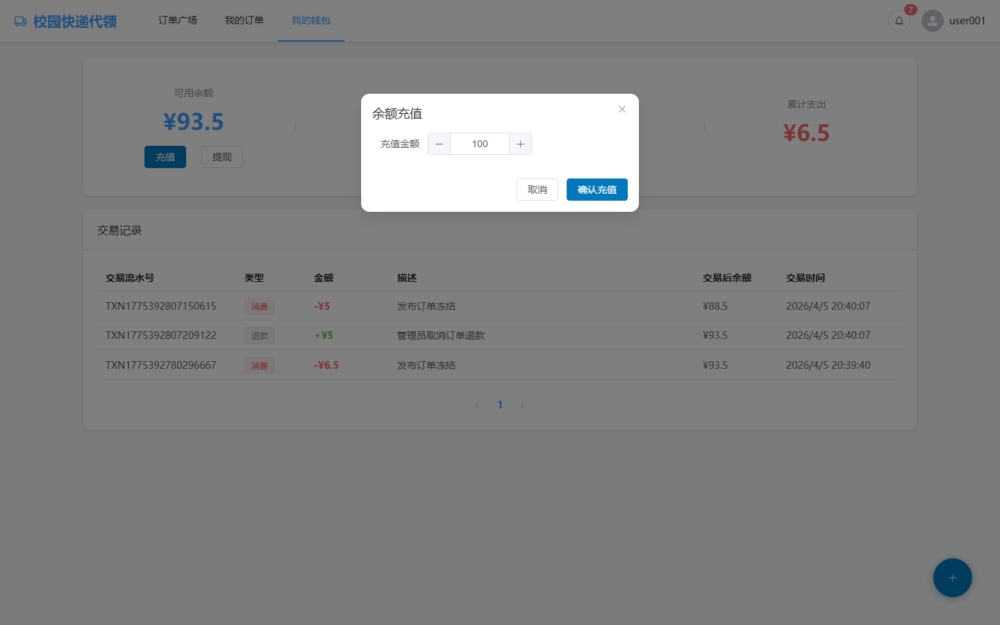
