# 017 - 高校自助点餐系统 🔥最新

## 项目信息

- 项目编号：`017`
- 组件类型：`backend`
- 后端入口：`http://127.0.0.1:8080`
- 前端入口：`未启动`
- 账号来源：017-backend\ACCOUNTS.md, 017-backend\README.md
- 已收录截图：`16` 张

## 默认账号

- `管理员`：`admin` / `admin123`
- `学生`：`20210001` / `123456`
- `学生`：`20210002` / `123456`

## 预览截图

### admin

#### admin-10-dashboard

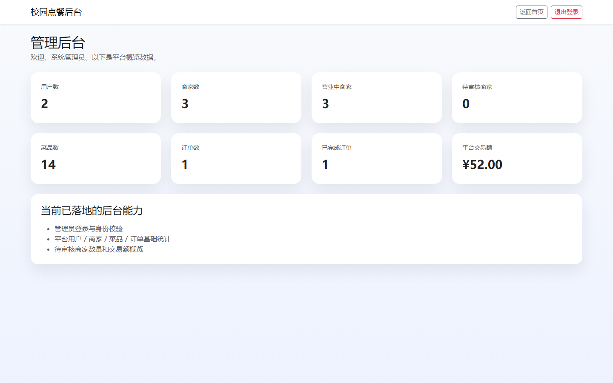

### guest

#### guest-01-home

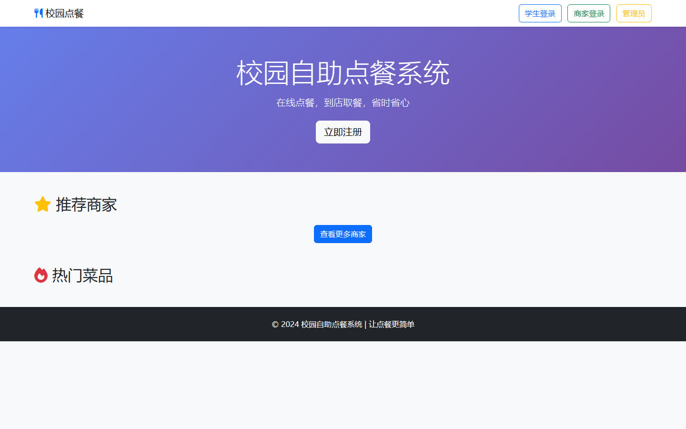

#### guest-10-index

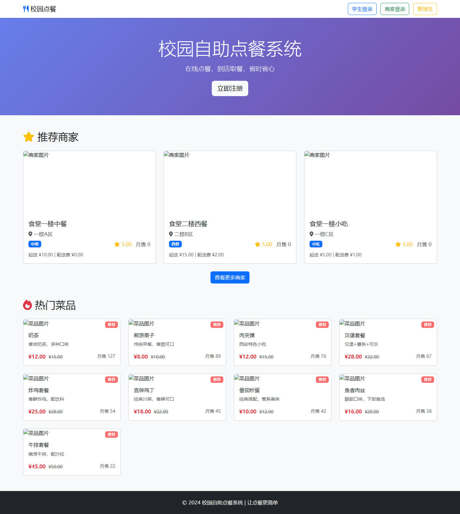

#### guest-11-merchant-list

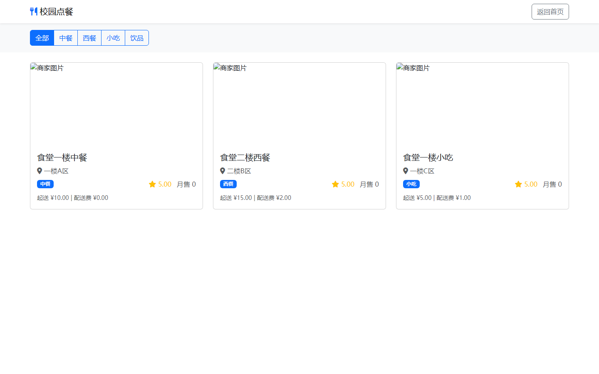

#### guest-12-merchant-detail

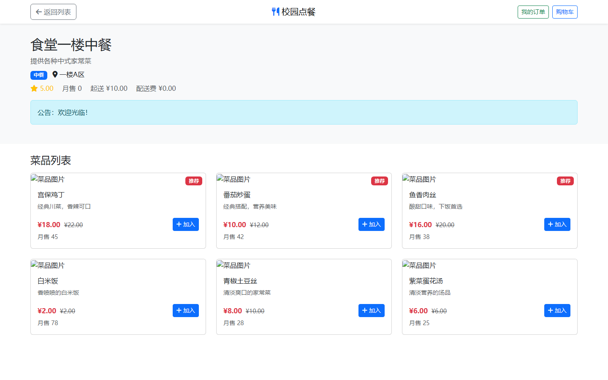

#### guest-13-user-login

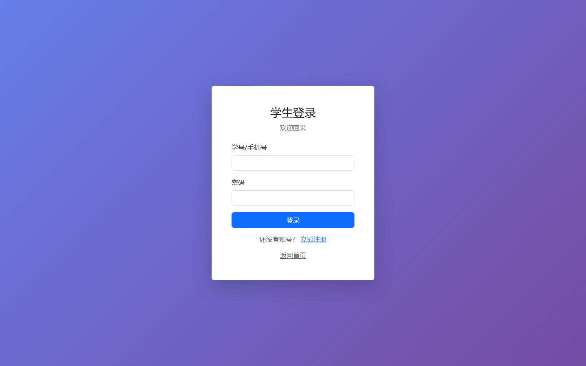

#### guest-14-user-register

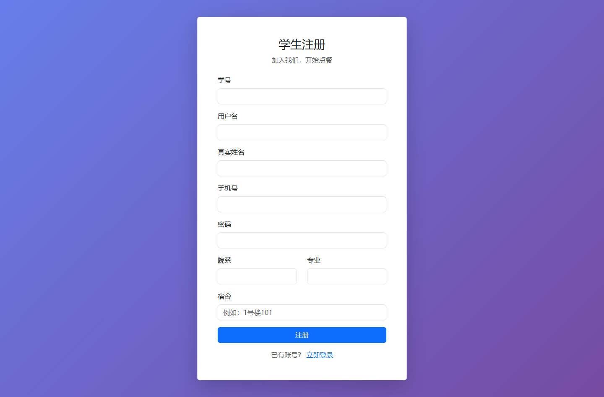

#### guest-15-merchant-login

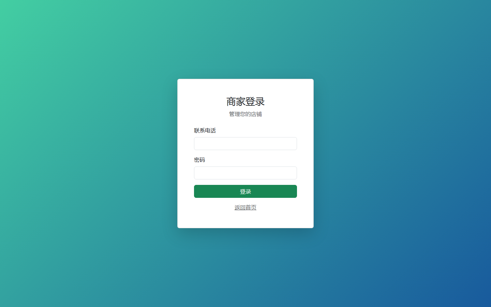

#### guest-16-admin-login

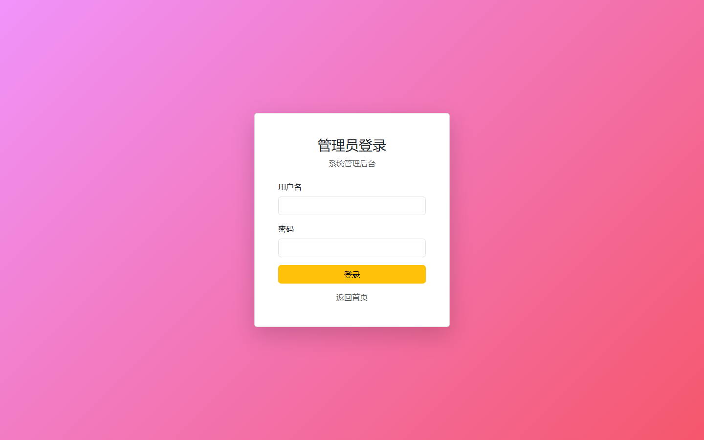

### merchant

#### merchant-13900000001-10-manage-pending

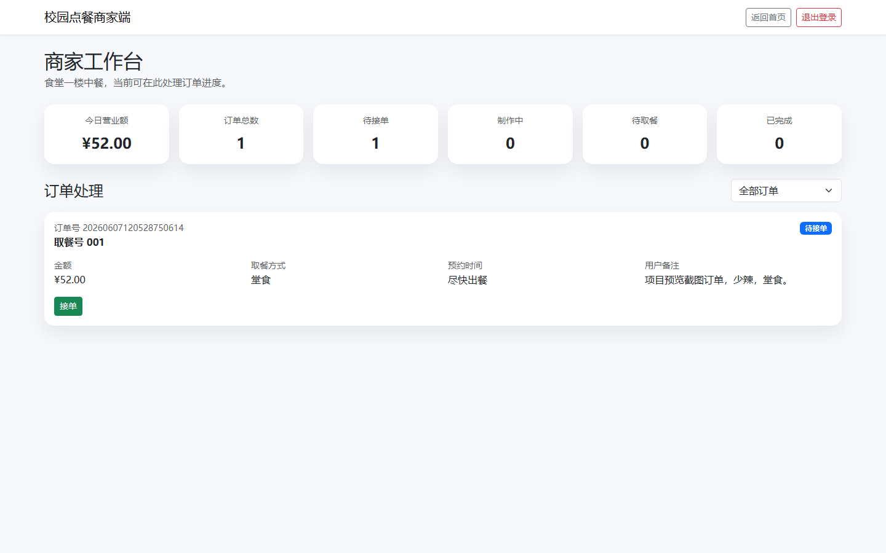

#### merchant-13900000001-11-manage-accepted

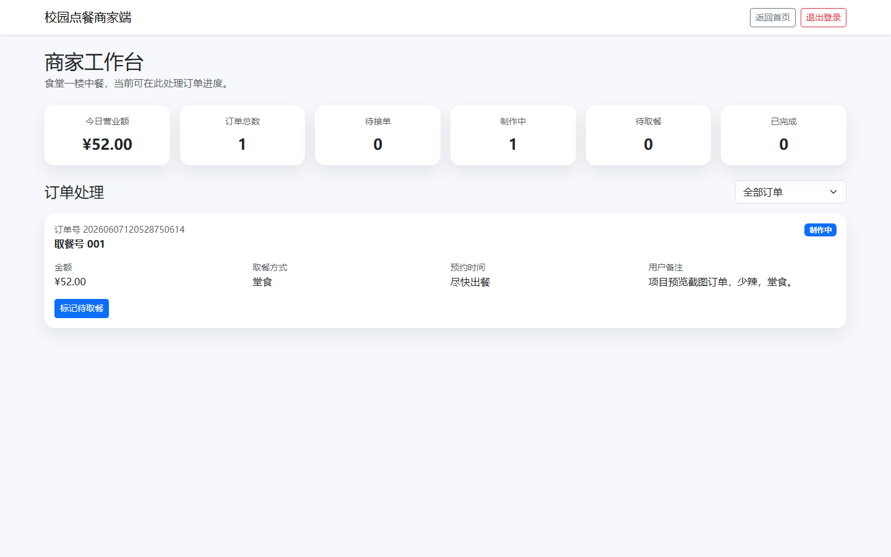

#### merchant-13900000001-12-manage-ready

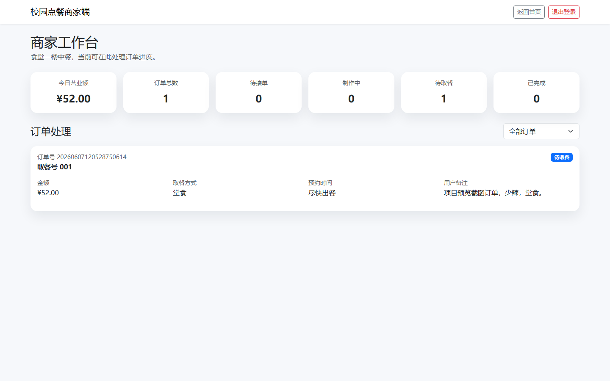

### user

#### user-20210001-13-orders-pending

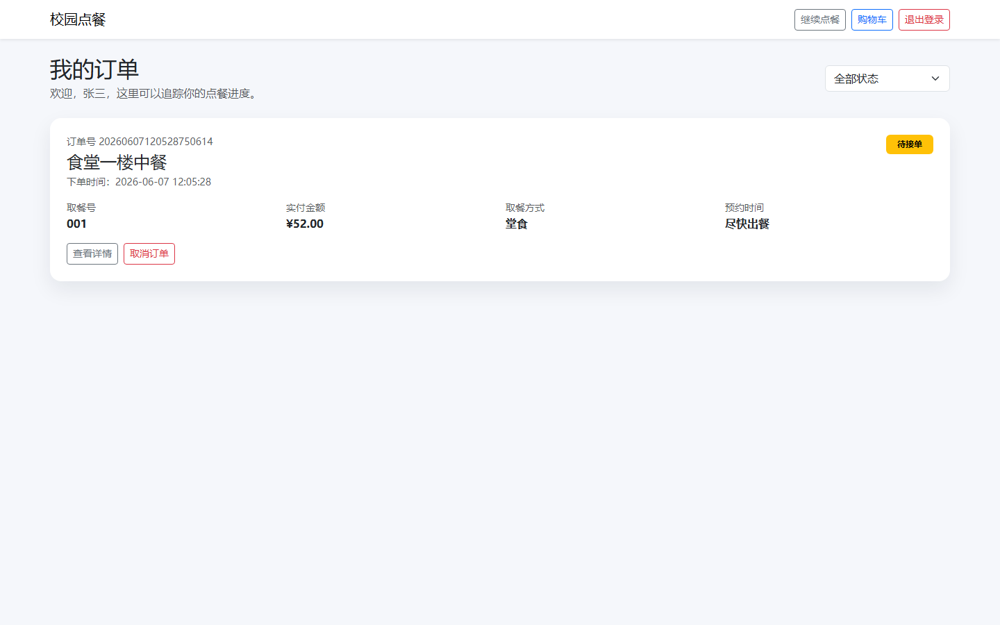

#### user-20210001-14-order-detail

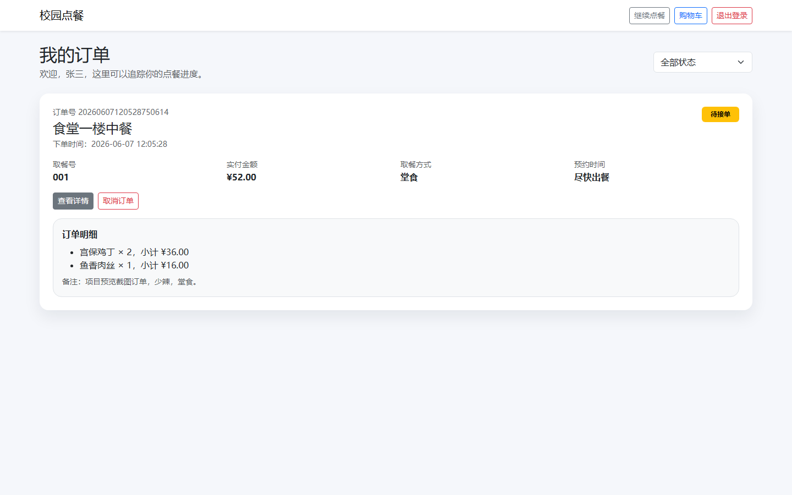

#### user-20210001-15-orders-ready

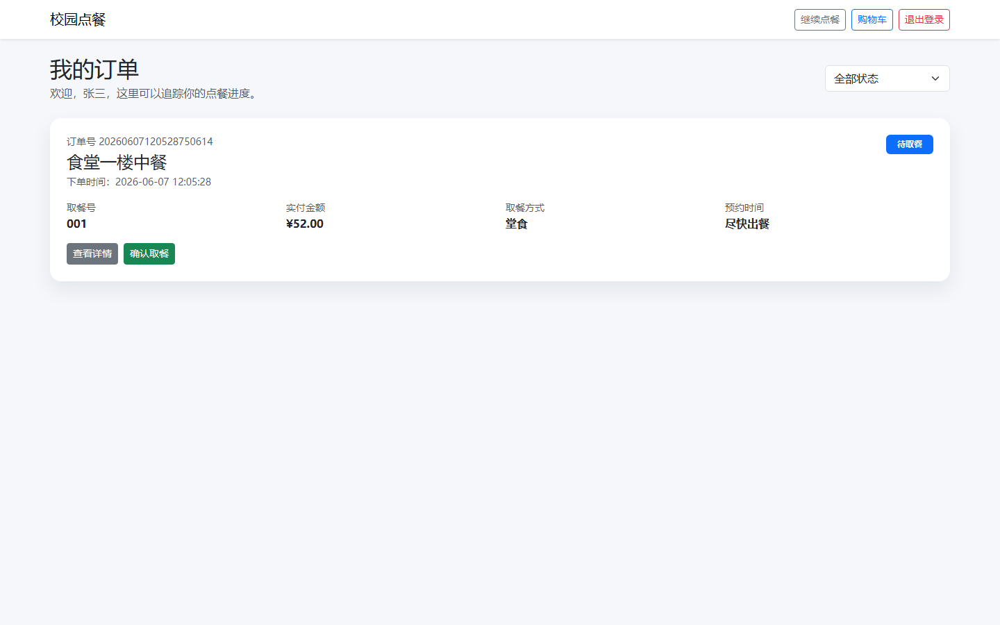

#### user-20210001-16-orders-completed

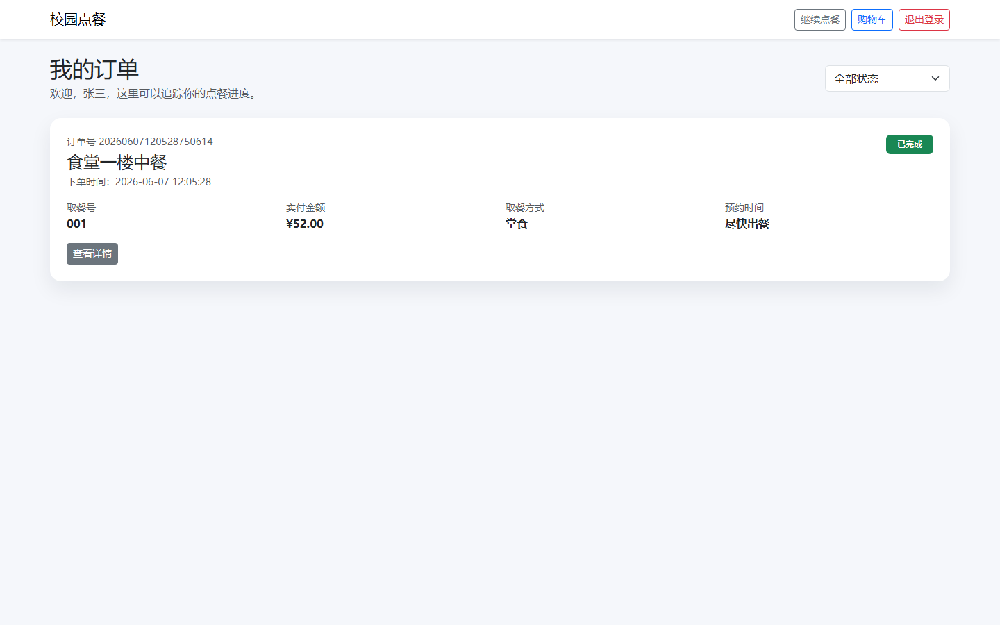
