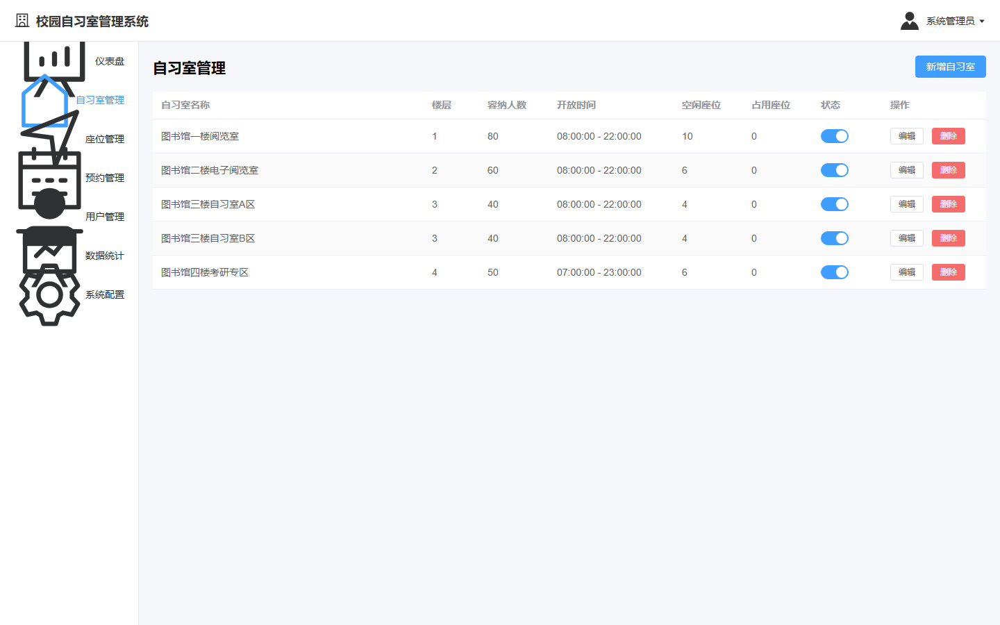
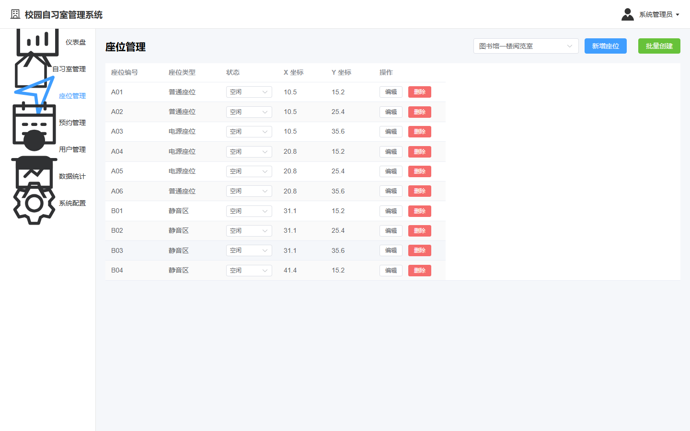
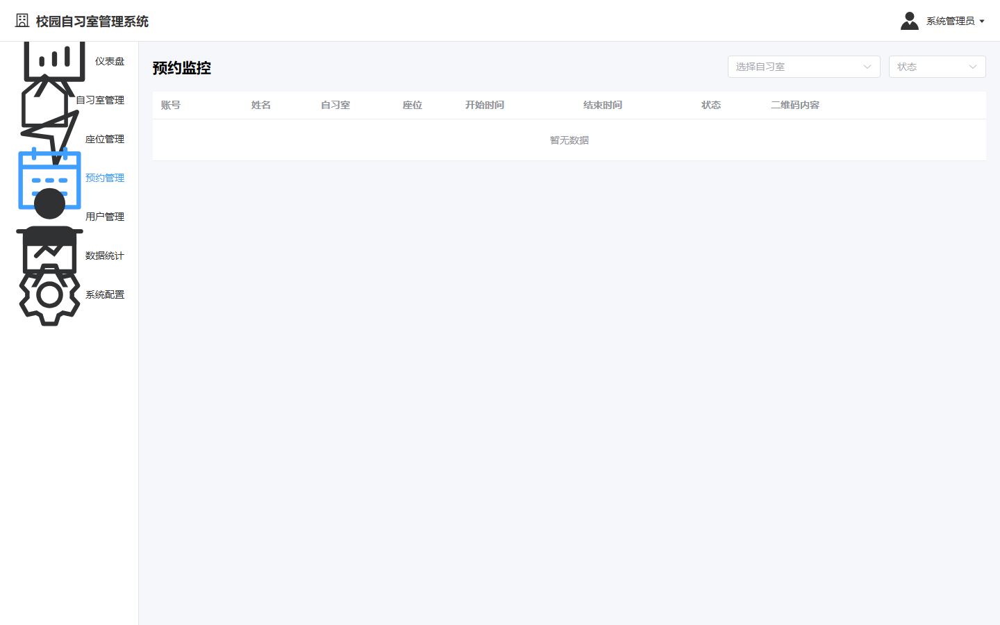
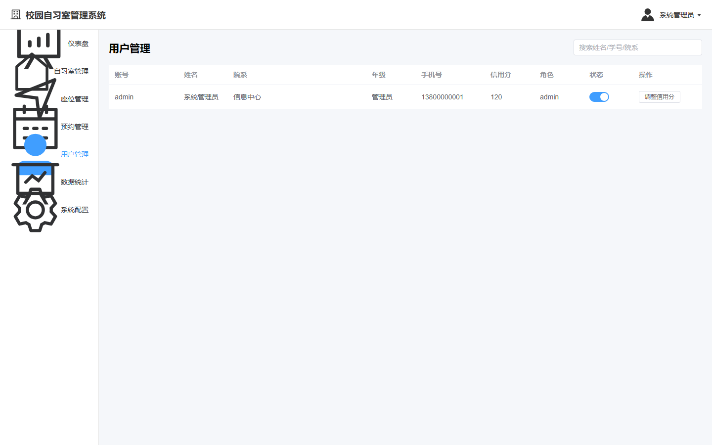
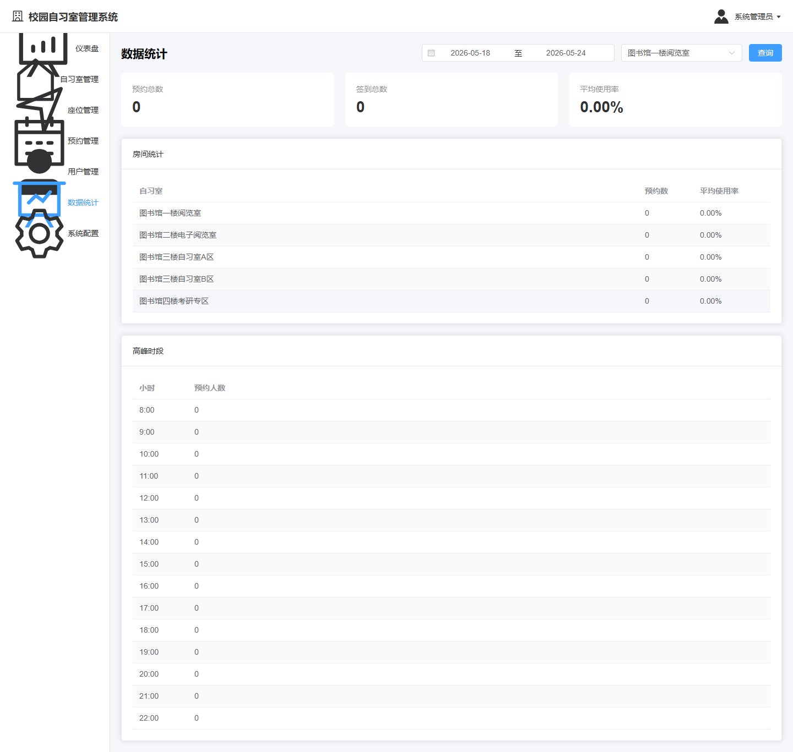
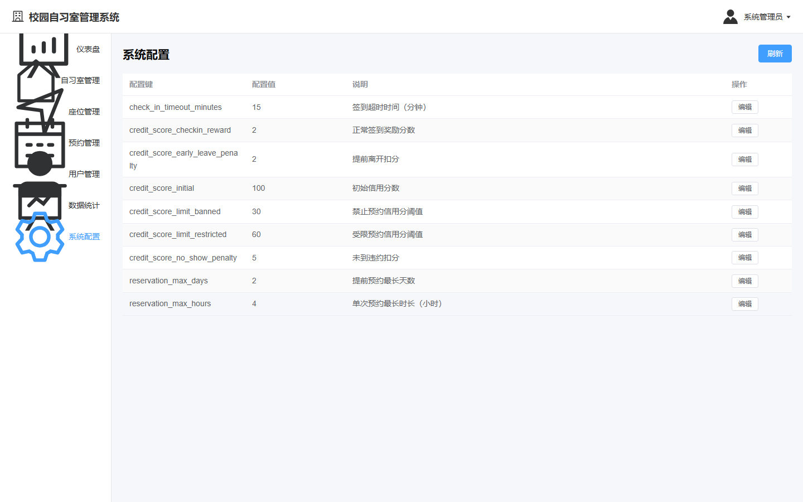
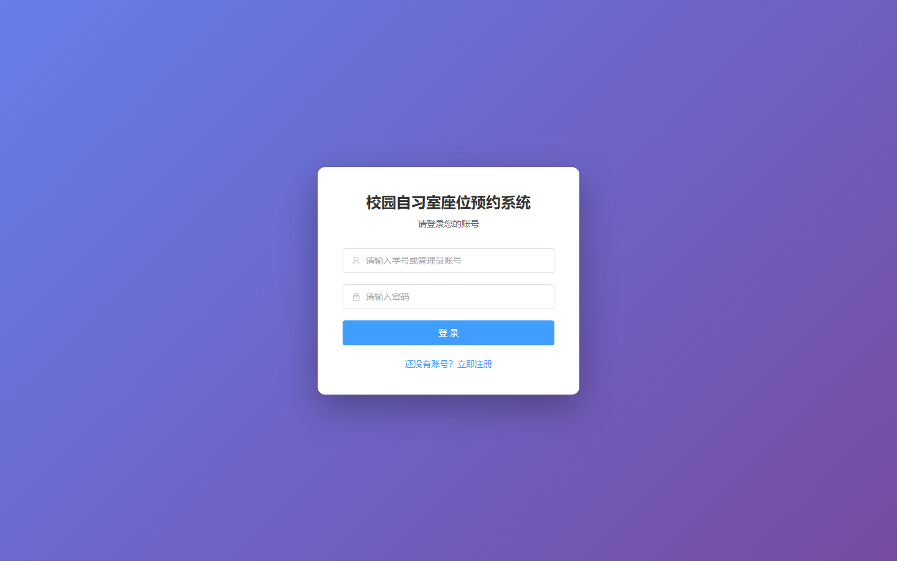
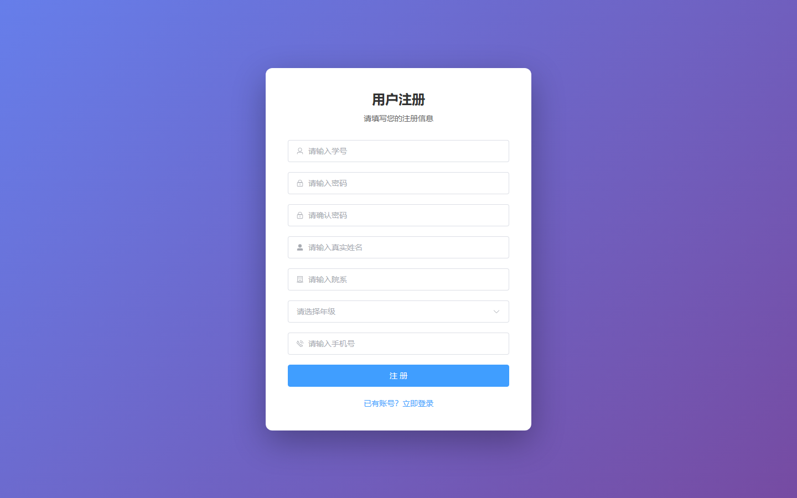

# 022 - 校园自习室座位预约系统 🔥最新

## 项目信息

- 项目编号：`022`
- 组件类型：`backend, frontend`
- 后端入口：`http://127.0.0.1:8080`
- 前端入口：`http://127.0.0.1:5173`
- 账号来源：022-frontend\README.md
- 已收录截图：`9` 张

## 默认账号

- `管理员`：`admin` / `123456`
- `学生`：`202001` / `123456`

## 预览截图

### admin

#### admin-01-dashboard

#### admin-02-rooms

#### admin-03-seats

#### admin-04-reservations

#### admin-05-users

#### admin-06-statistics

#### admin-07-system

### guest

#### guest-01-login

#### guest-02-register

