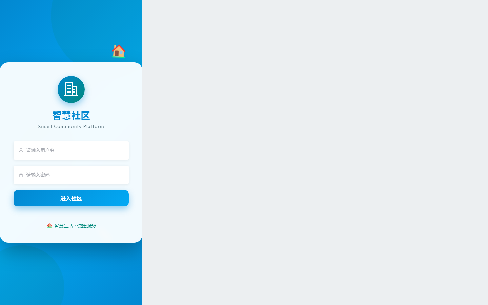
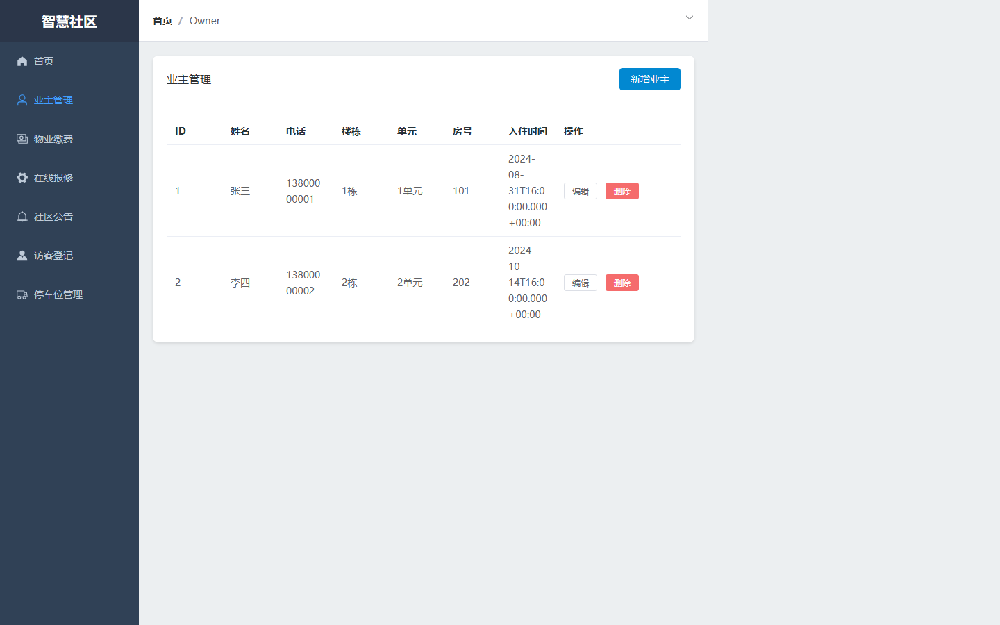
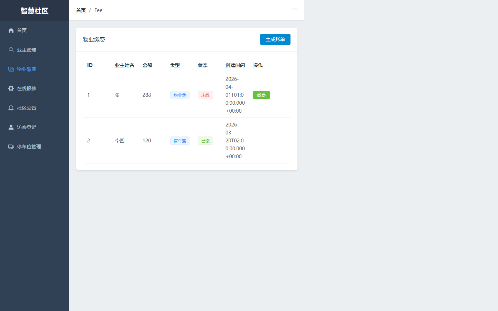
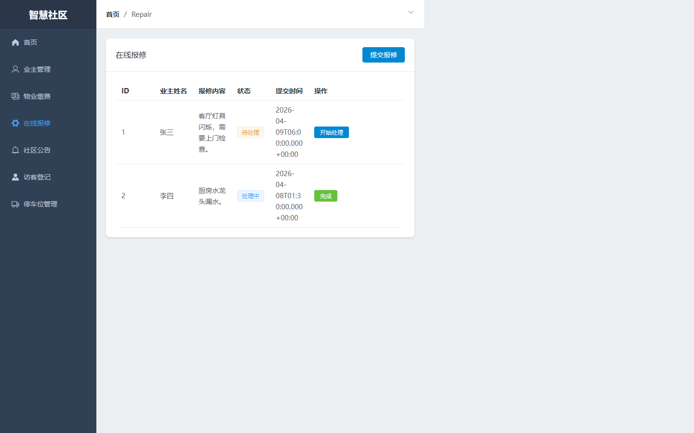
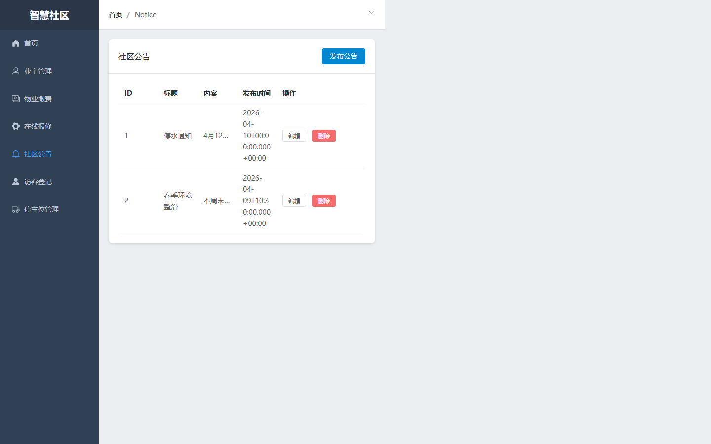
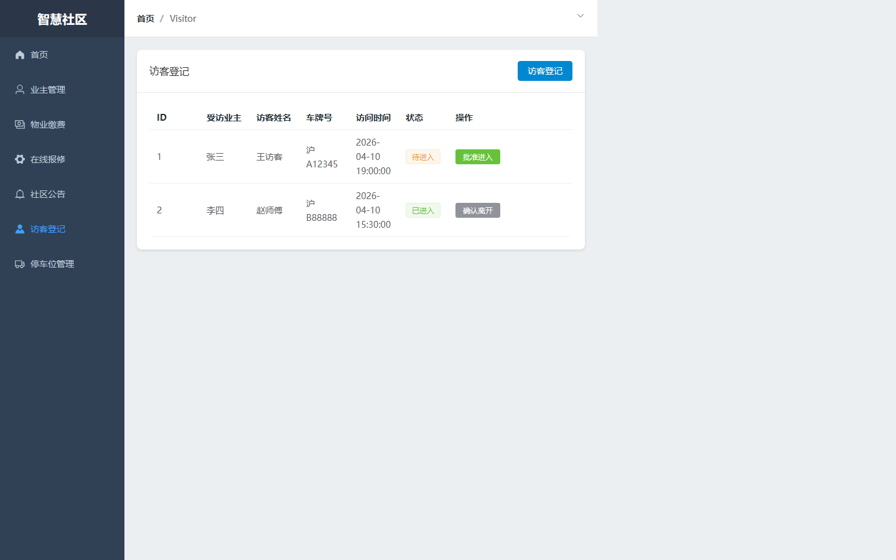
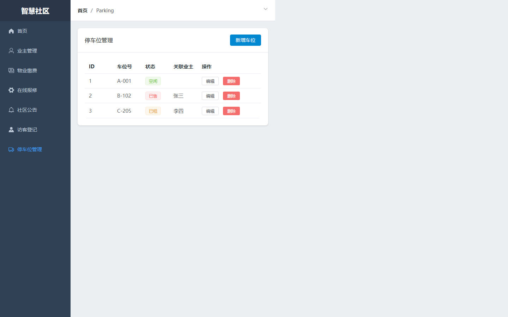

# 025 - 智慧社区综合服务管理平台 🔥最新

## 项目信息

- 项目编号：`025`
- 组件类型：`backend, frontend`
- 后端入口：`http://127.0.0.1:8025`
- 前端入口：`http://127.0.0.1:3025`
- 账号来源：未识别
- 已收录截图：`9` 张

## 默认账号

- 暂未自动识别到默认账号

## 预览截图

### guest

#### guest-01-home

#### guest-01-login

#### guest-02-owner

#### guest-02-register

#### guest-03-fee

#### guest-04-repair

#### guest-05-notice

#### guest-06-visitor

#### guest-07-parking

