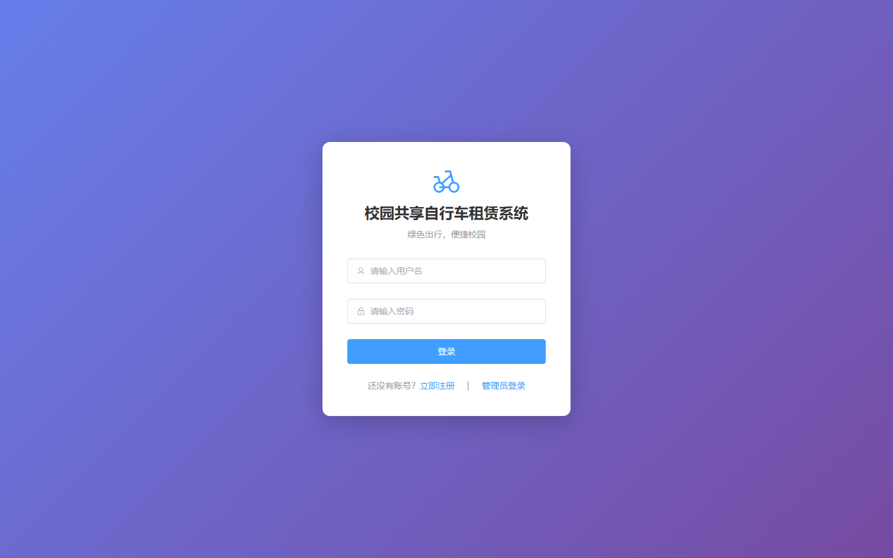
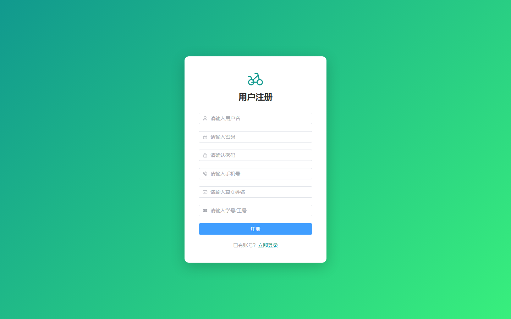

# 028 - 校园共享自行车租赁系统 🔥最新

## 项目信息

- 项目编号：`028`
- 组件类型：`backend, frontend`
- 后端入口：`http://127.0.0.1:8028`
- 前端入口：`http://127.0.0.1:3028`
- 账号来源：028-backend\README.md
- 已收录截图：`7` 张

## 默认账号

- `管理员`：`admin` / `admin123`
- `用户`：`testuser` / `123456`

## 预览截图

### guest

#### guest-01-home

#### guest-02-stations

#### guest-03-orders

#### guest-04-wallet

#### guest-05-profile

#### guest-06-login

#### guest-07-register

