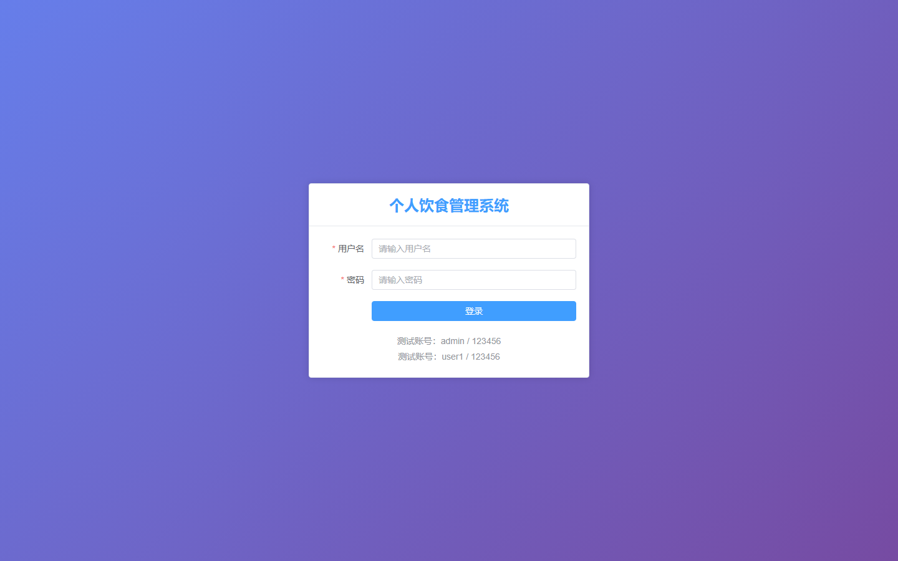

# 038 - 个人饮食管理系统 🔥最新

## 项目信息

- 项目编号：`038`
- 组件类型：`backend, frontend`
- 后端入口：`http://127.0.0.1:8039`
- 前端入口：`http://127.0.0.1:3038`
- 账号来源：038-backend\README.md
- 已收录截图：`9` 张

## 默认账号

- `管理员`：`admin` / `123456`

## 预览截图

### guest

#### guest-01-dashboard

#### guest-02-diet-record

#### guest-02-register

#### guest-03-food-library

#### guest-04-nutrition

#### guest-05-health

#### guest-06-goal

#### guest-07-recipe

#### guest-08-login

