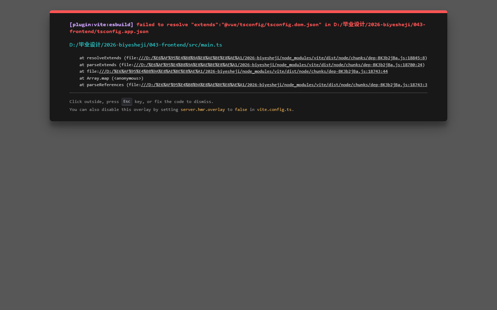

# 043 - 宠物寄养服务系统 🔥最新

## 项目信息

- 项目编号：`043`
- 组件类型：`backend, frontend`
- 后端入口：`http://127.0.0.1:8043`
- 前端入口：`http://127.0.0.1:3043`
- 账号来源：未识别
- 已收录截图：`7` 张

## 默认账号

- 暂未自动识别到默认账号

## 预览截图

### guest

#### guest-01-home

#### guest-02-pets

#### guest-03-providers

#### guest-04-bookings

#### guest-05-profile

#### guest-06-login

#### guest-07-register

