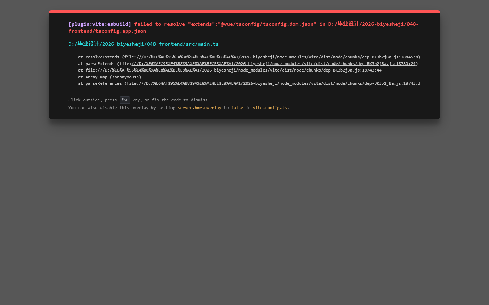

# 048 - 博物馆文物数字化管理平台 🔥

## 项目信息

- 项目编号：`048`
- 组件类型：`backend, frontend`
- 后端入口：`http://127.0.0.1:8048`
- 前端入口：`http://127.0.0.1:3048`
- 账号来源：048-backend\README.md
- 已收录截图：`2` 张

## 默认账号

- `管理员`：`admin` / `123456`

## 预览截图

### guest

#### guest-01-login

#### guest-02-register

