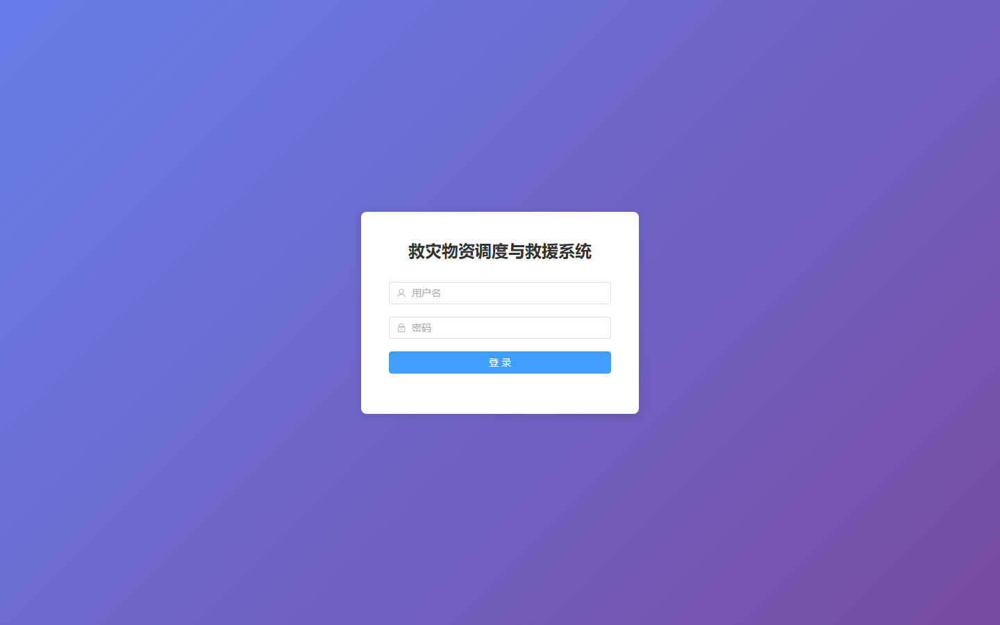

# 053 - 救灾物资调度与救援系统 🔥最新

## 项目信息

- 项目编号：`053`
- 组件类型：`backend, frontend`
- 后端入口：`http://127.0.0.1:8055`
- 前端入口：`http://127.0.0.1:3053`
- 账号来源：053-backend\README.md
- 已收录截图：`21` 张

## 默认账号

- `管理员`：`admin` / `123456`
- `仓库管理员`：`warehouse` / `123456`

## 预览截图

### disaster

#### disaster-01-index

### dispatch

#### dispatch-01-index

### guest

#### guest-01-dashboard

#### guest-02-disaster

#### guest-02-register

#### guest-03-category

#### guest-04-material

#### guest-05-warehouse

#### guest-06-stock

#### guest-07-dispatch

#### guest-08-task

#### guest-09-notice

#### guest-10-user

#### guest-11-login

### material

#### material-01-category

#### material-02-material

### notice

#### notice-01-index

### task

#### task-01-index

### user

#### user-01-index

### warehouse

#### warehouse-01-index

#### warehouse-02-stock

