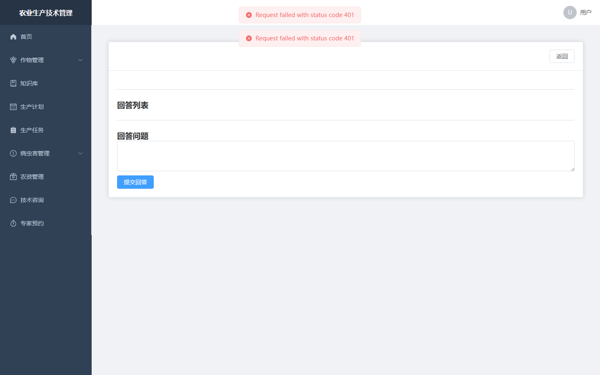
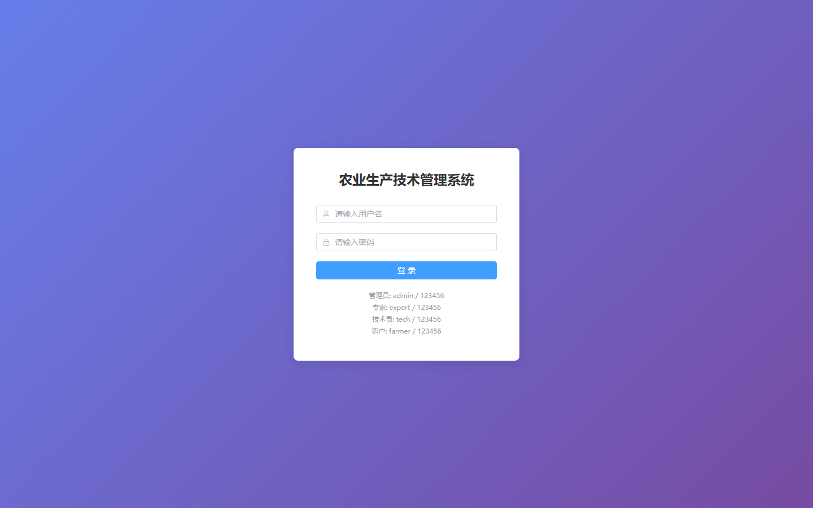
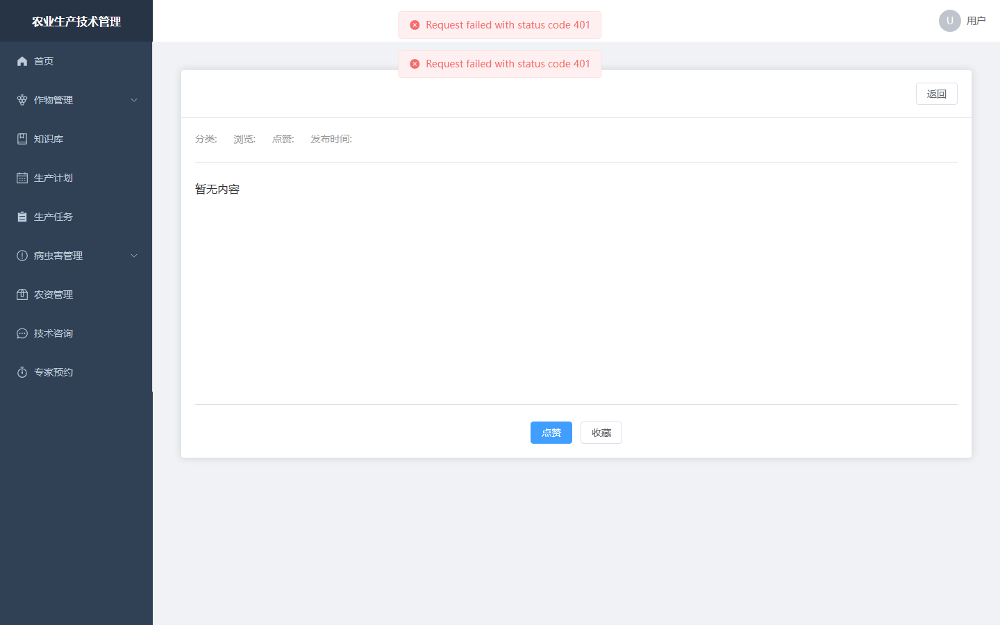

# 054 - 农业生产技术管理系统 🌱最新

## 项目信息

- 项目编号：`054`
- 组件类型：`backend, frontend`
- 后端入口：`http://127.0.0.1:8055`
- 前端入口：`http://127.0.0.1:3054`
- 账号来源：054-backend\README.md
- 已收录截图：`19` 张

## 默认账号

- `管理员`：`admin` / `123456`
- `农户`：`farmer` / `123456`

## 预览截图

### appointment

#### appointment-01-appointmentlist

### consultation

#### consultation-01-consultationdetail

#### consultation-02-consultationlist

### crop

#### crop-01-categorylist

#### crop-02-croplist

### guest

#### guest-01-dashboard

#### guest-02-register

#### guest-02-user

#### guest-03-login

### knowledge

#### knowledge-01-knowledgedetail

#### knowledge-02-knowledgelist

### material

#### material-01-materiallist

### notice

#### notice-01-noticelist

### pest

#### pest-01-pestlist

#### pest-02-treatmentlist

#### pest-03-warninglist

### plan

#### plan-01-planlist

### task

#### task-01-tasklist

### user

#### user-01-userlist

