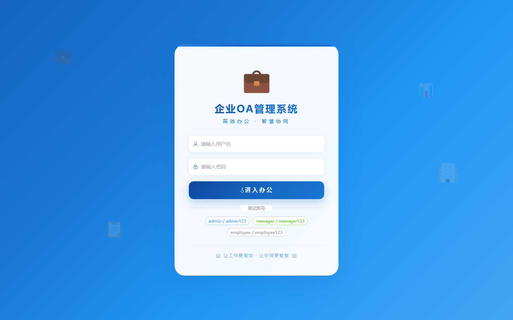
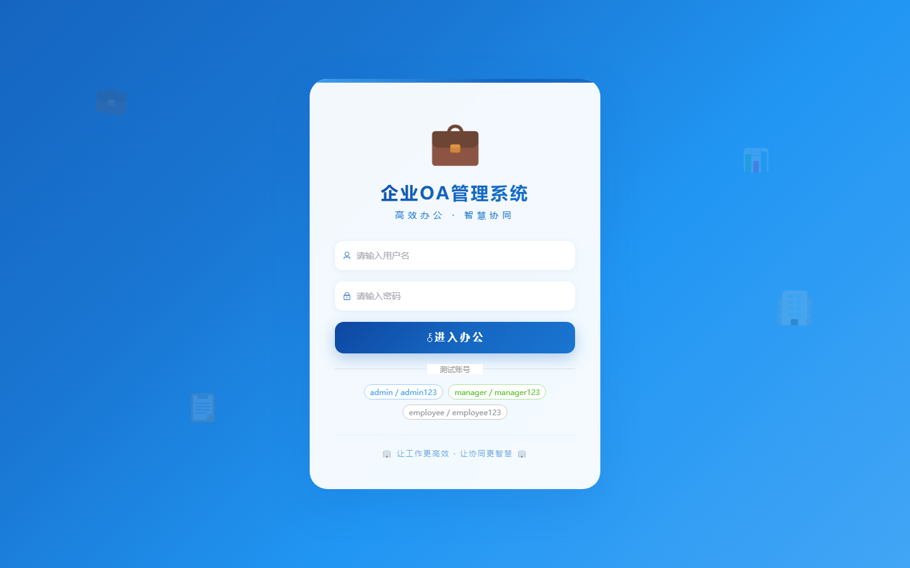

# 055 - 企业OA管理系统 🔥最新

## 项目信息

- 项目编号：`055`
- 组件类型：`backend, frontend`
- 后端入口：`http://127.0.0.1:8055`
- 前端入口：`http://127.0.0.1:3055`
- 账号来源：055-backend\README.md
- 已收录截图：`2` 张

## 默认账号

- `用户`：`sa` / `留空`
- `管理员`：`admin` / `admin123`
- `HR 主管`：`hr` / `hr123456`

## 预览截图

### guest

#### guest-01-login

#### guest-02-register

