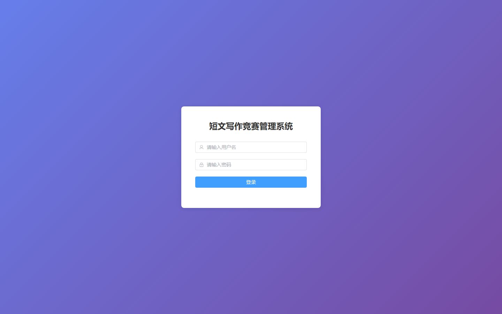
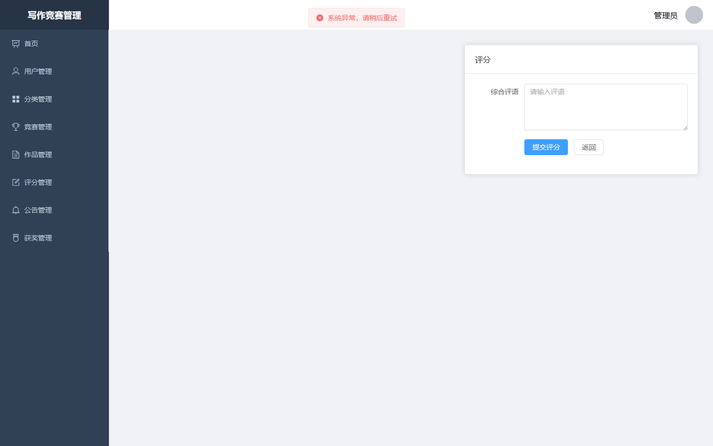
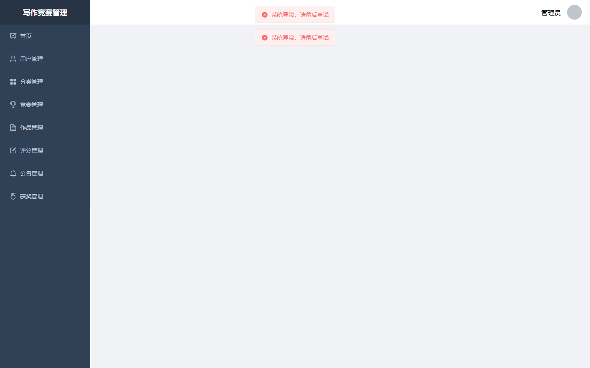

# 056 - 短文写作竞赛管理小程序 🔥最新

## 项目信息

- 项目编号：`056`
- 组件类型：`backend, frontend, miniapp`
- 后端入口：`http://127.0.0.1:8056`
- 前端入口：`http://127.0.0.1:3056`
- 账号来源：056-backend\README.md
- 已收录截图：`21` 张

## 默认账号

- `管理员`：`admin` / `123456`

## 预览截图

### award

#### award-01-awardlist

### category

#### category-01-categorylist

### competition

#### competition-01-competitionform

#### competition-02-competitionlist

### guest

#### guest-01-dashboard

#### guest-02-register

#### guest-02-user

#### guest-03-category

#### guest-04-competition

#### guest-05-competition-add

#### guest-06-work

#### guest-07-score

#### guest-08-notice

#### guest-09-award

#### guest-10-login

### notice

#### notice-01-noticelist

### score

#### score-01-scoreform

#### score-02-scorelist

### user

#### user-01-userlist

### work

#### work-01-workdetail

#### work-02-worklist

