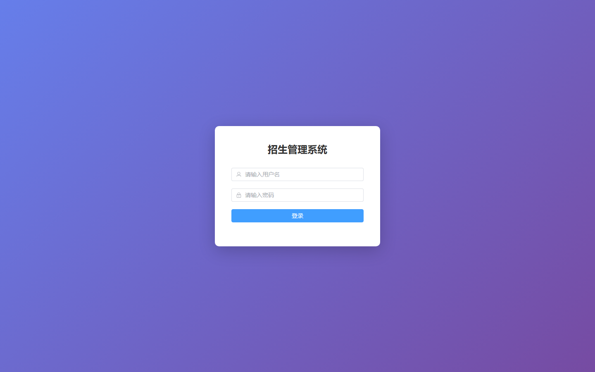

# 057 - 招生管理系统 🔥

## 项目信息

- 项目编号：`057`
- 组件类型：`backend, frontend`
- 后端入口：`http://127.0.0.1:8057`
- 前端入口：`http://127.0.0.1:3057`
- 账号来源：057-backend\README.md
- 已收录截图：`13` 张

## 默认账号

- `超级管理员`：`admin` / `123456`
- `普通管理员`：`user` / `123456`

## 预览截图

### admin

#### admin-01-index

### admission

#### admission-01-index

### application

#### application-01-index

### department

#### department-01-index

### guest

#### guest-01-login

#### guest-02-home

#### guest-02-register

### major

#### major-01-index

### notice

#### notice-01-index

### plan

#### plan-01-index

### score

#### score-01-index

### scoreline

#### scoreline-01-index

### student

#### student-01-index

