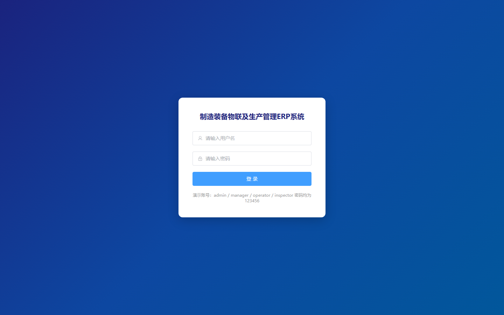
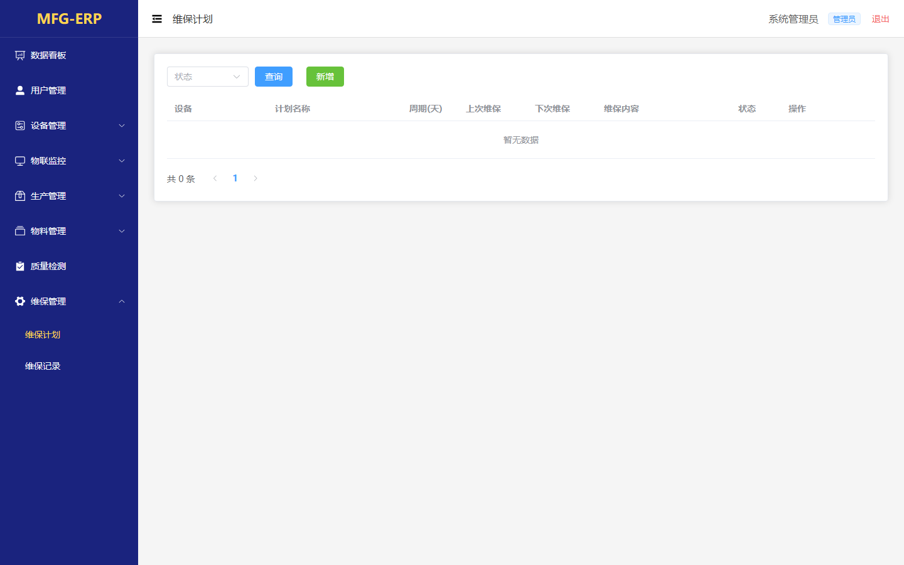
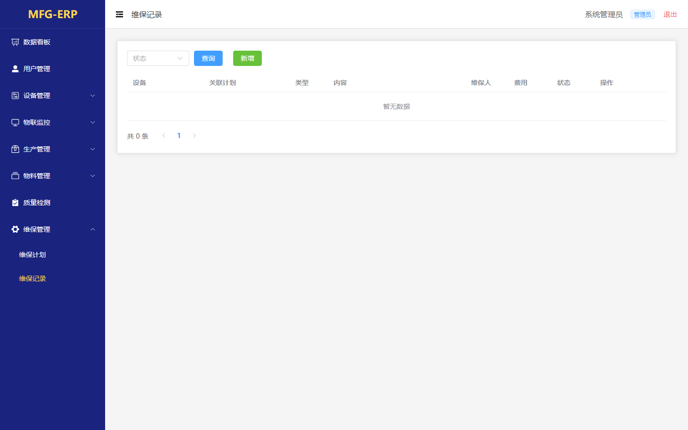
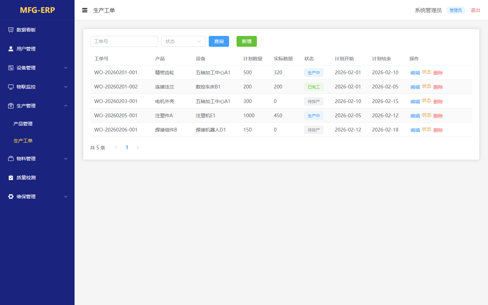
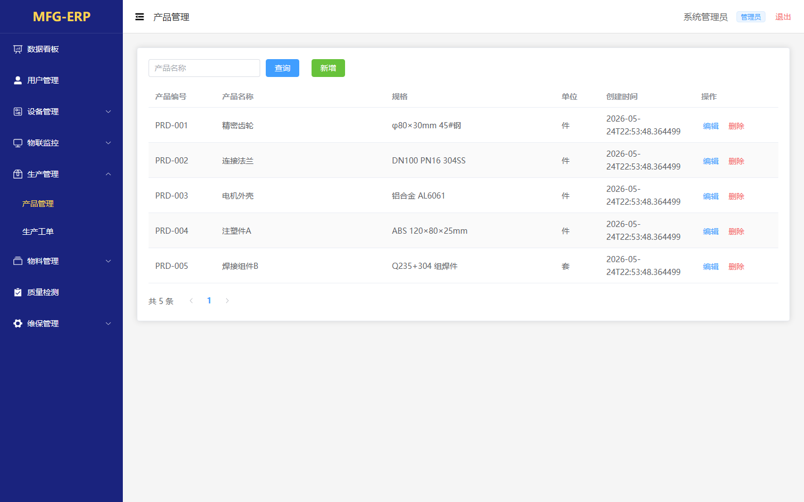

# 059 - 制造装备物联及生产管理ERP系统 🔥最新

## 项目信息

- 项目编号：`059`
- 组件类型：`backend, frontend`
- 后端入口：`http://127.0.0.1:8059`
- 前端入口：`http://127.0.0.1:3059`
- 账号来源：059-backend\README.md
- 已收录截图：`15` 张

## 默认账号

- `管理员`：`admin` / `123456`

## 预览截图

### equipment

#### equipment-01-category

#### equipment-02-index

### guest

#### guest-01-dashboard

#### guest-01-login

#### guest-02-register

### iot

#### iot-01-alertrecord

#### iot-02-sensordata

### maintenance

#### maintenance-01-plan

#### maintenance-02-record

### material

#### material-01-index

#### material-02-stockrecord

### production

#### production-01-order

#### production-02-product

### quality

#### quality-01-index

### user

#### user-01-index

