# 063 - 进销存管理系统后端

## 项目信息

- 项目编号：`063`
- 组件类型：`backend, frontend`
- 后端入口：`http://127.0.0.1:80063`
- 前端入口：`http://127.0.0.1:3063`
- 账号来源：063-backend\README.md
- 已收录截图：`22` 张

## 默认账号

- `管理员`：`admin` / `123456`
- `业务员`：`staff` / `123456`

## 预览截图

### admin

#### admin-01-dashboard

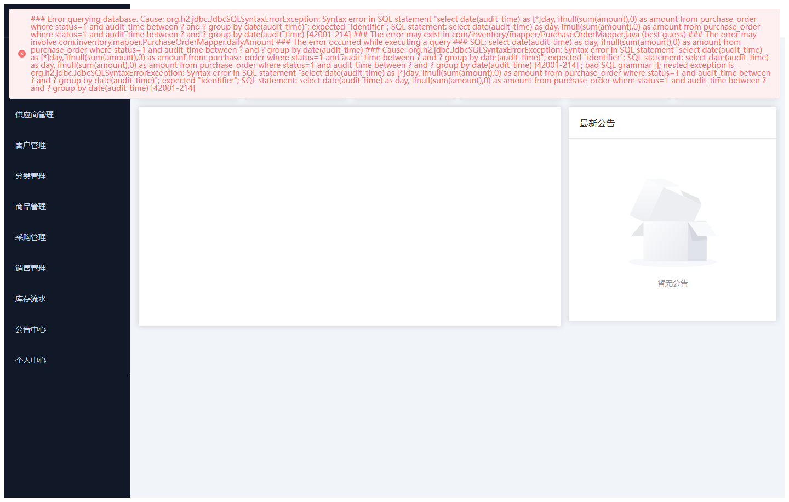

#### admin-02-user

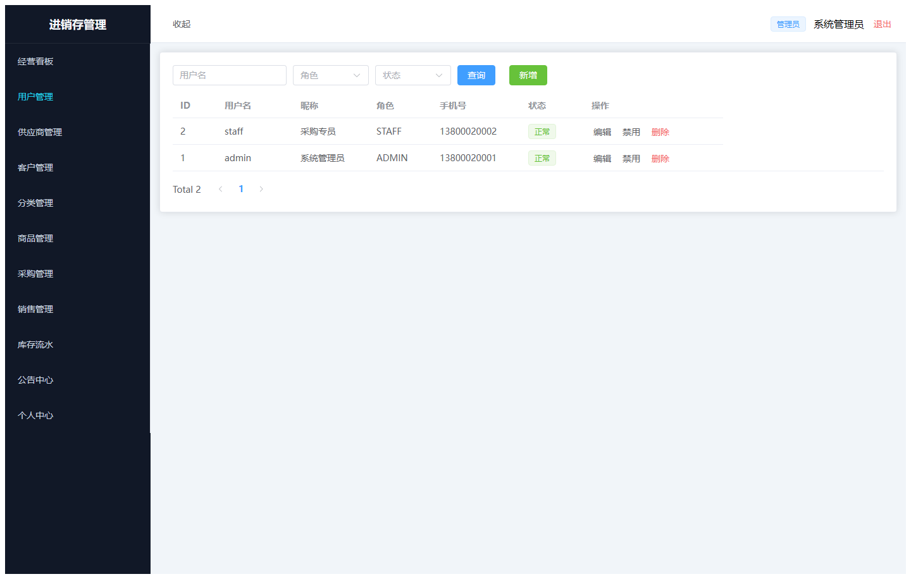

#### admin-03-supplier

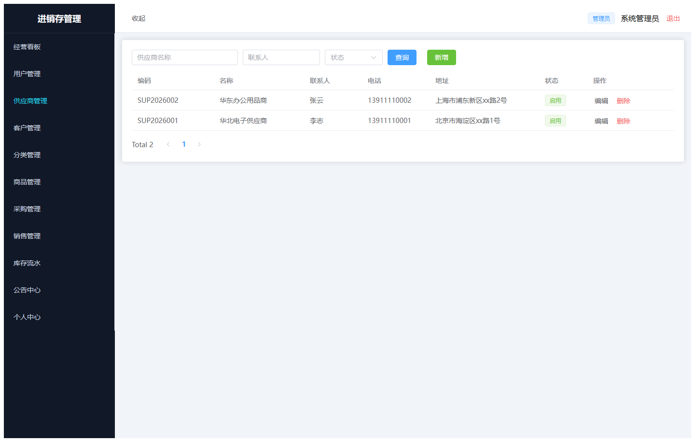

#### admin-04-customer

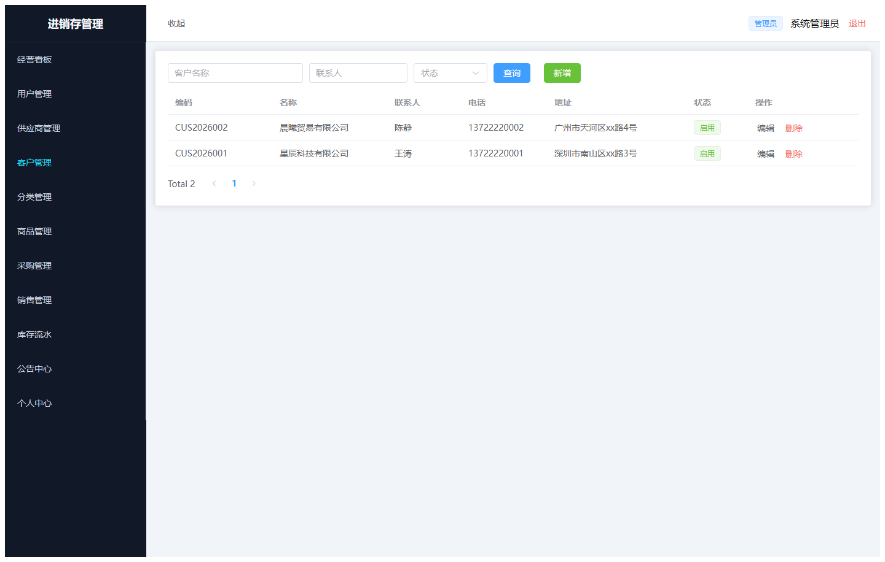

#### admin-05-category

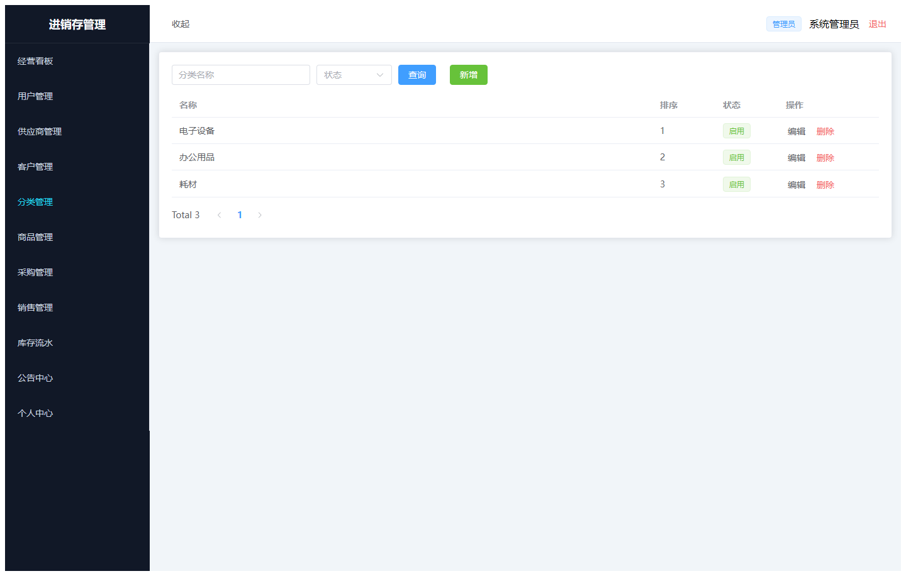

#### admin-06-product

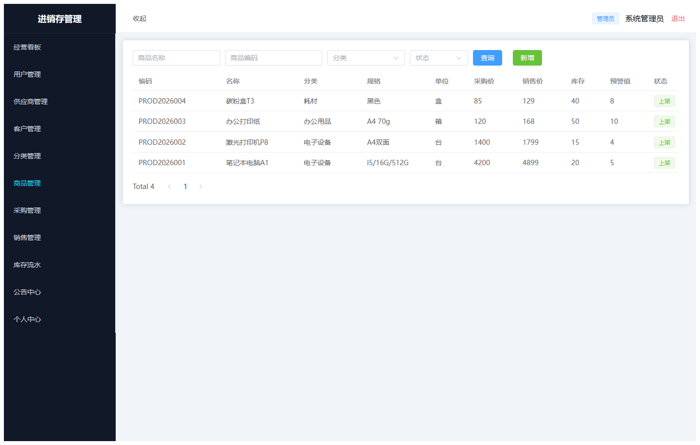

#### admin-07-purchase

#### admin-08-sale

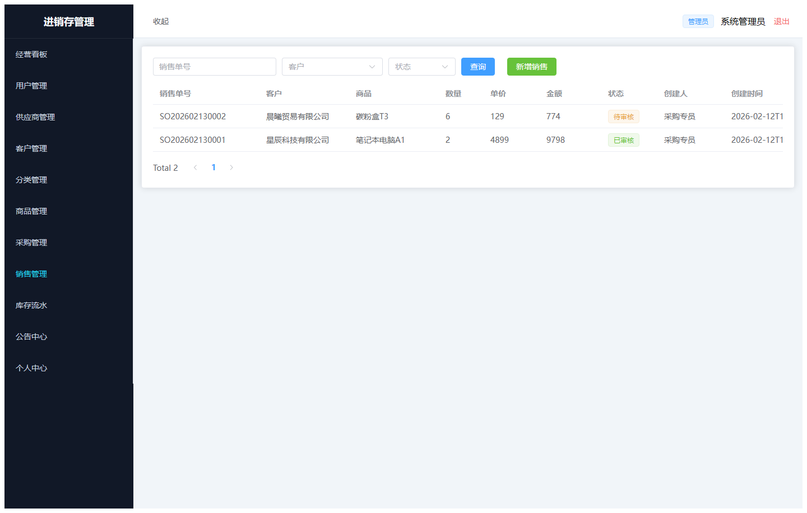

#### admin-09-stock

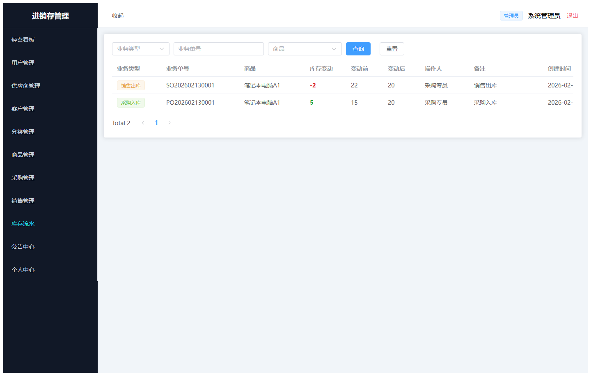

#### admin-10-announcement

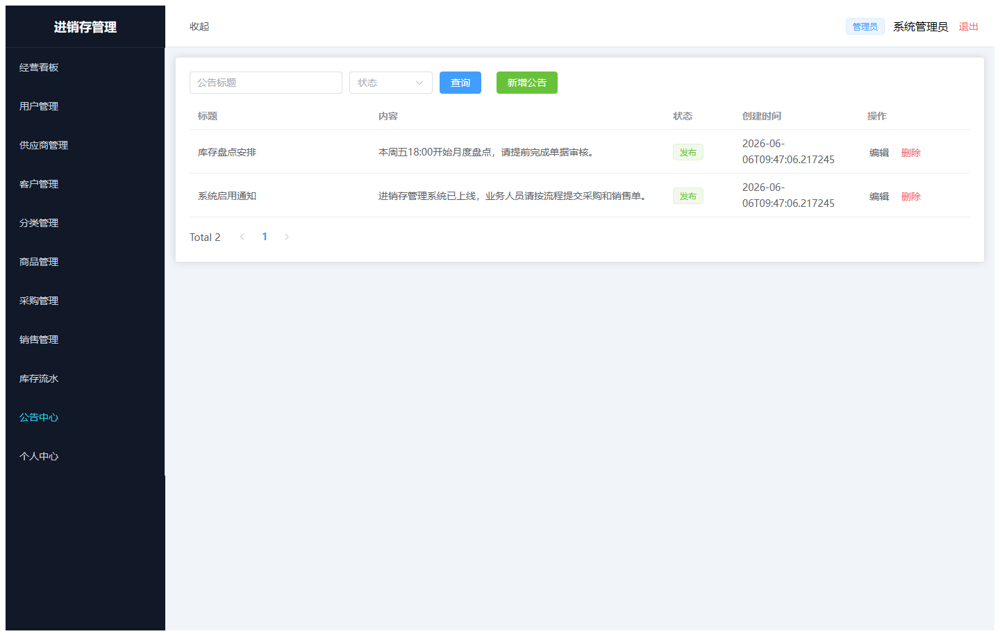

#### admin-11-profile

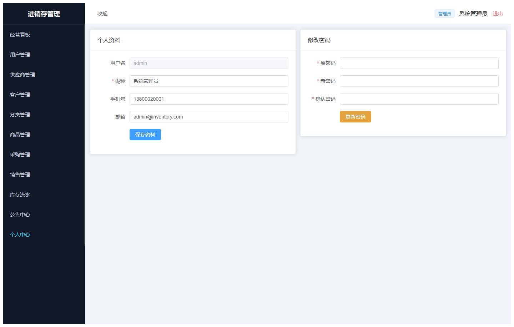

### guest

#### guest-01-login

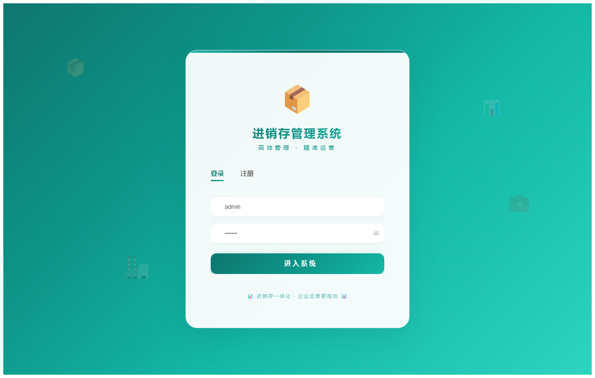

### user

#### user-01-dashboard

#### user-02-supplier

#### user-03-customer

#### user-04-category

#### user-05-product

#### user-06-purchase

#### user-07-sale

#### user-08-stock

#### user-09-announcement

#### user-10-profile

