# 064 - 经方药食两用服务平台

## 项目信息

- 项目编号：`064`
- 组件类型：`backend, frontend`
- 后端入口：`http://127.0.0.1:8064`
- 前端入口：`http://127.0.0.1:3064`
- 账号来源：064-backend\README.md
- 已收录截图：`13` 张

## 默认账号

- `平台管理员`：`admin` / `123456`
- `调理用户`：`user` / `123456`

## 预览截图

### admin

#### admin-01-dashboard

#### admin-02-user

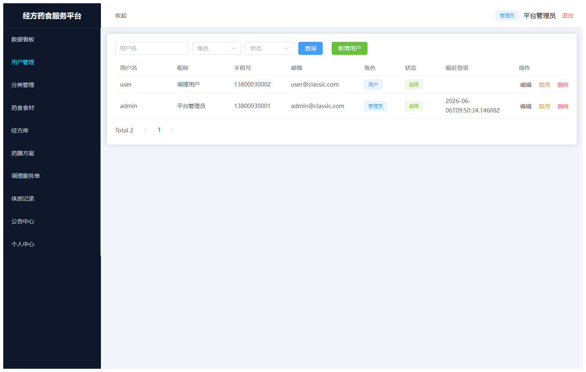

#### admin-03-category

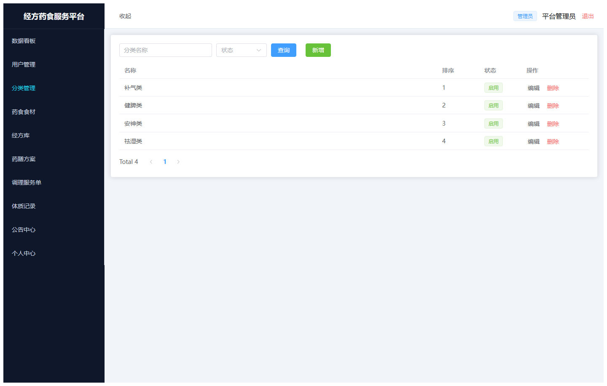

#### admin-04-ingredient

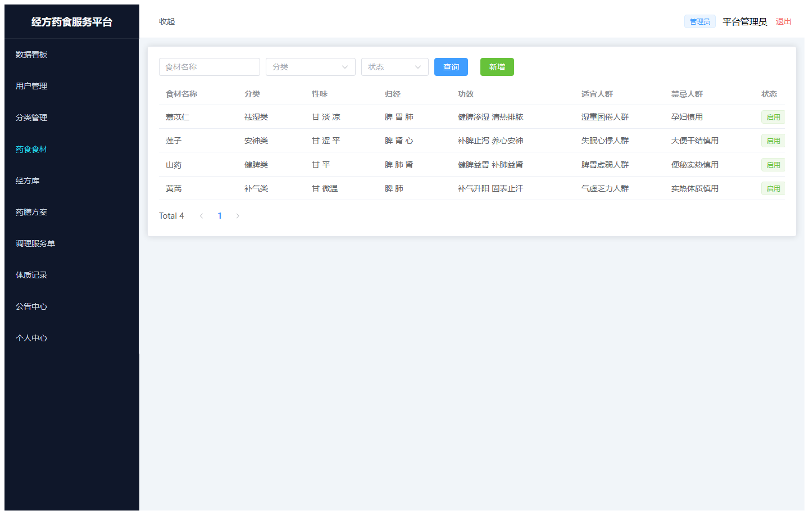

#### admin-05-formula

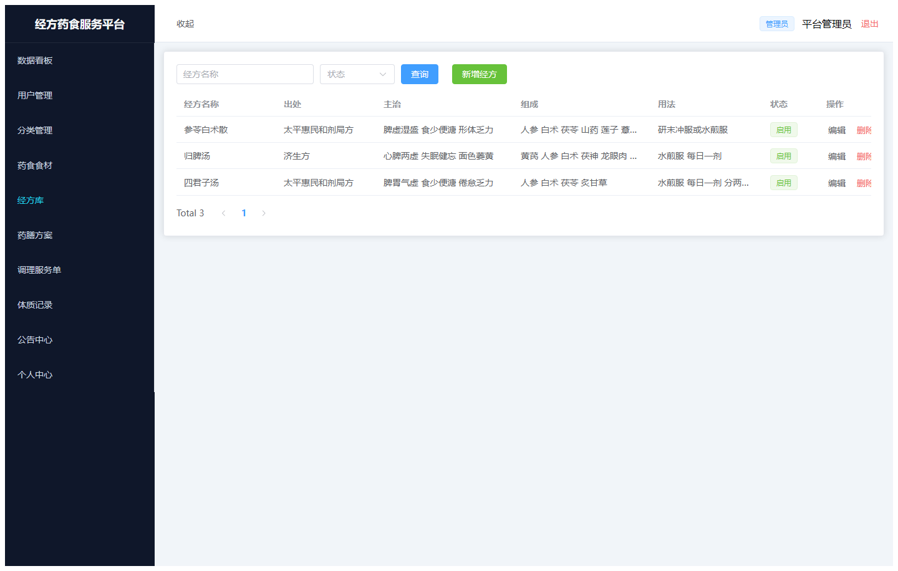

#### admin-06-plan

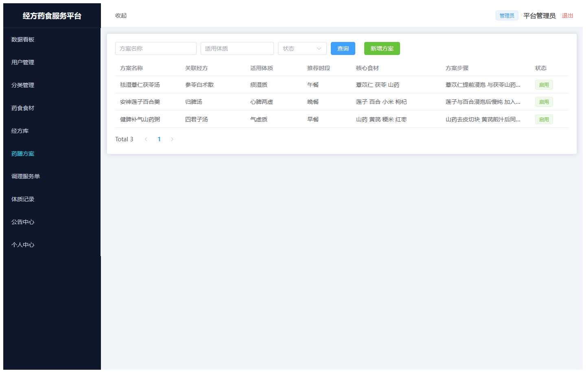

#### admin-07-service

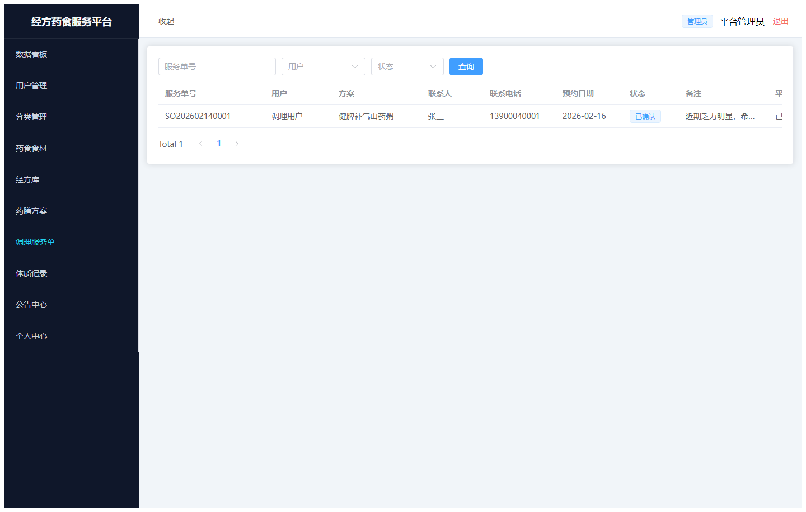

#### admin-08-constitution

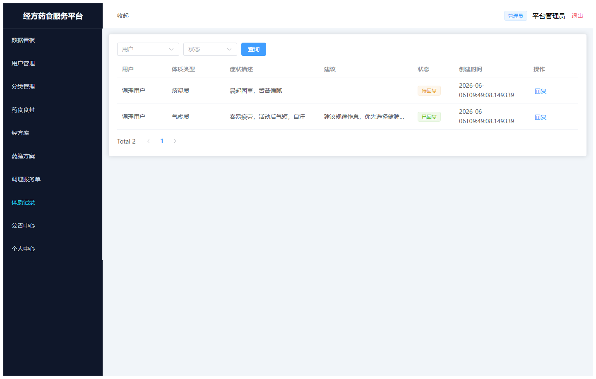

#### admin-09-favorite

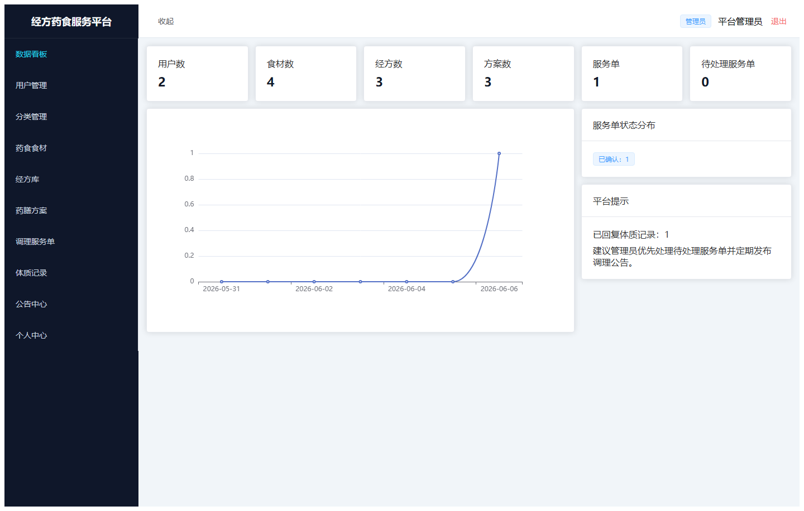

#### admin-10-announcement

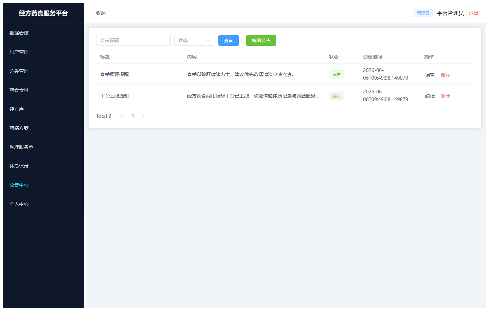

#### admin-11-profile

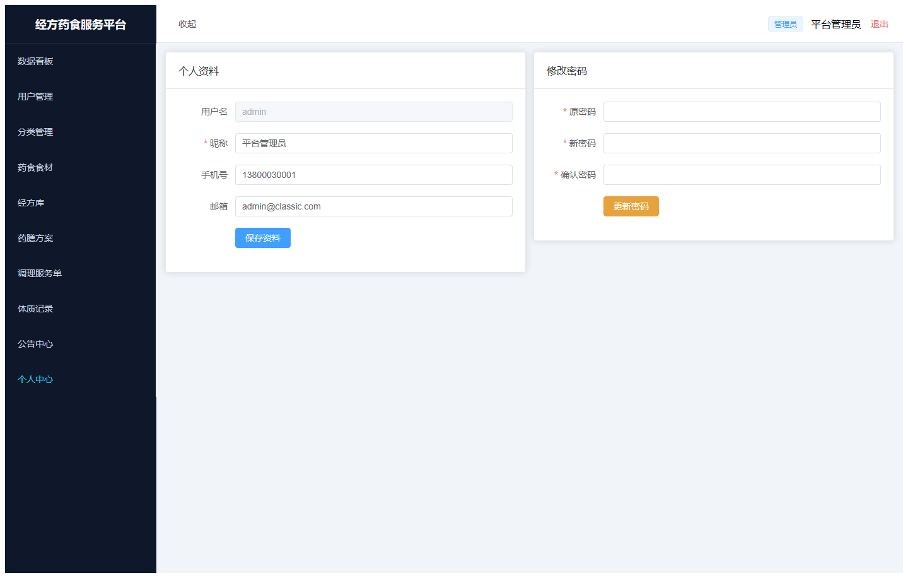

### guest

#### guest-01-login

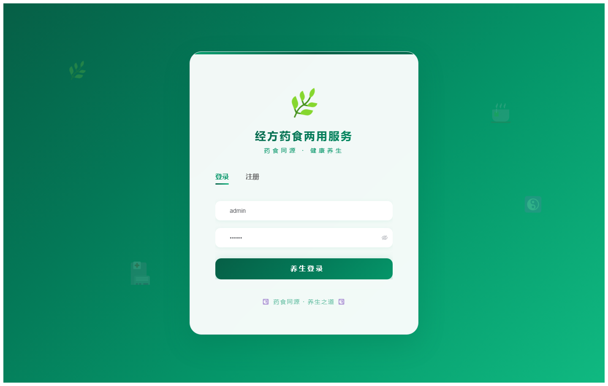

#### guest-02-register

