# 065 - 名城小区物业管理系统

## 项目信息

- 项目编号：`065`
- 组件类型：`backend, frontend`
- 后端入口：`http://127.0.0.1:8065`
- 前端入口：`http://127.0.0.1:3065`
- 账号来源：065-backend\README.md
- 已收录截图：`13` 张

## 默认账号

- `系统管理员`：`admin` / `123456`

## 预览截图

### admin

#### admin-01-dashboard

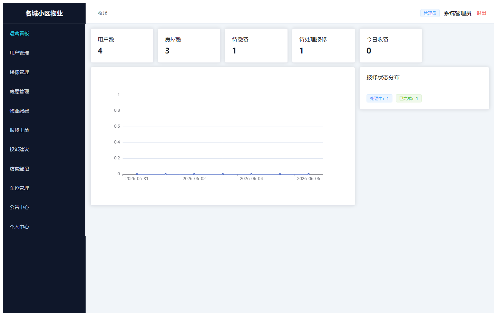

#### admin-02-user

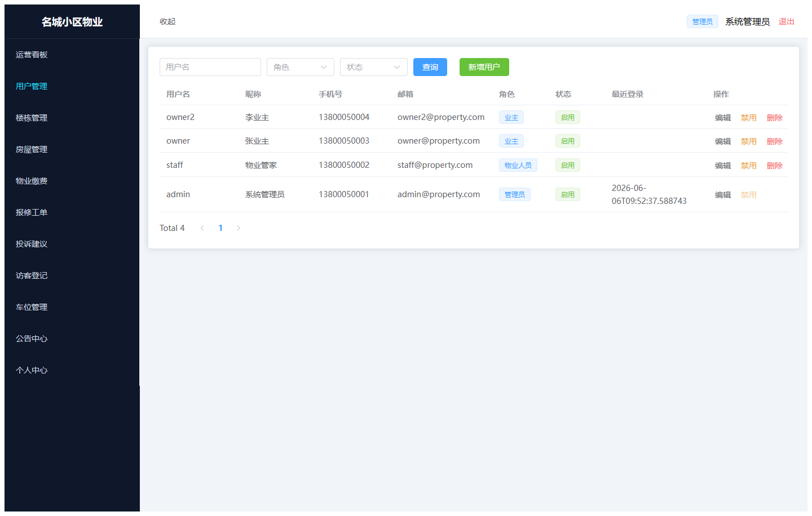

#### admin-03-building

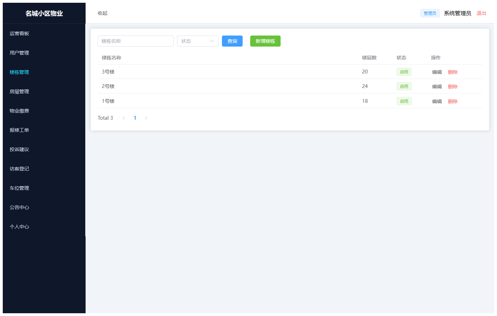

#### admin-04-house

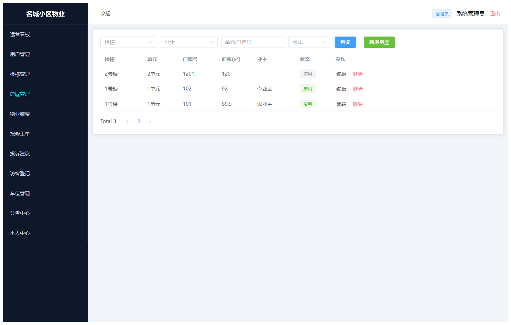

#### admin-05-fee

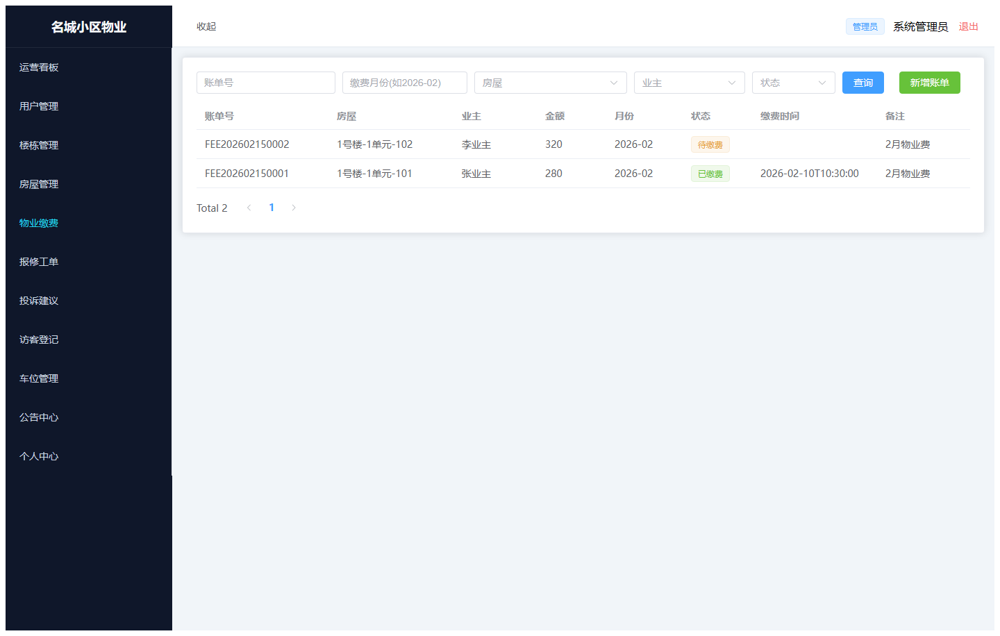

#### admin-06-repair

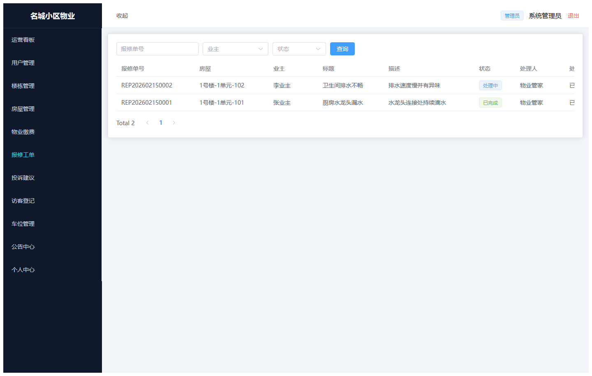

#### admin-07-complaint

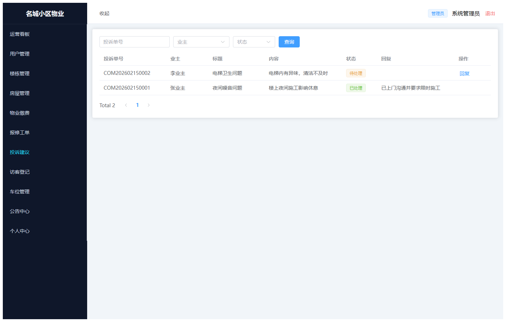

#### admin-08-visitor

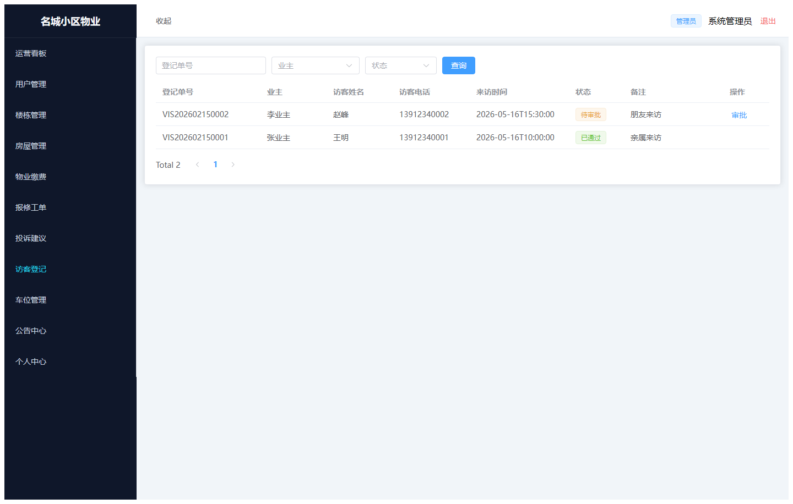

#### admin-09-parking

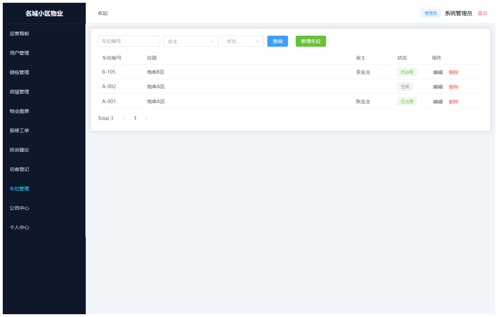

#### admin-10-announcement

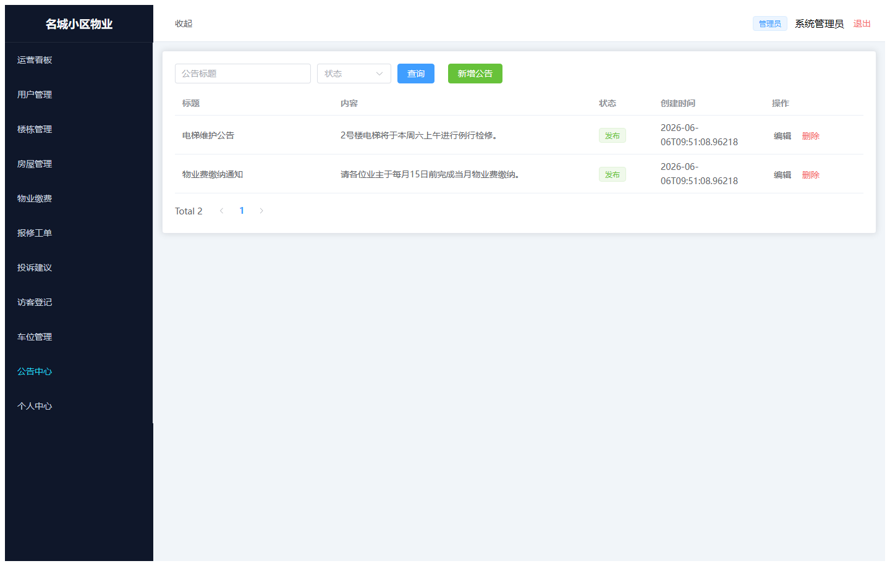

#### admin-11-profile

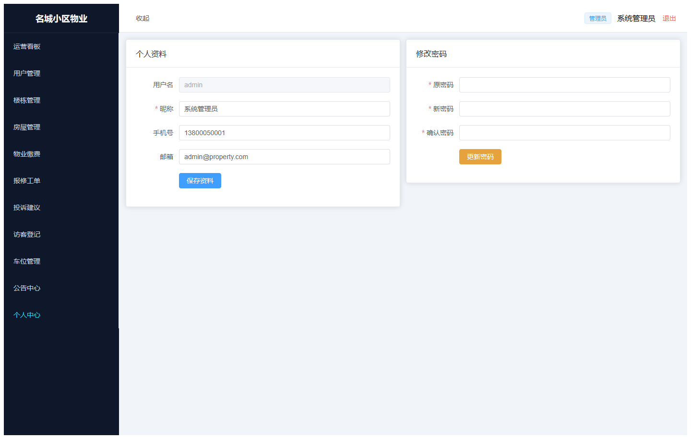

### guest

#### guest-01-login

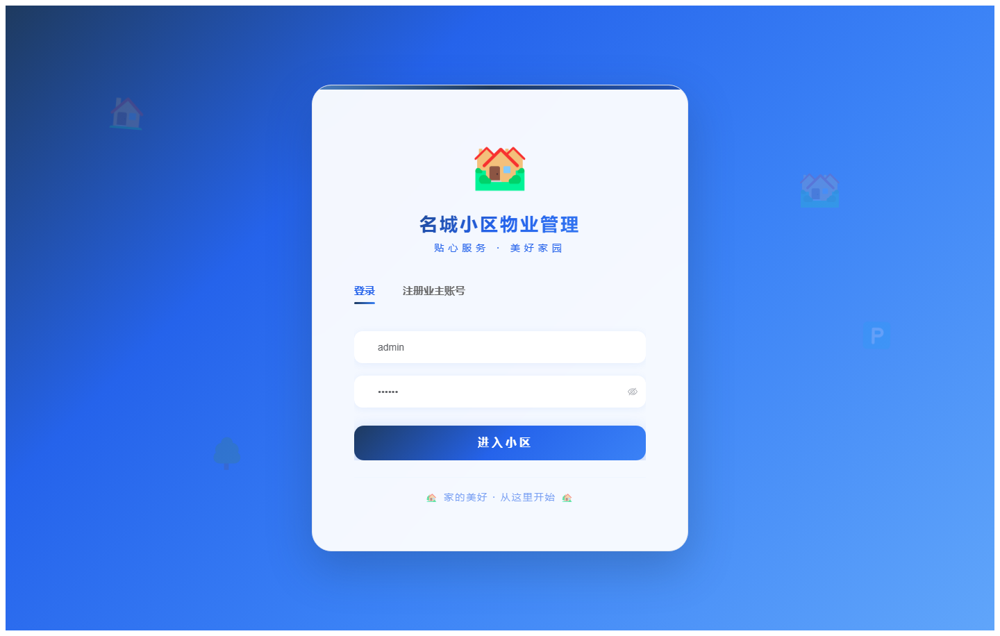

#### guest-02-register

