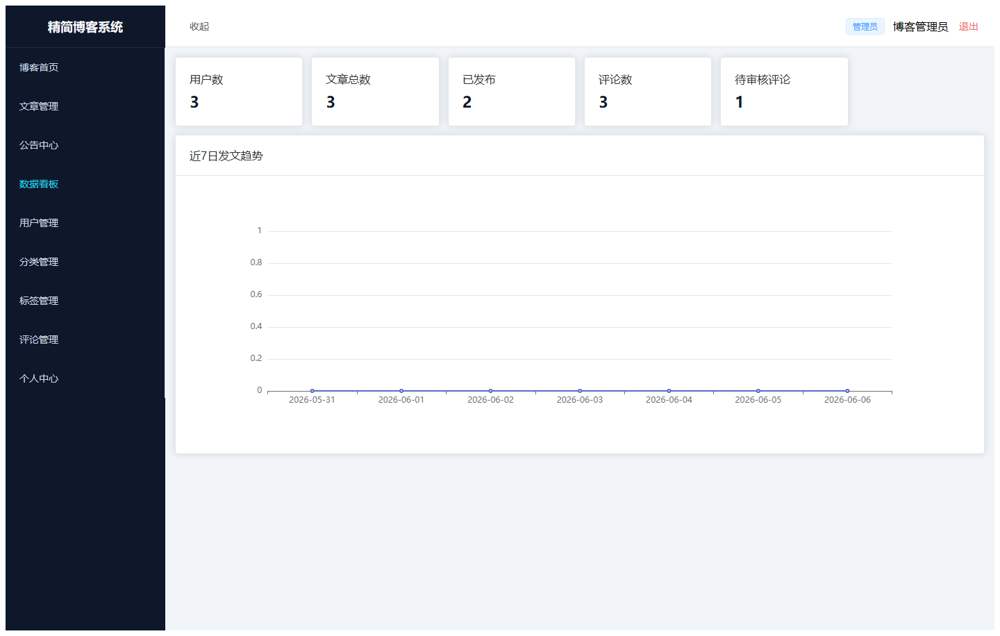
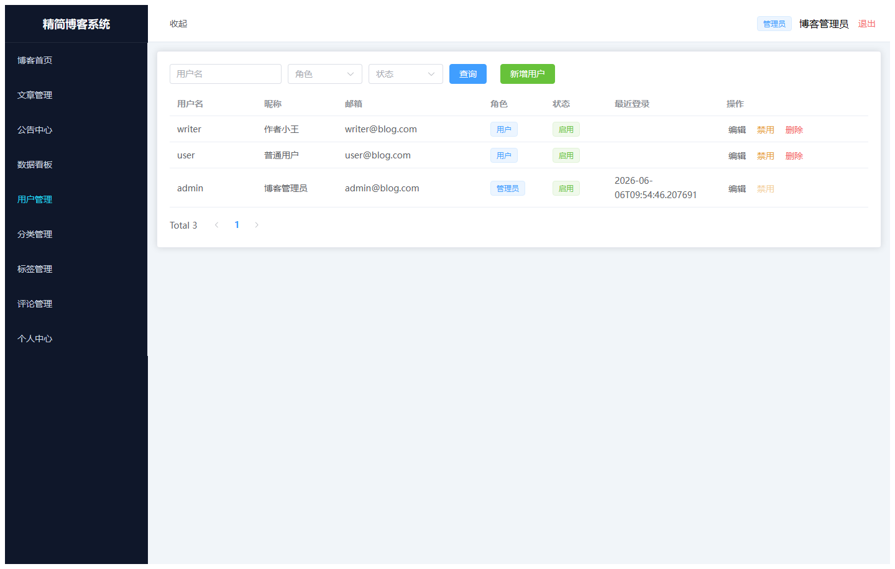
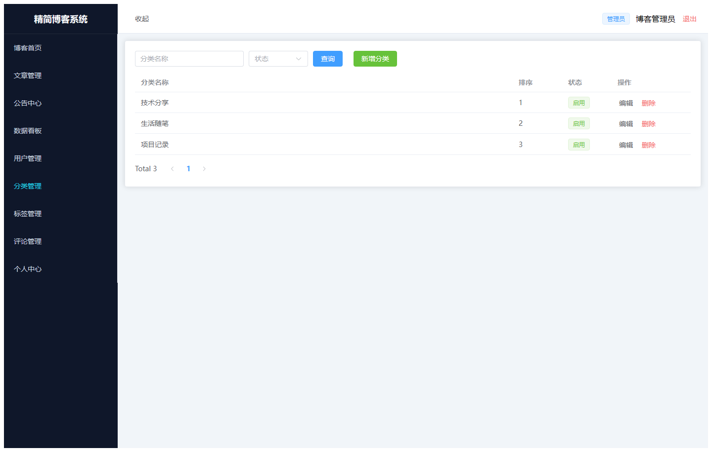
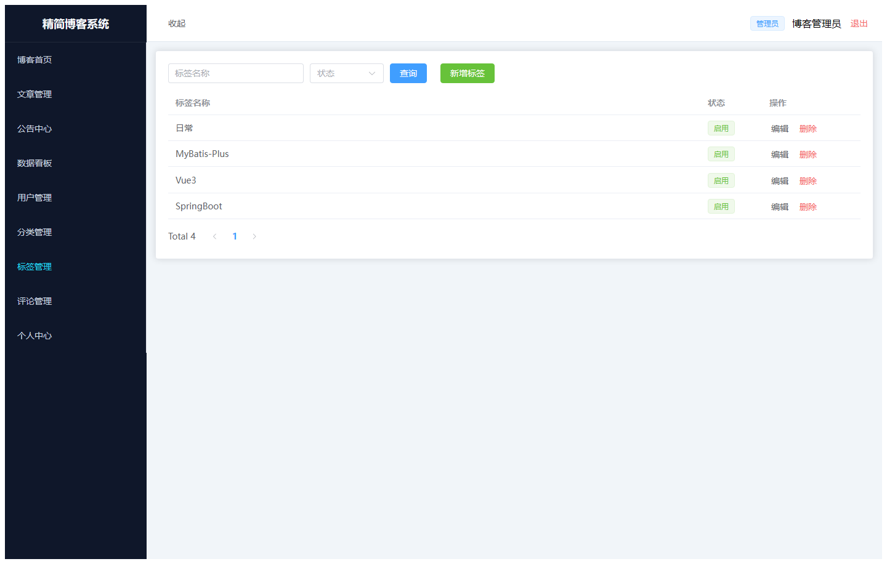
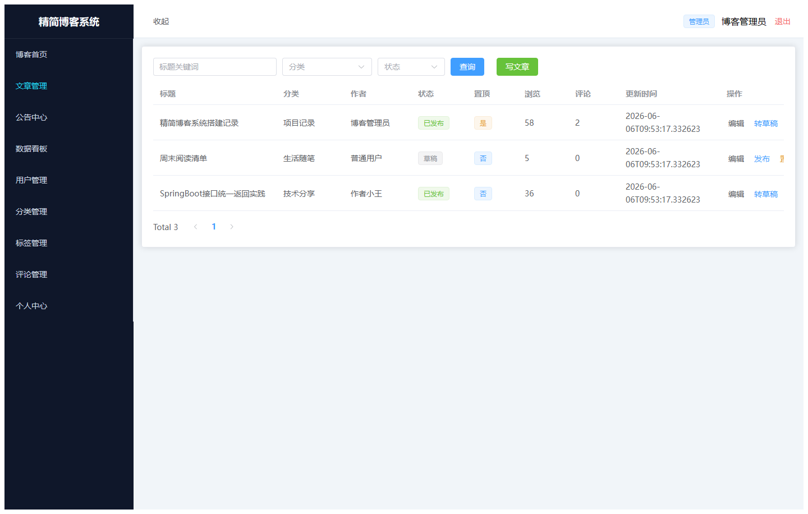
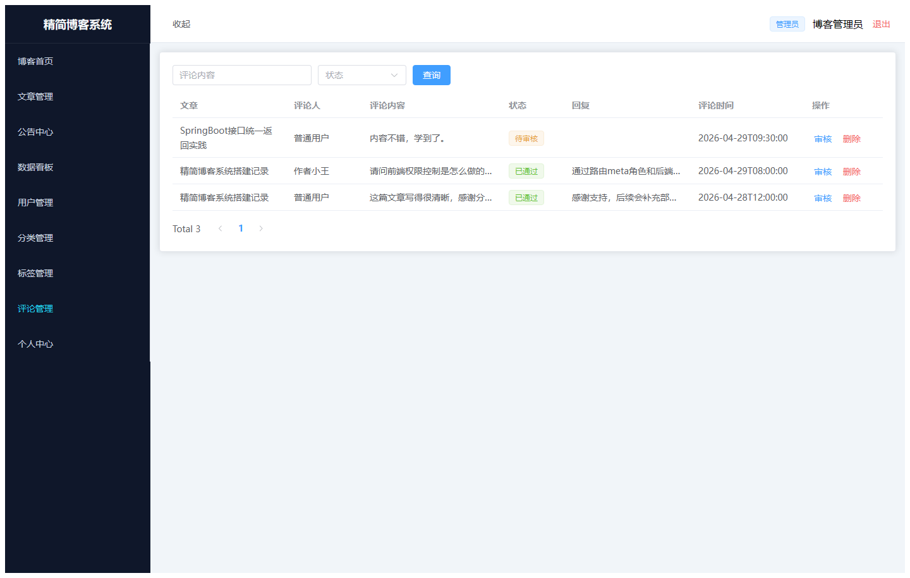
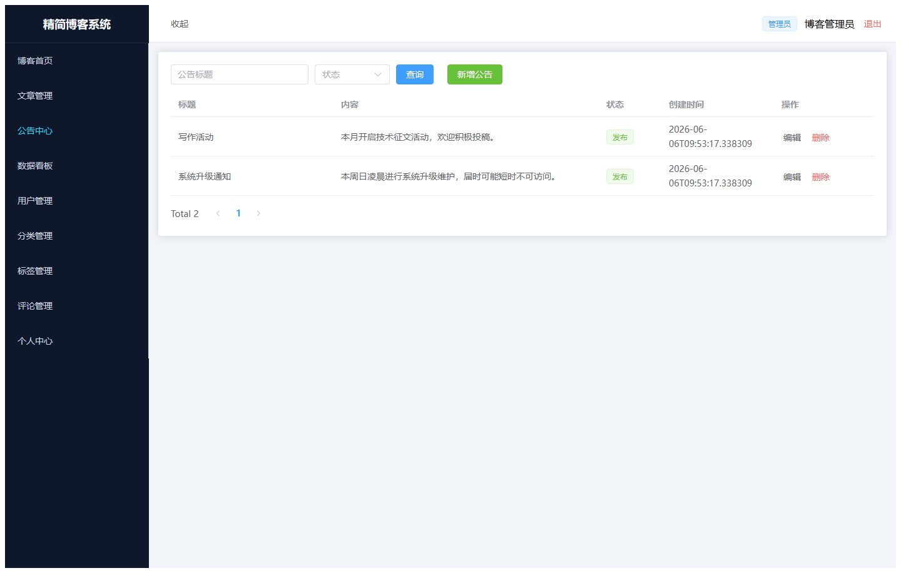
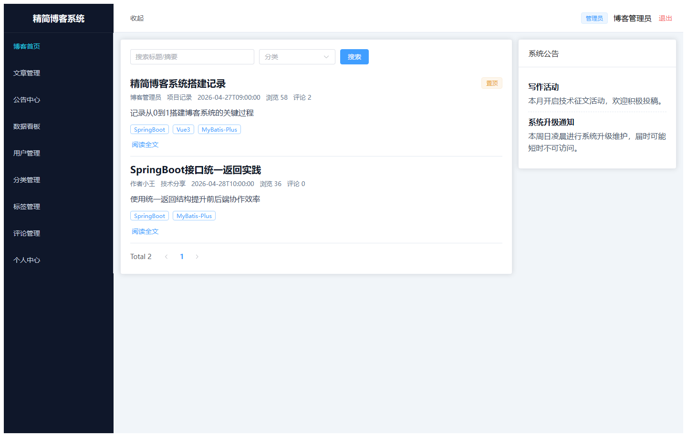
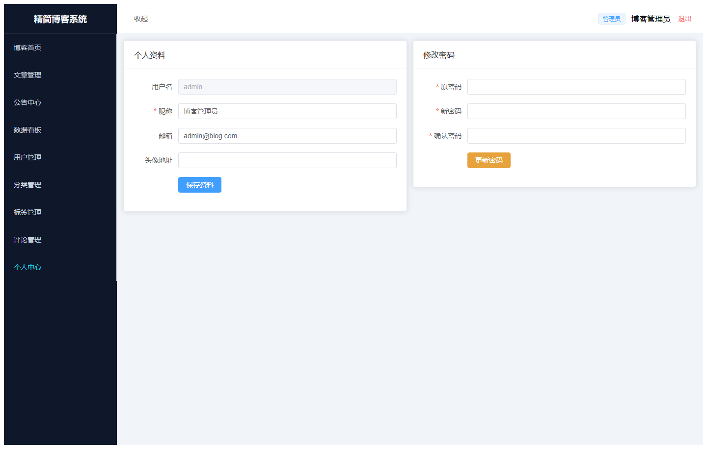
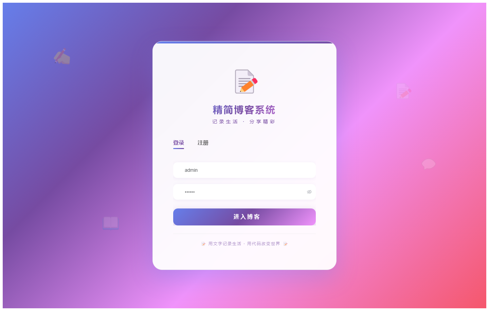

# 066 - 精简博客系统 🔥最新

## 项目信息

- 项目编号：`066`
- 组件类型：`backend, frontend`
- 后端入口：`http://127.0.0.1:8066`
- 前端入口：`http://127.0.0.1:3066`
- 账号来源：066-backend\README.md
- 已收录截图：`11` 张

## 默认账号

- `管理员`：`admin` / `123456`
- `普通用户`：`user` / `123456`
- `作者用户`：`writer` / `123456`

## 预览截图

### admin

#### admin-01-dashboard

#### admin-02-user

#### admin-03-category

#### admin-04-tag

#### admin-05-post

#### admin-06-comment

#### admin-07-notice

#### admin-08-blog

#### admin-09-profile

### guest

#### guest-01-login

#### guest-02-register

