# 067 - 大学生一体化服务平台 🔥最新

## 项目信息

- 项目编号：`067`
- 组件类型：`backend, frontend`
- 后端入口：`http://127.0.0.1:8067`
- 前端入口：`http://127.0.0.1:3067`
- 账号来源：067-backend\README.md
- 已收录截图：`13` 张

## 默认账号

- `管理员`：`admin` / `123456`
- `教师`：`teacher` / `123456`
- `学生`：`student` / `123456`

## 预览截图

### admin

#### admin-01-dashboard

#### admin-02-user

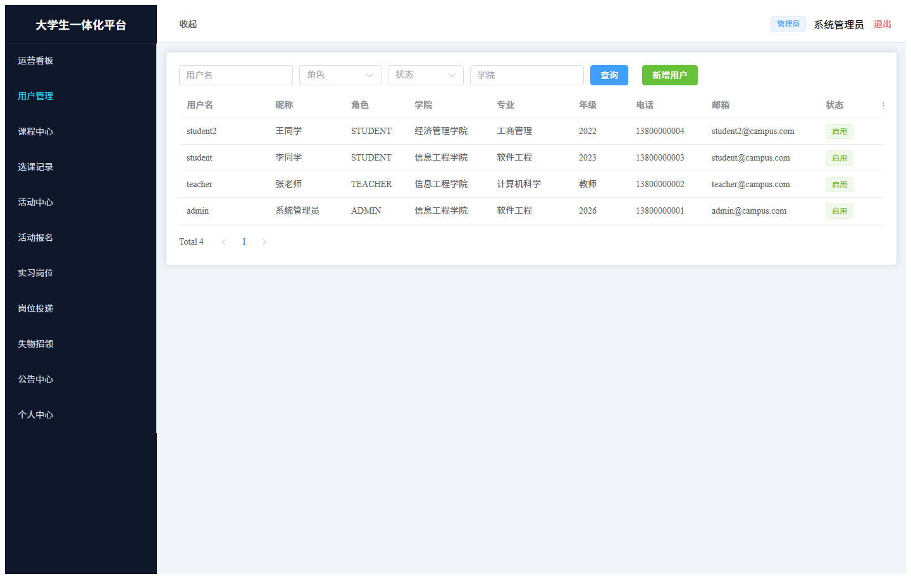

#### admin-03-course

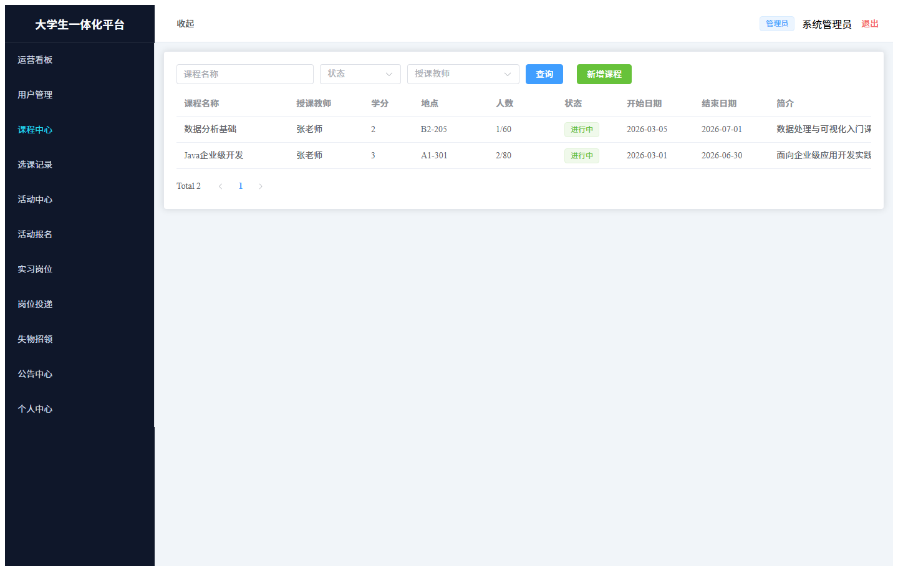

#### admin-04-enroll

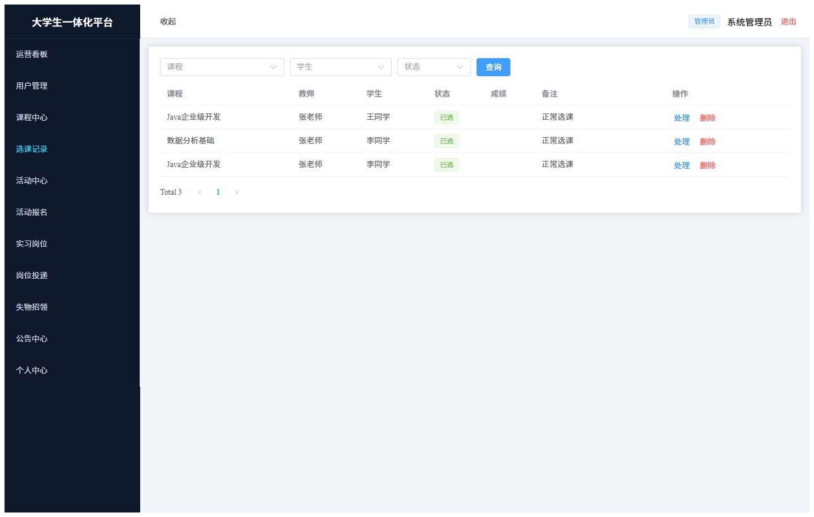

#### admin-05-activity

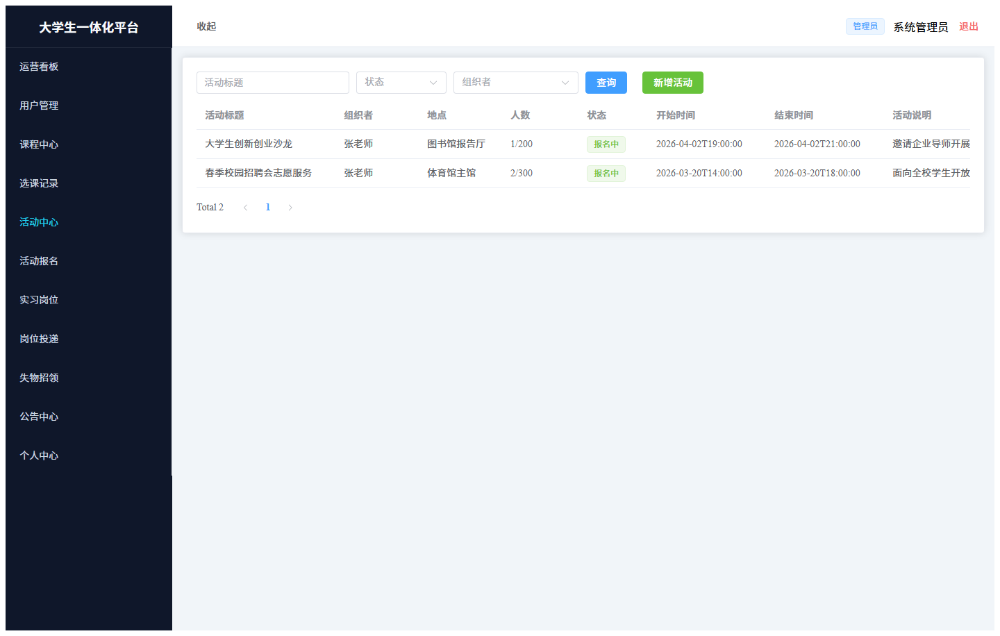

#### admin-06-signup

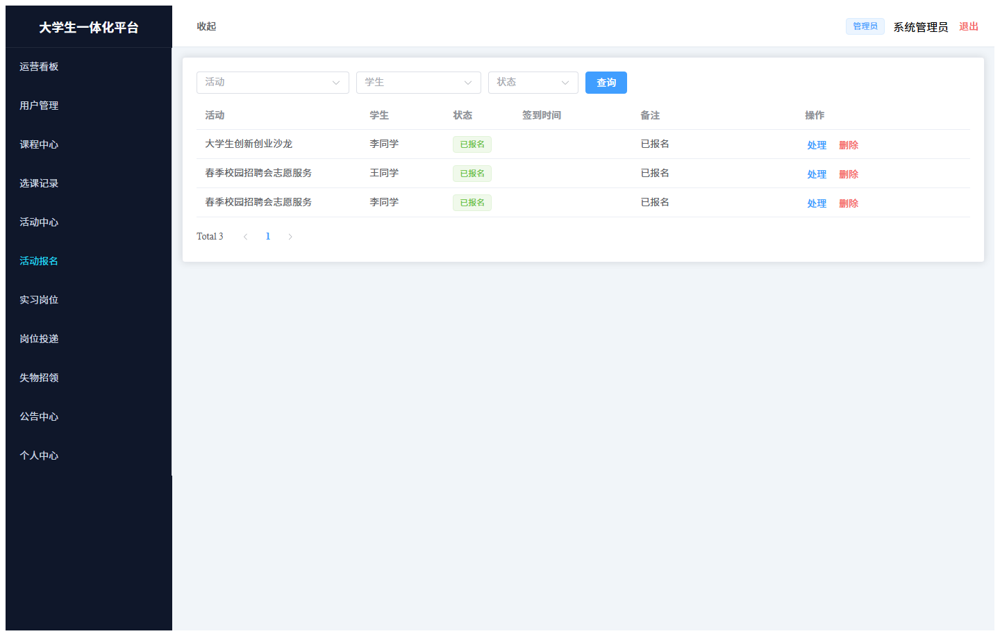

#### admin-07-job

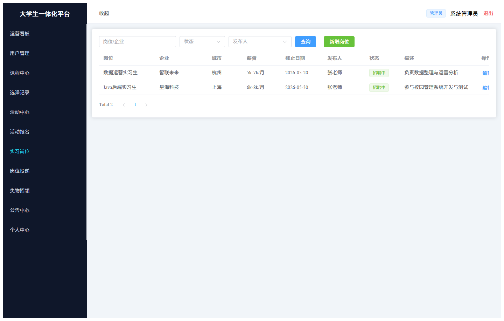

#### admin-08-apply

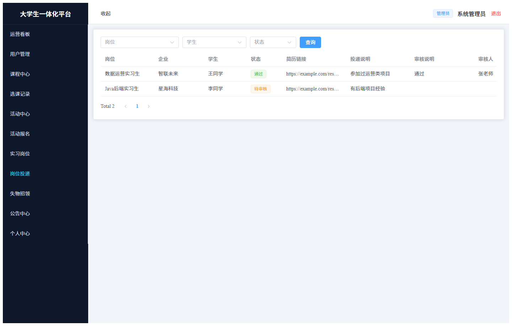

#### admin-09-lost

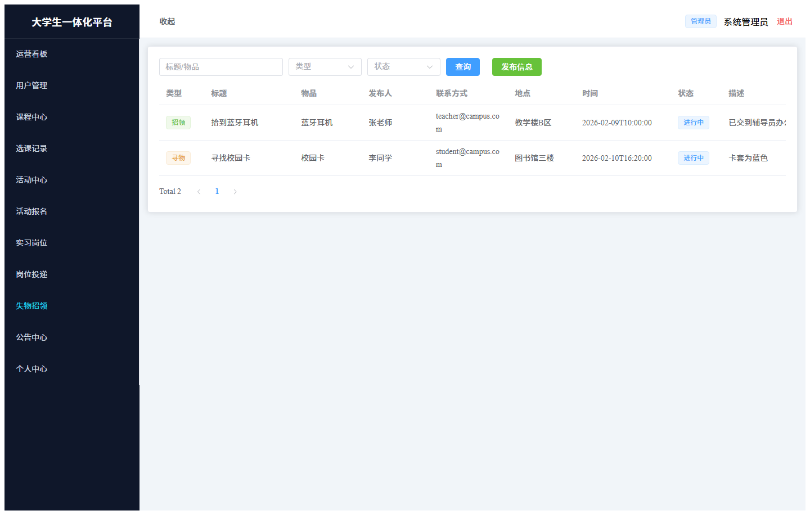

#### admin-10-notice

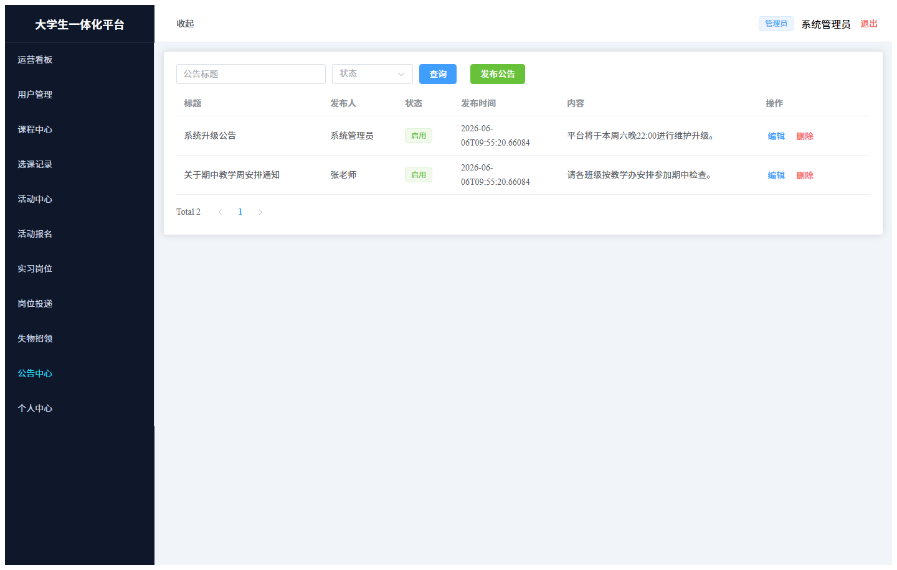

#### admin-11-profile

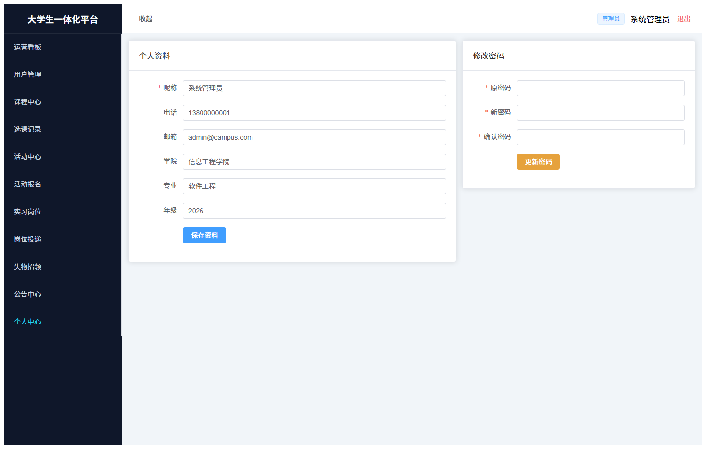

### guest

#### guest-01-login

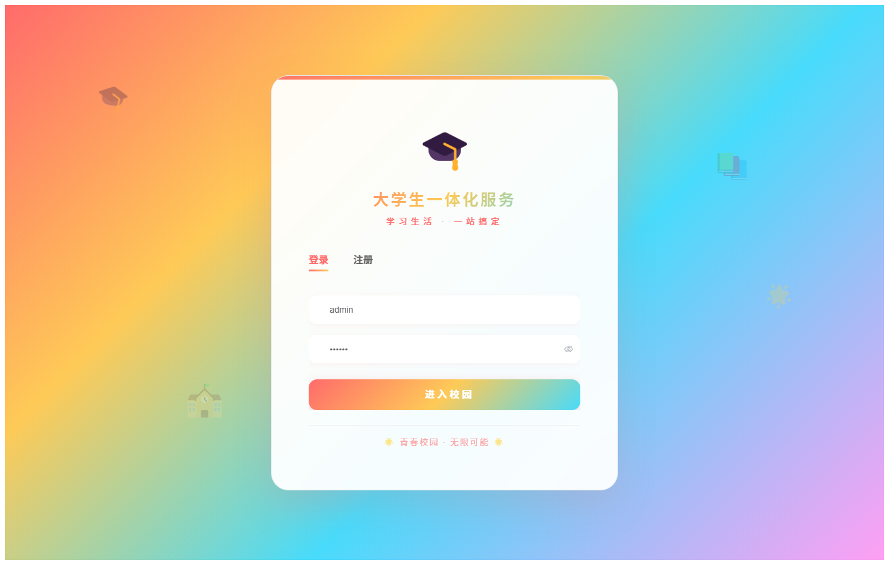

#### guest-02-register

