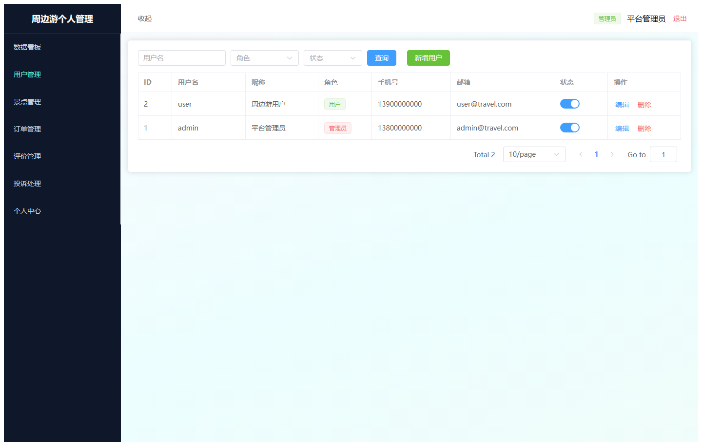
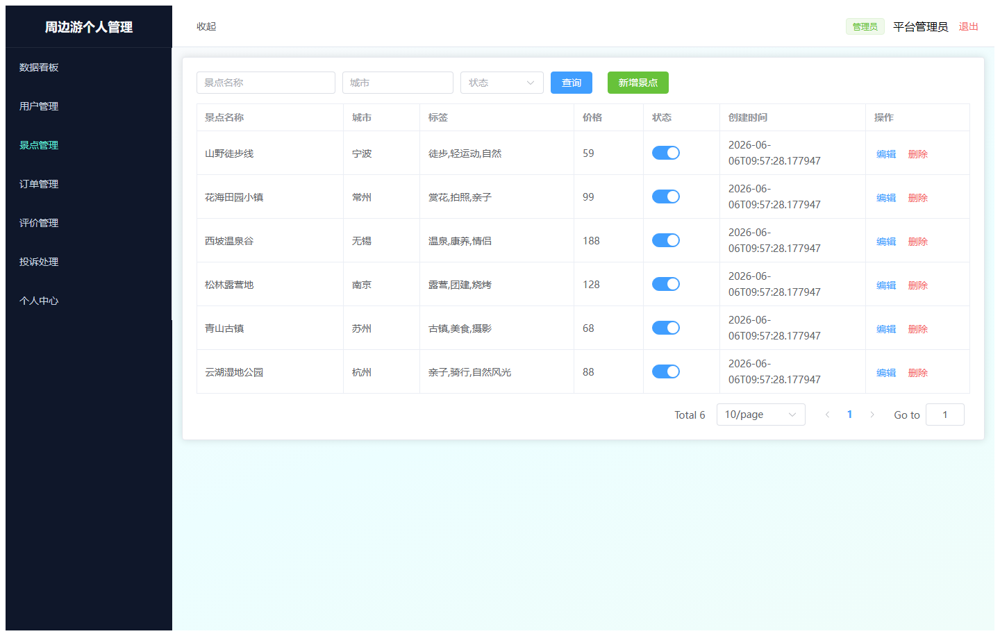
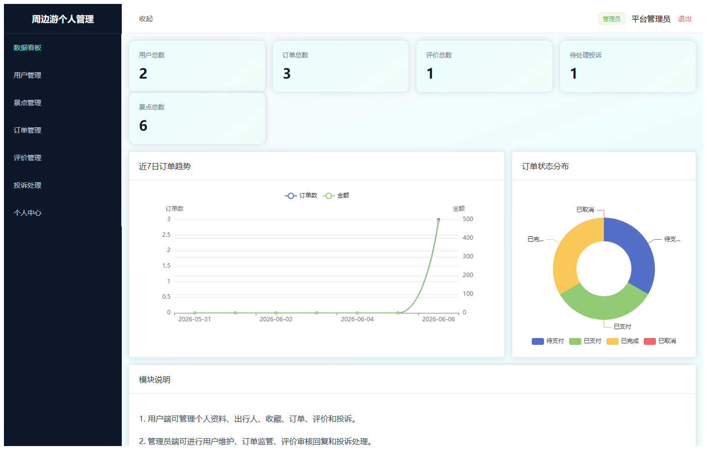
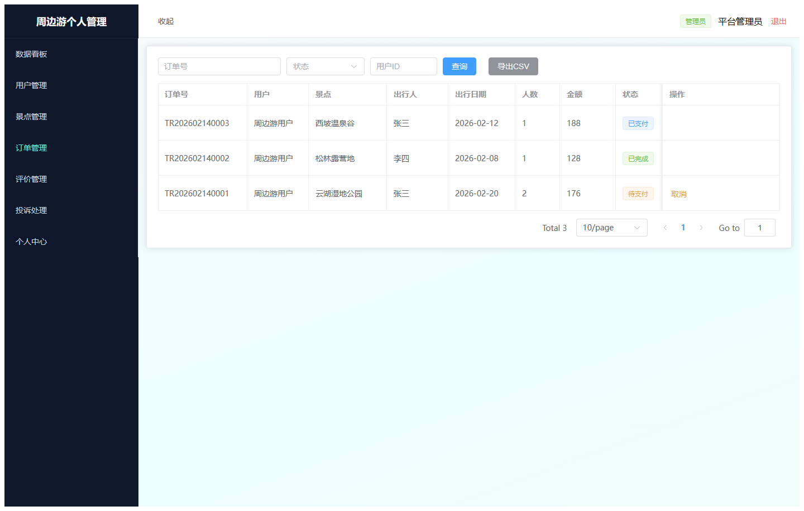
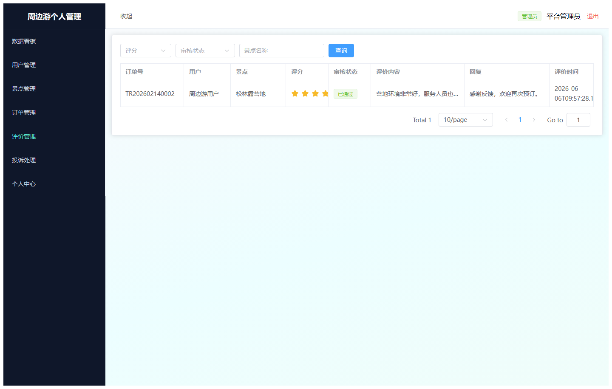
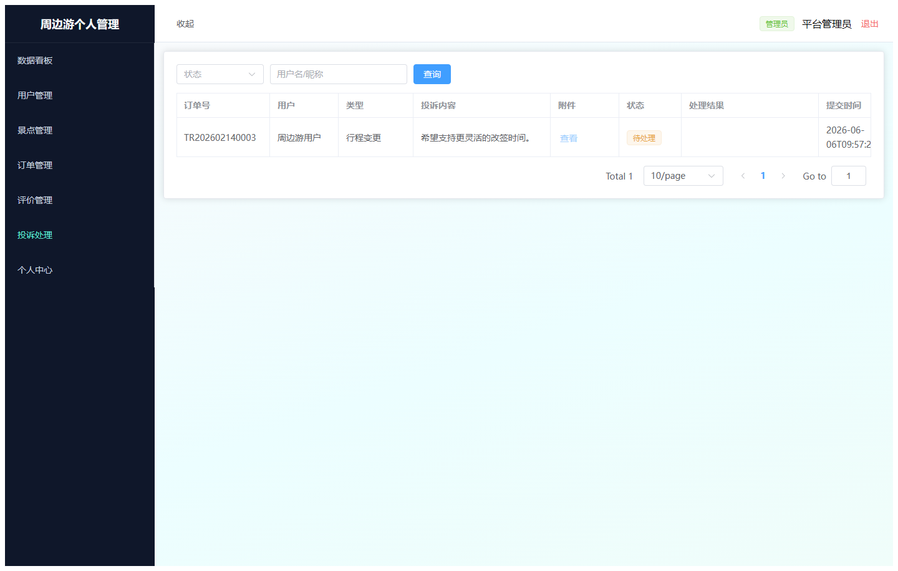
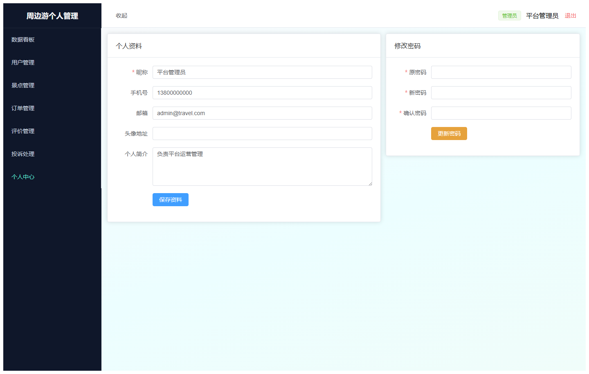
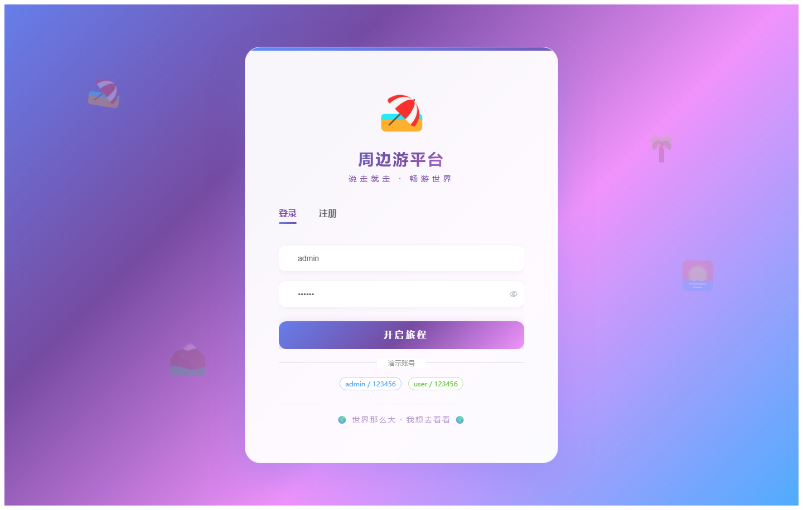

# 068 - 周边游平台个人管理模块 🔥最新

## 项目信息

- 项目编号：`068`
- 组件类型：`backend, frontend`
- 后端入口：`http://127.0.0.1:8068`
- 前端入口：`http://127.0.0.1:3068`
- 账号来源：068-backend\README.md
- 已收录截图：`11` 张

## 默认账号

- `管理员`：`admin` / `123456`
- `普通用户`：`user` / `123456`

## 预览截图

### admin

#### admin-01-dashboard

#### admin-02-user

#### admin-03-spot

#### admin-04-traveler

#### admin-05-favorite

#### admin-06-order

#### admin-07-review

#### admin-08-complaint

#### admin-09-profile

### guest

#### guest-01-login

#### guest-02-register

