# 069 - 科任教师考评系统 🔥最新

## 项目信息

- 项目编号：`069`
- 组件类型：`backend, frontend`
- 后端入口：`http://127.0.0.1:8069`
- 前端入口：`http://127.0.0.1:3069`
- 账号来源：069-backend\README.md
- 已收录截图：`13` 张

## 默认账号

- `管理员`：`admin` / `123456`
- `教师`：`teacher1` / `123456`
- `学生`：`student1` / `123456`

## 预览截图

### admin

#### admin-01-dashboard

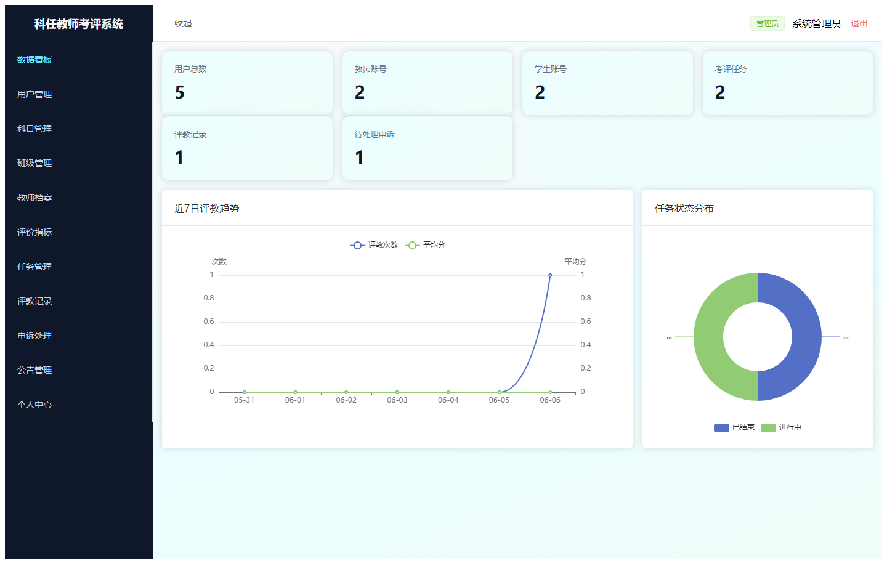

#### admin-02-user

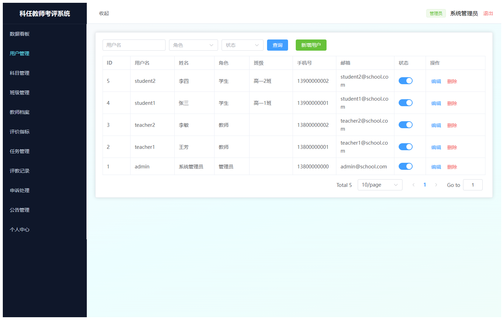

#### admin-03-subject

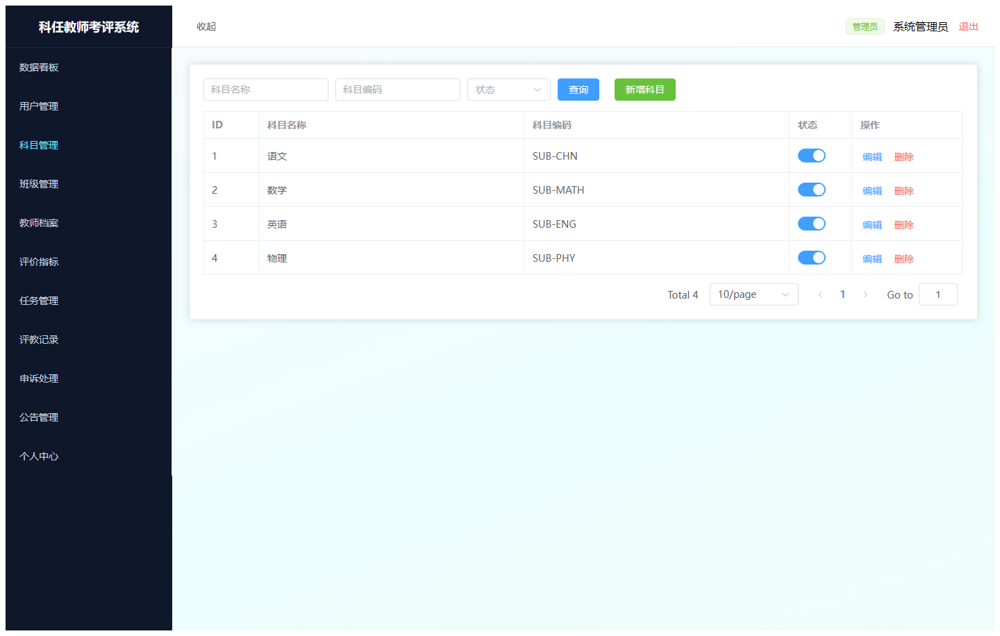

#### admin-04-class

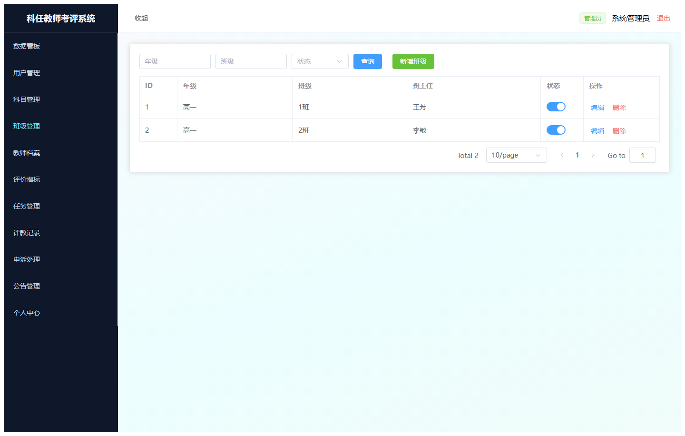

#### admin-05-teacher

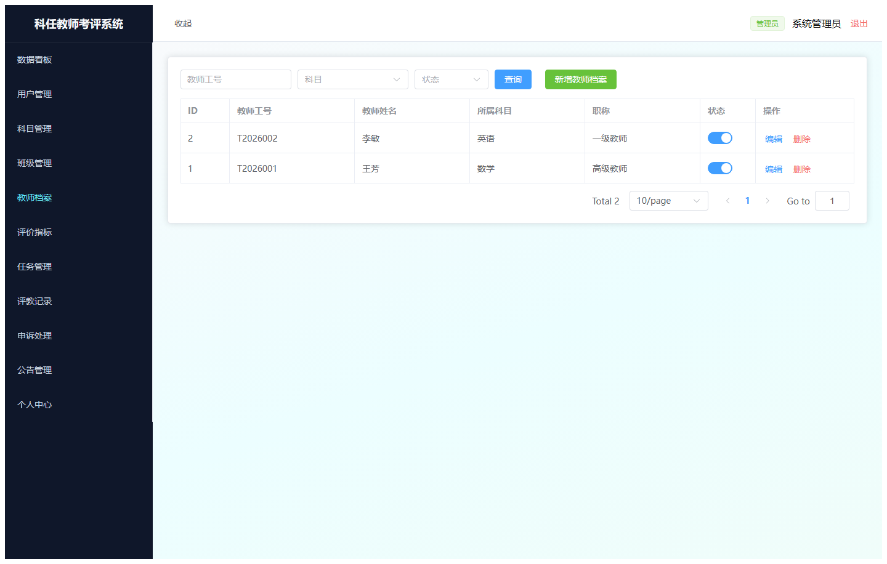

#### admin-06-indicator

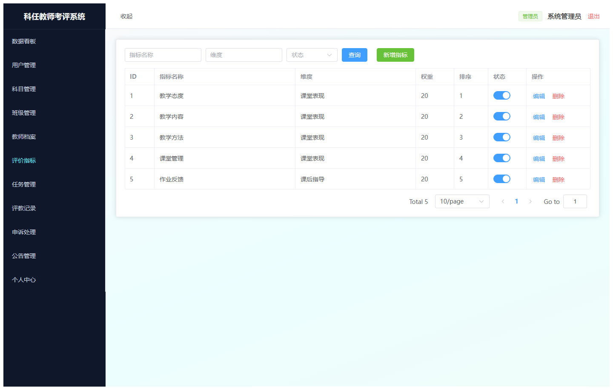

#### admin-07-task

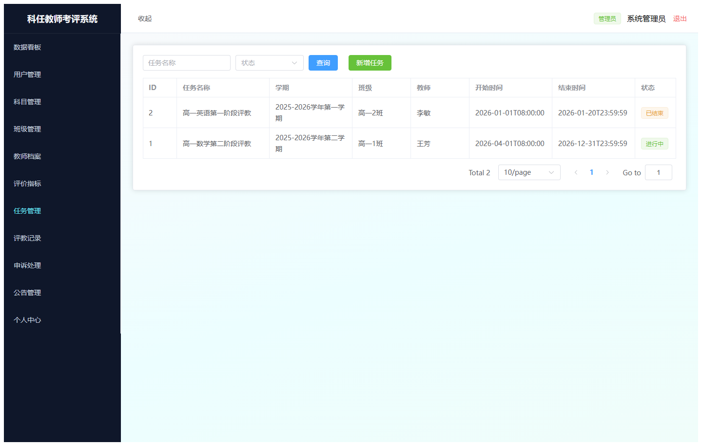

#### admin-08-record

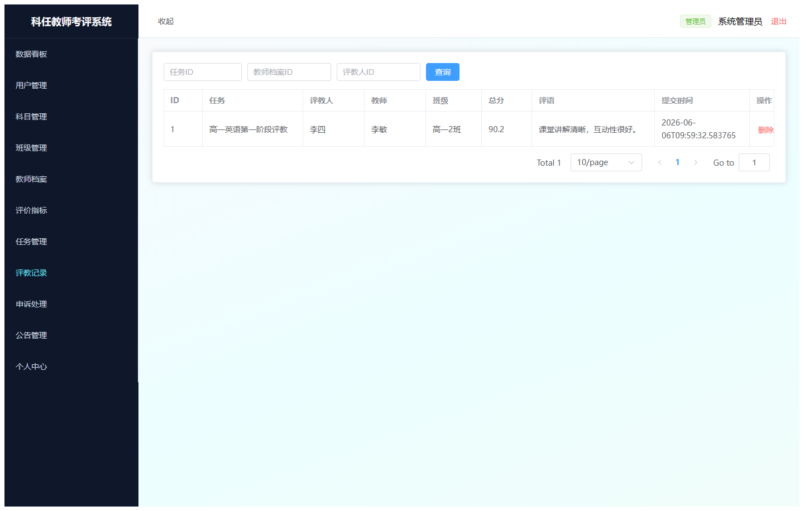

#### admin-09-appeal

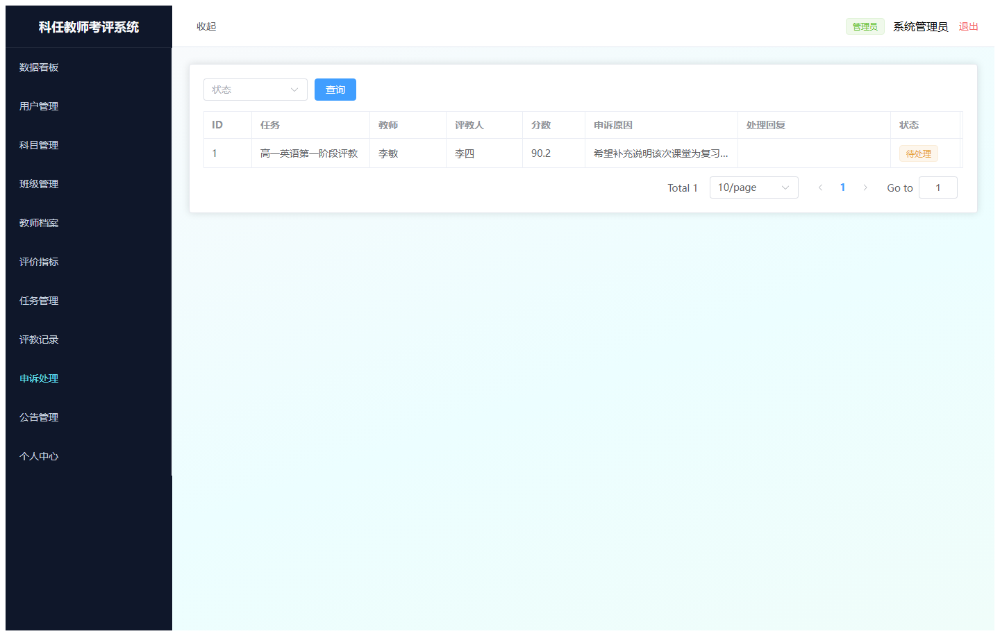

#### admin-10-notice

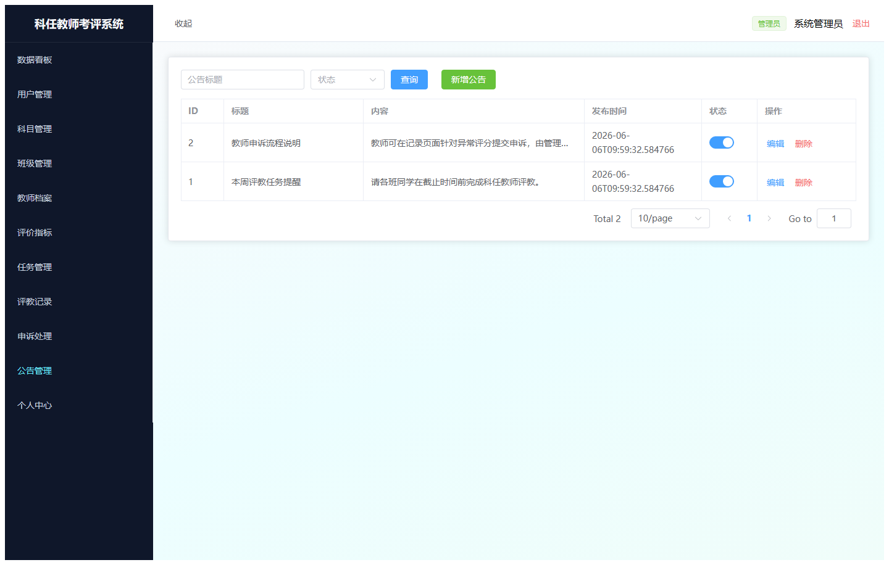

#### admin-11-profile

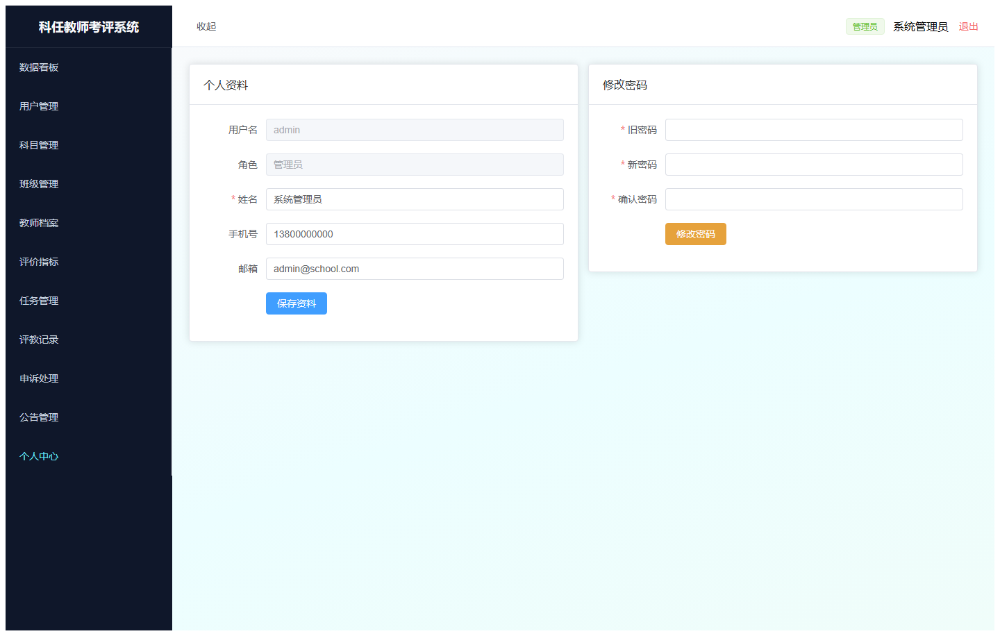

### guest

#### guest-01-login

#### guest-02-register

