# 071 - 基于SpringBoot和Vue的共享单车系统

## 项目信息

- 项目编号：`071`
- 组件类型：`backend, frontend`
- 后端入口：`http://127.0.0.1:8071`
- 前端入口：`http://127.0.0.1:3071`
- 账号来源：071-backend\README.md
- 已收录截图：`19` 张

## 默认账号

- `管理员`：`admin` / `123456`
- `普通用户`：`user` / `123456`
- `测试用户`：`test` / `123456`

## 预览截图

### admin

#### admin-01-dashboard

#### admin-02-profile

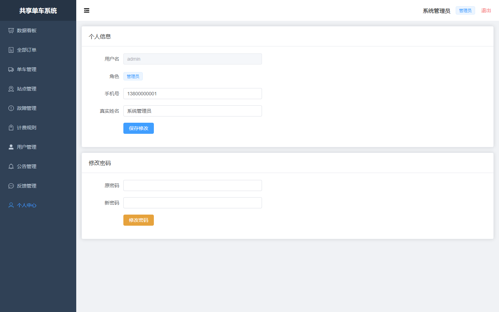

#### admin-03-list

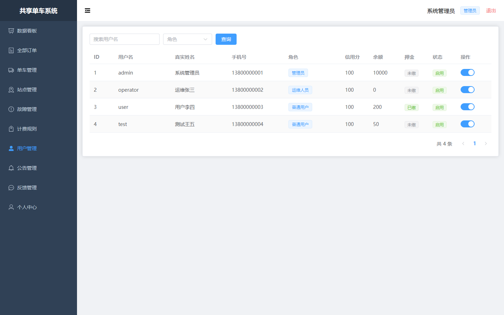

#### admin-04-list

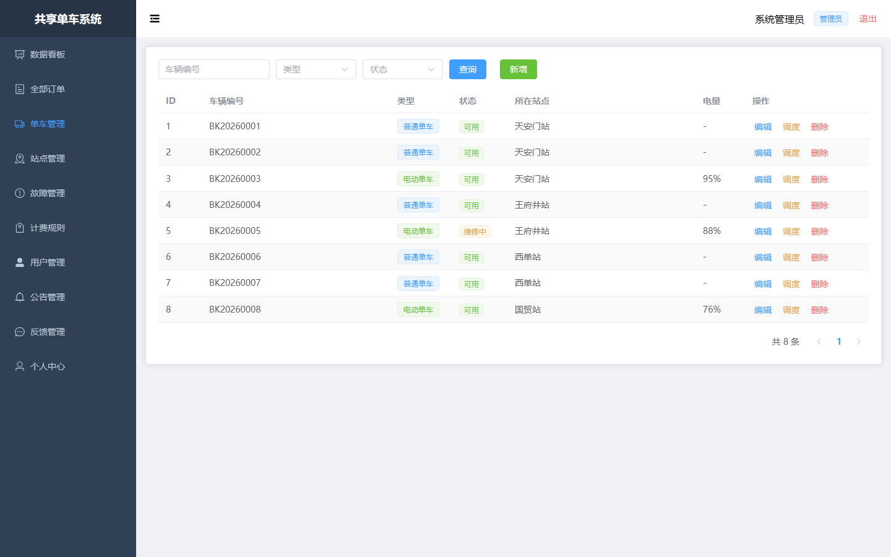

#### admin-05-list

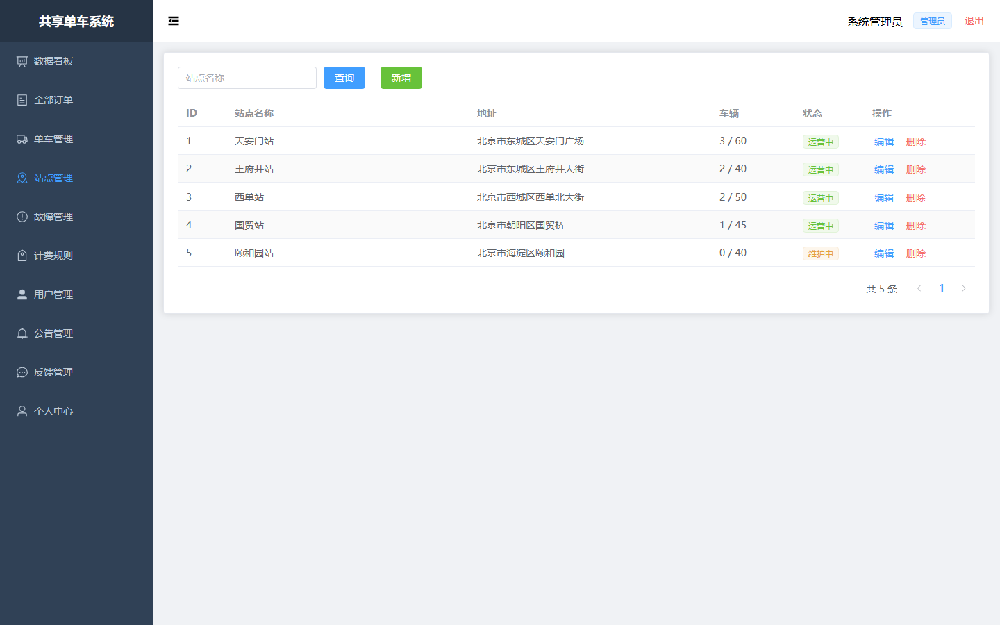

#### admin-06-start

#### admin-07-status

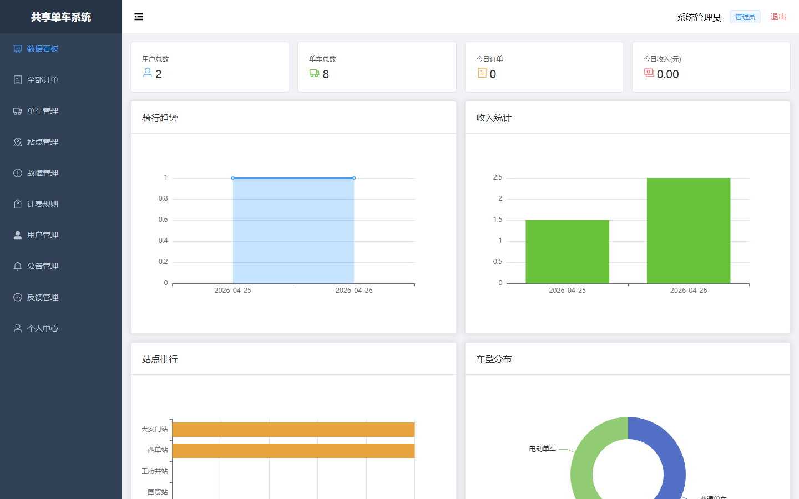

#### admin-08-history

#### admin-09-orders

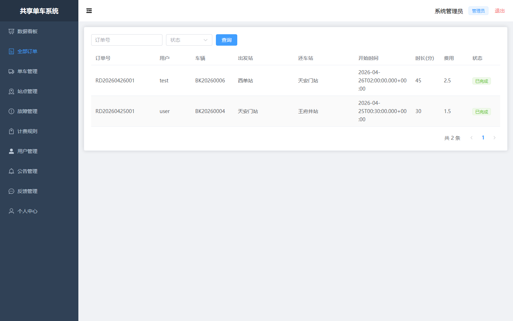

#### admin-10-my

#### admin-11-records

#### admin-12-report

#### admin-13-list

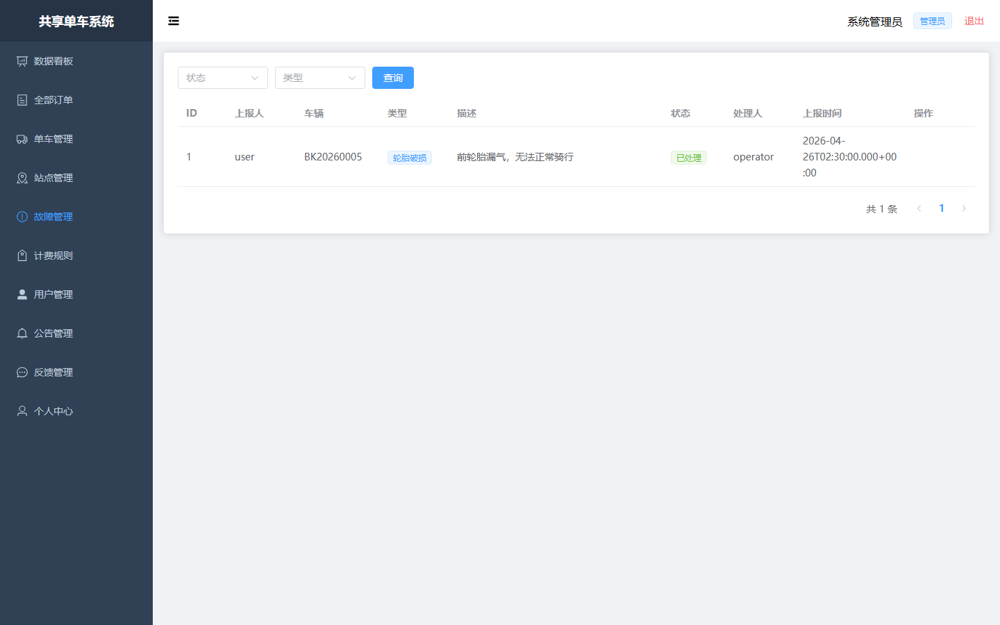

#### admin-14-list

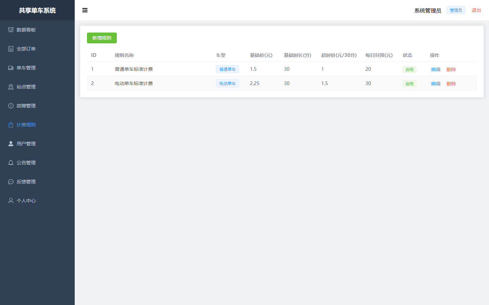

#### admin-15-info

#### admin-16-list

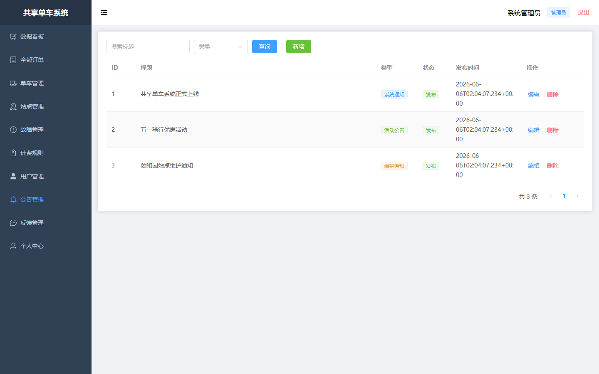

#### admin-17-list

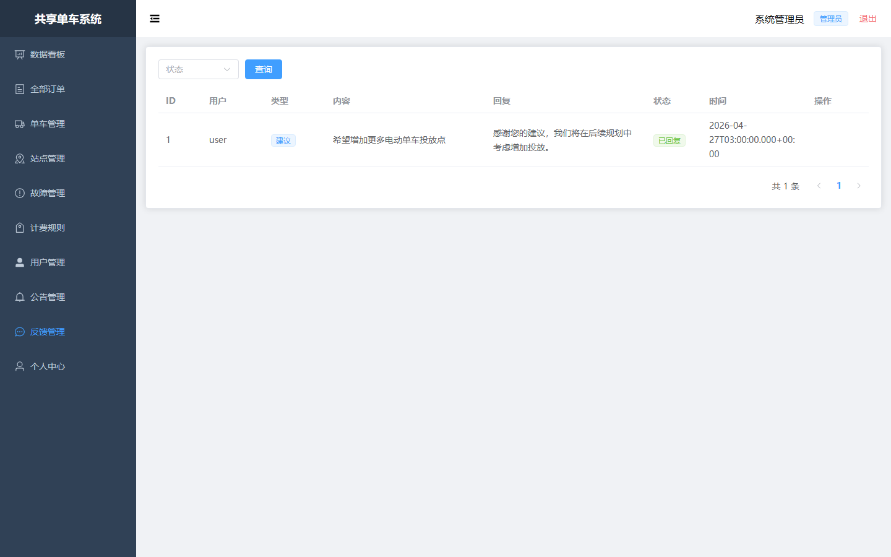

### guest

#### guest-01-login

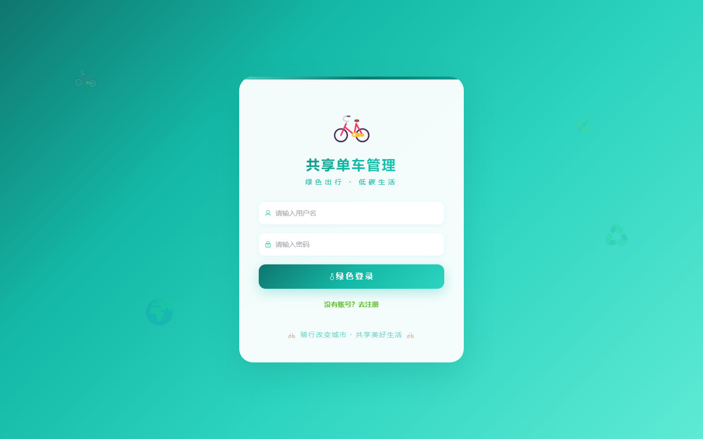

#### guest-02-register

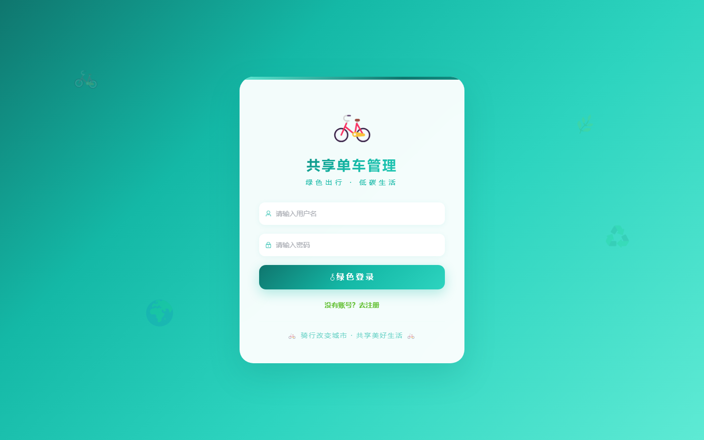
