# 073 - 基于SpringBoot和Vue的人事管理系统 🔥最新

## 项目信息

- 项目编号：`073`
- 组件类型：`backend, frontend`
- 后端入口：`http://127.0.0.1:8073`
- 前端入口：`http://127.0.0.1:3073`
- 账号来源：073-backend\README.md
- 已收录截图：`16` 张

## 默认账号

- `管理员`：`admin` / `123456`
- `HR`：`hr` / `123456`

## 预览截图

### admin

#### admin-01-dashboard

#### admin-02-department

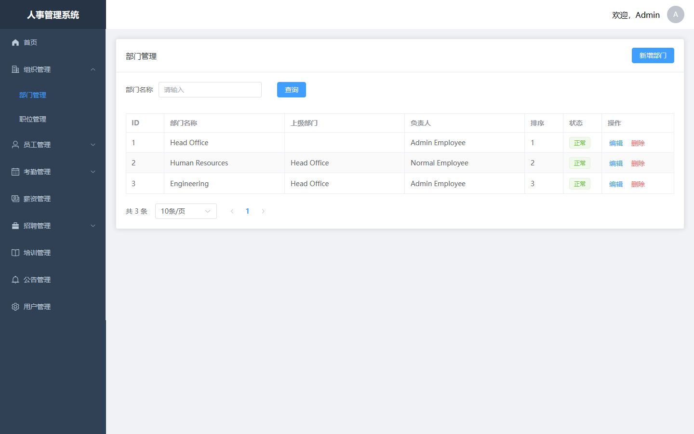

#### admin-03-position

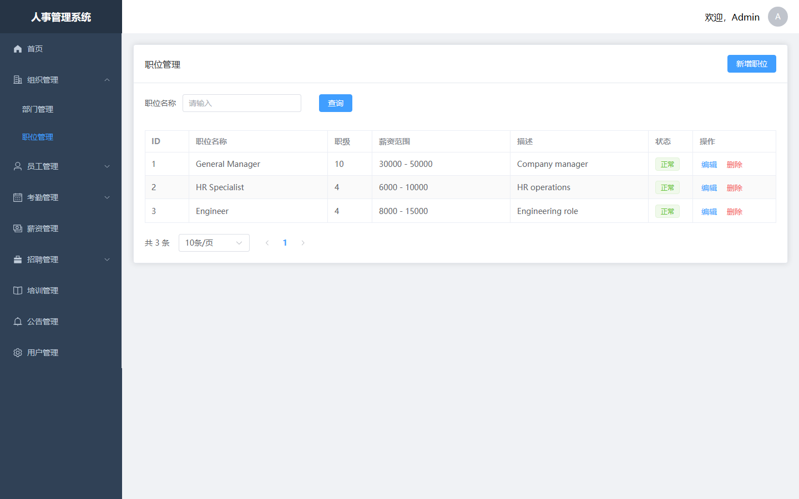

#### admin-04-employee

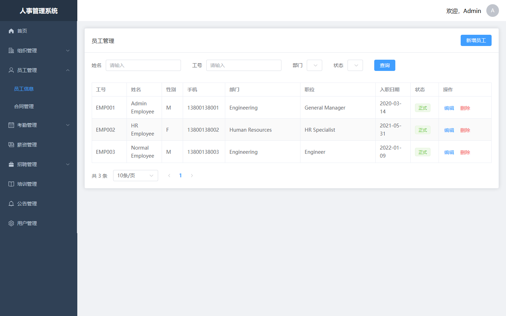

#### admin-05-attendance

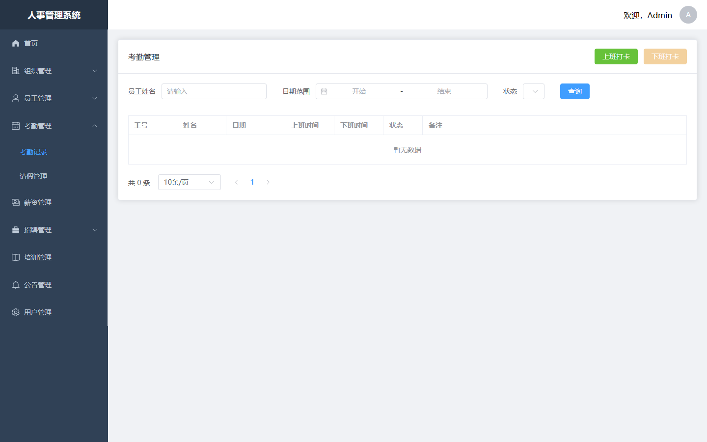

#### admin-06-leave

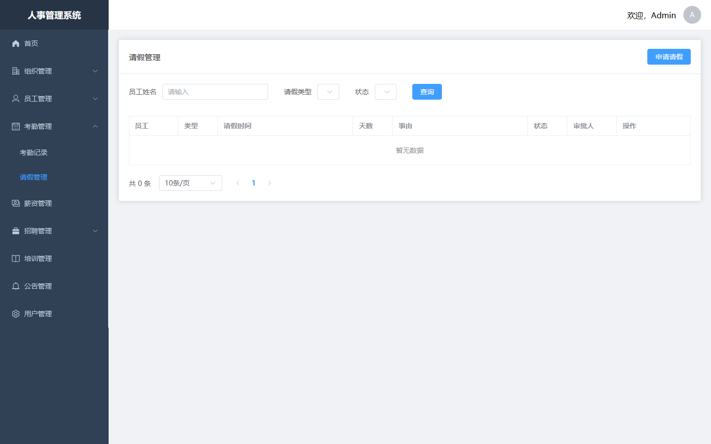

#### admin-07-salary

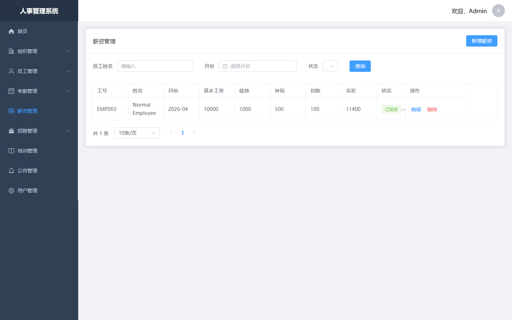

#### admin-08-recruitment

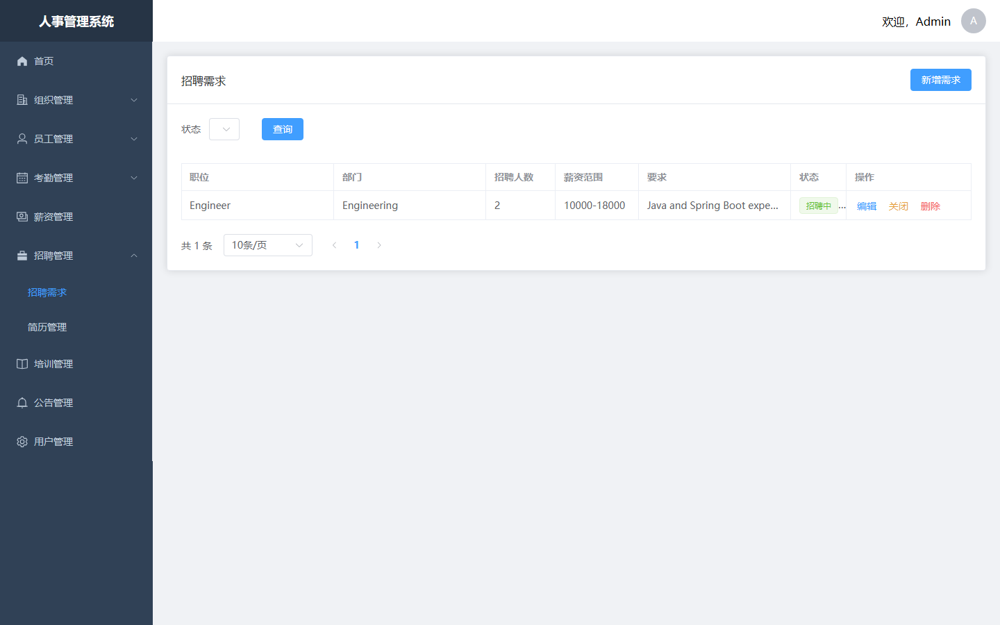

#### admin-09-resume

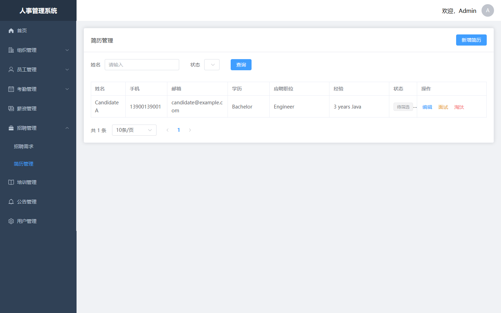

#### admin-10-training

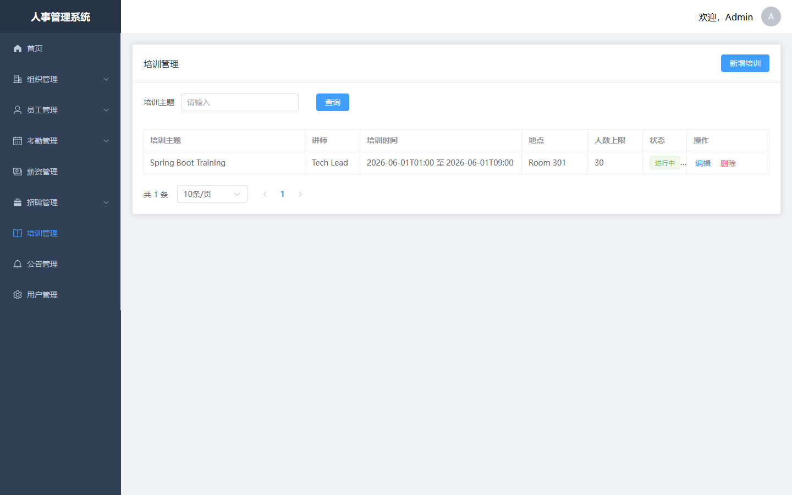

#### admin-11-contract

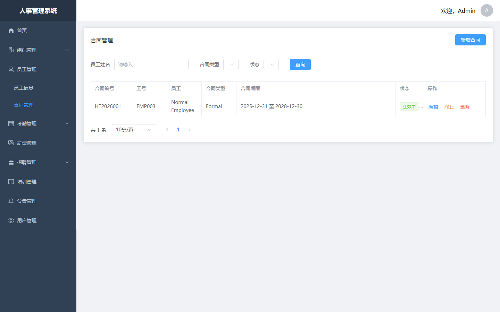

#### admin-12-announcement

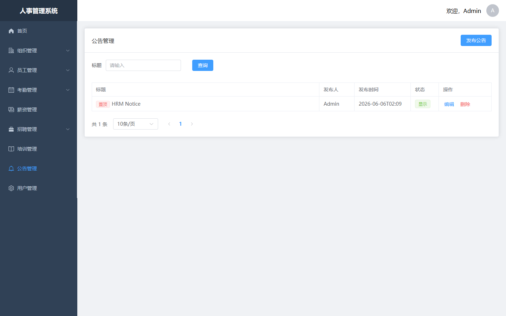

#### admin-13-user

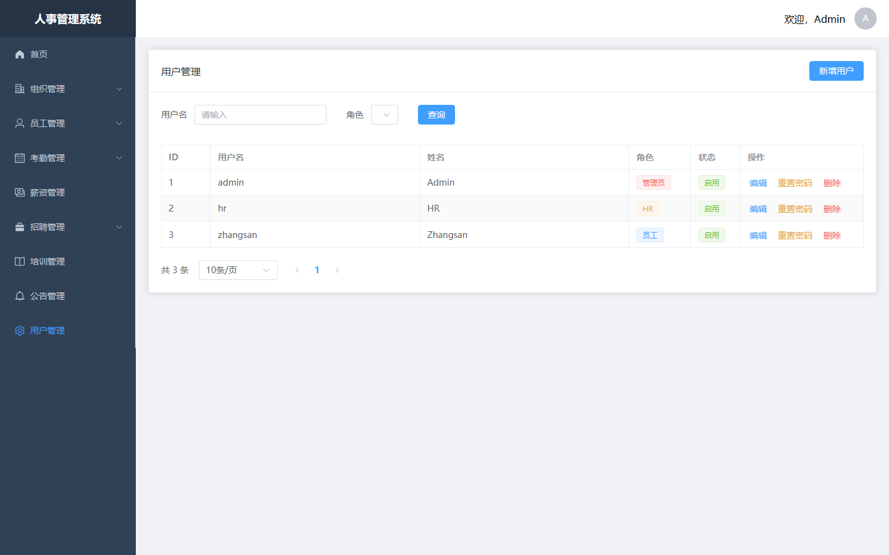

#### admin-14-profile

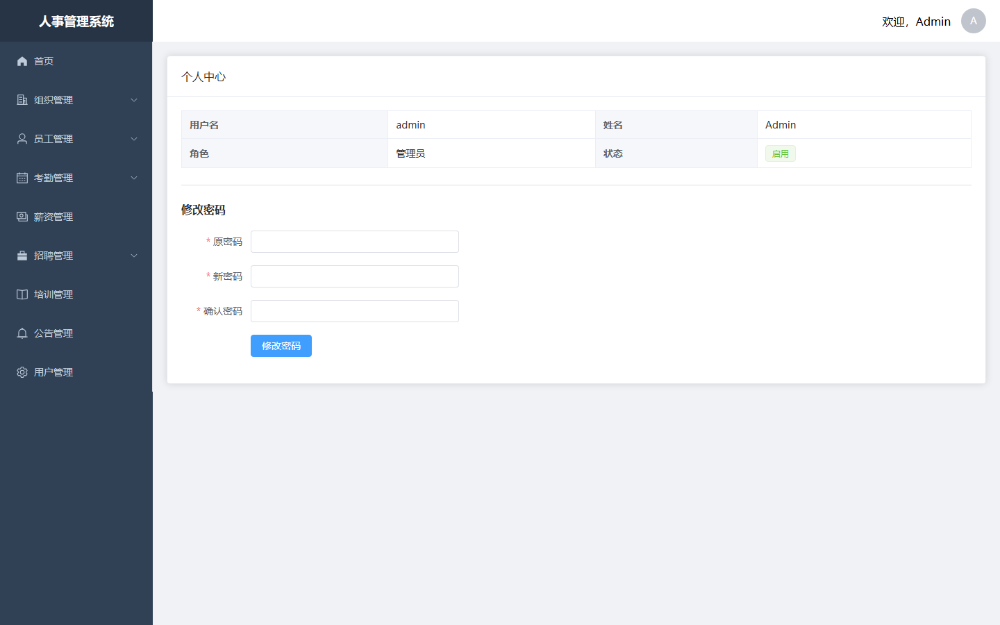

### guest

#### guest-01-login

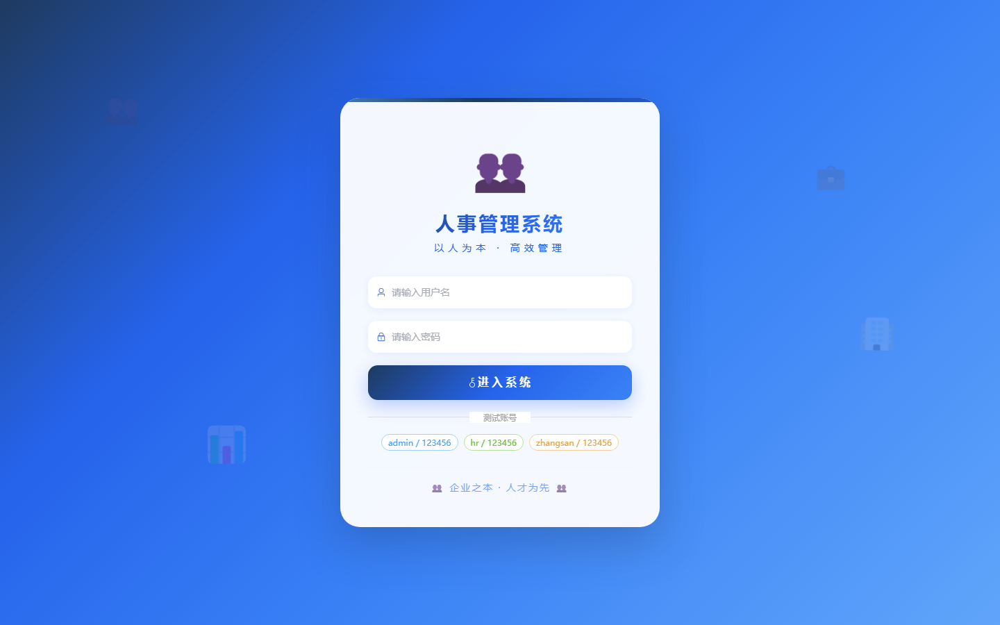

#### guest-02-register

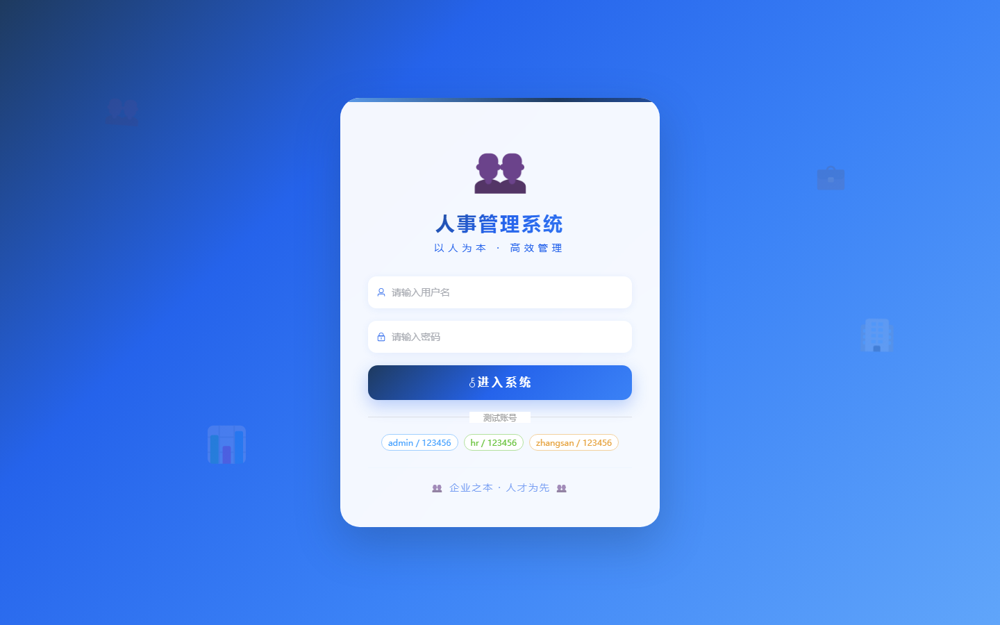
