# 079 - 计算机学院校友网 🔥最新

## 项目信息

- 项目编号：`079`
- 组件类型：`backend, frontend`
- 后端入口：`http://127.0.0.1:8079`
- 前端入口：`http://127.0.0.1:3079`
- 账号来源：079-backend\README.md
- 已收录截图：`15` 张

## 默认账号

- `管理员`：`admin` / `123456`

## 预览截图

### admin

#### admin-01-dashboard

#### admin-02-user

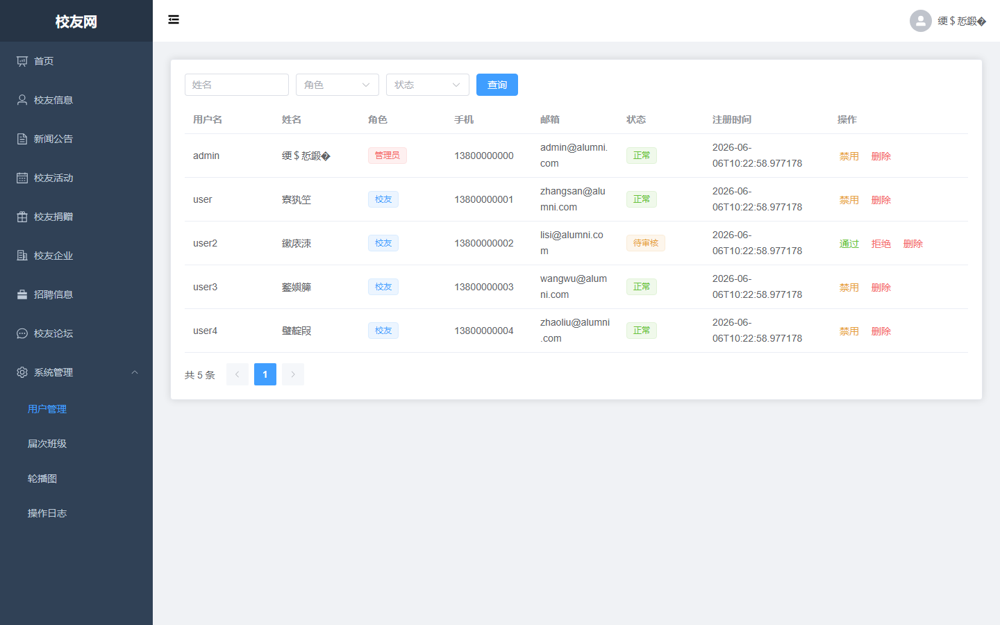

#### admin-03-alumni

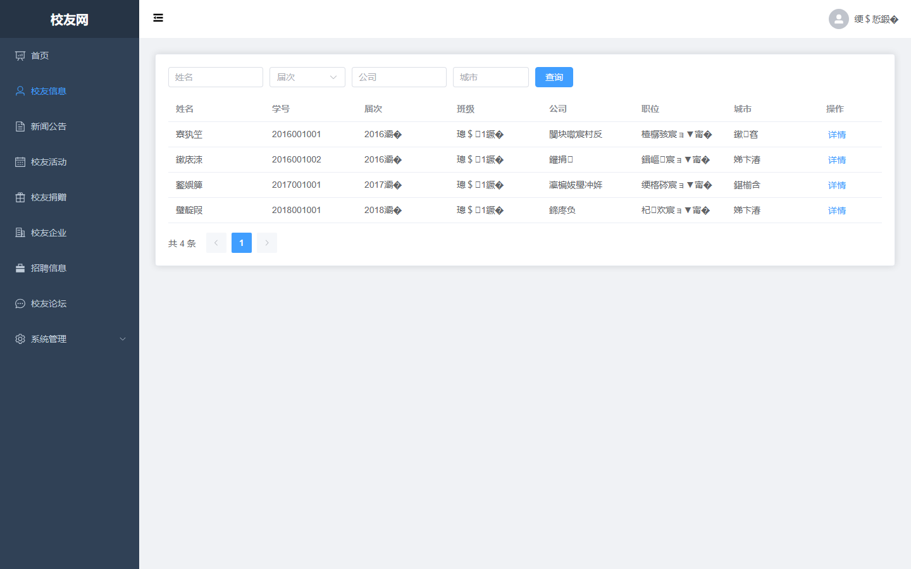

#### admin-04-grade

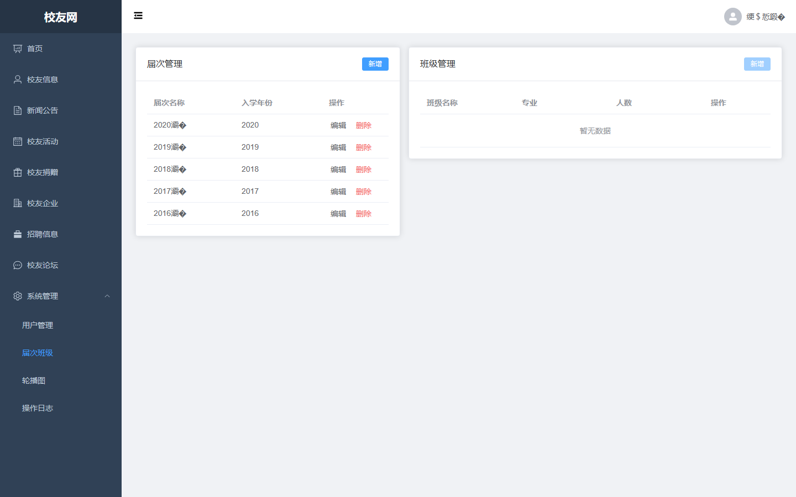

#### admin-05-news

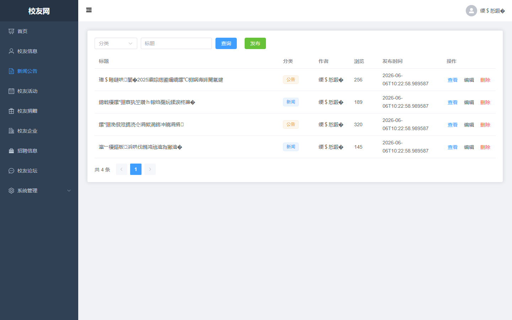

#### admin-06-activity

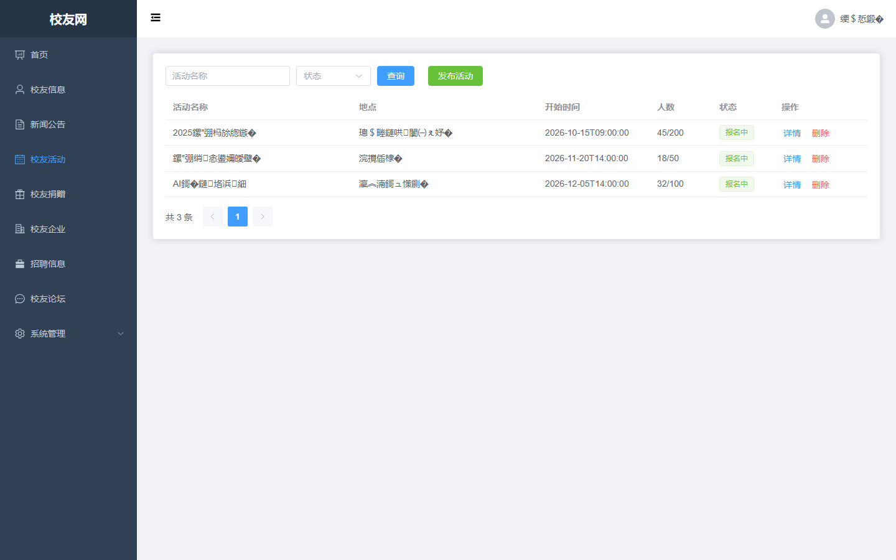

#### admin-07-donation

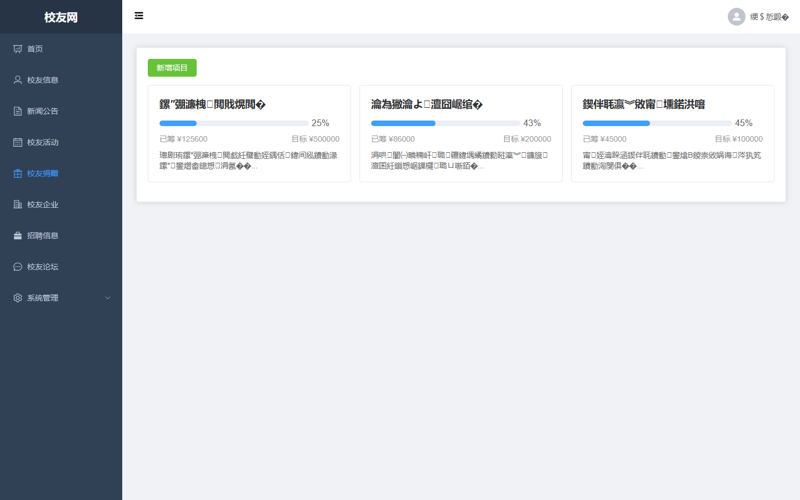

#### admin-08-company

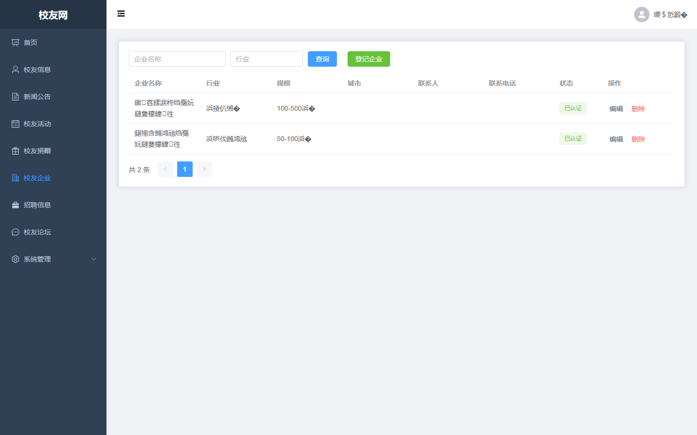

#### admin-09-job

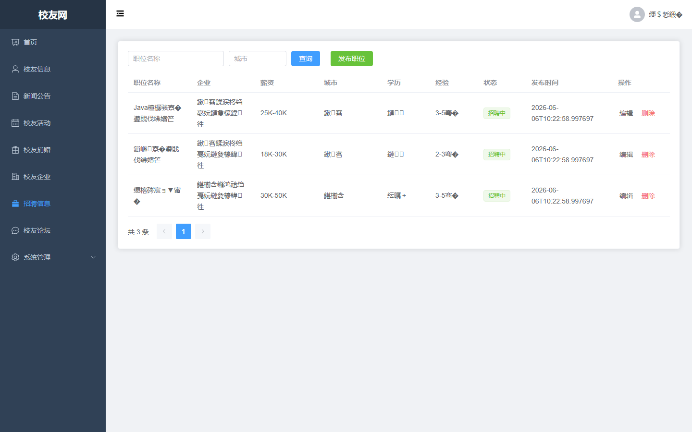

#### admin-10-forum

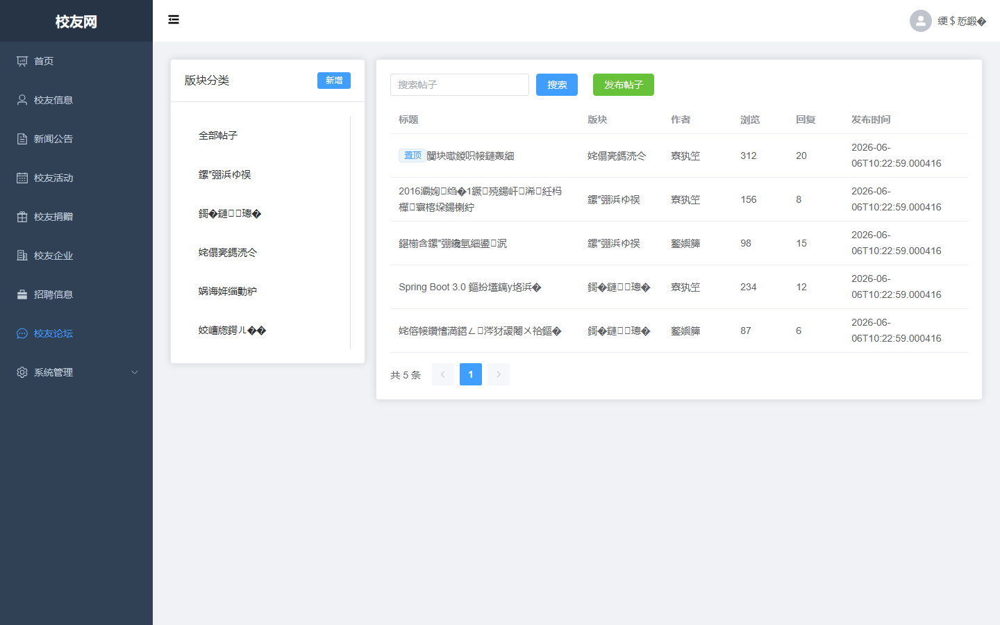

#### admin-11-banner

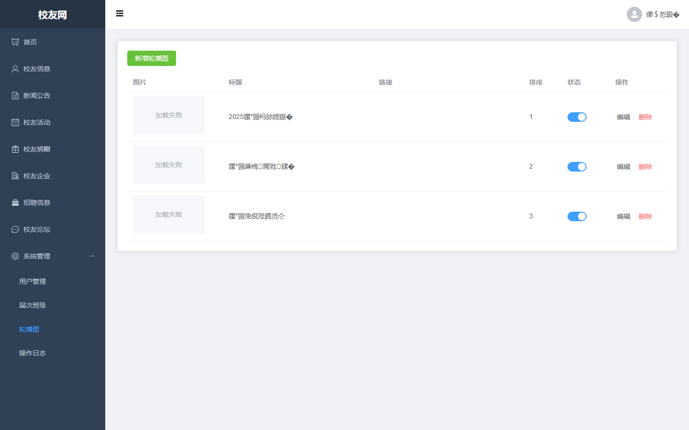

#### admin-12-log

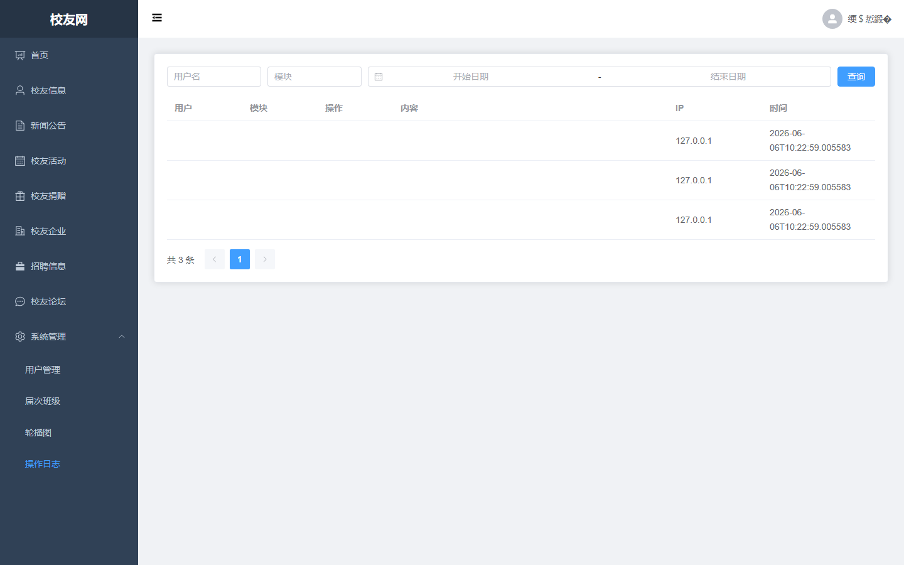

#### admin-13-profile

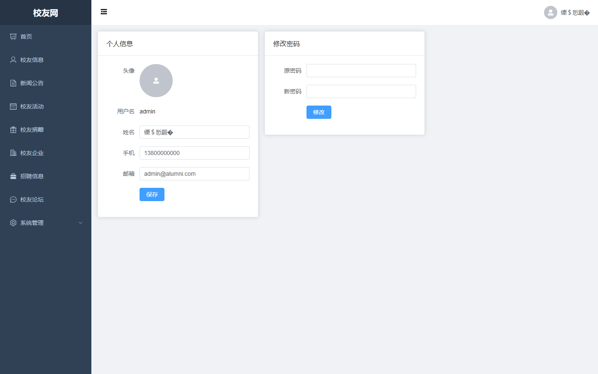

### guest

#### guest-01-login

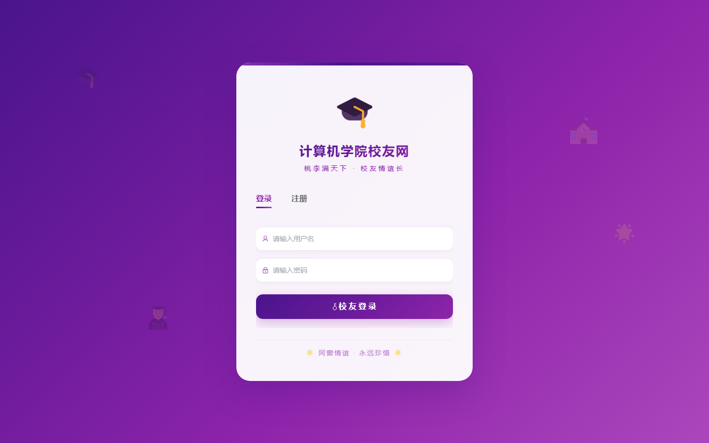

#### guest-02-register

