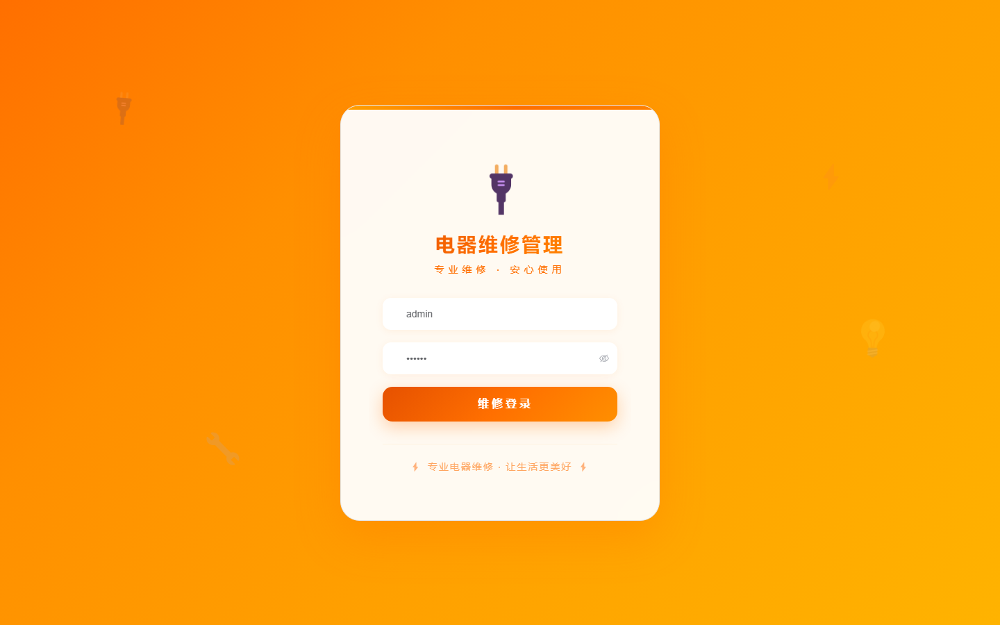

# 081 - 电器维修系统小程序 🔥最新

## 项目信息

- 项目编号：`081`
- 组件类型：`backend, frontend, miniapp`
- 后端入口：`http://127.0.0.1:8081`
- 前端入口：`http://127.0.0.1:3081`
- 账号来源：081-backend\README.md
- 已收录截图：`2` 张

## 默认账号

- `管理员`：`admin` / `123456`
- `普通用户`：`user1` / `123456`
- `普通用户`：`user2` / `123456`

## 预览截图

### guest

#### guest-01-login

#### guest-02-register

