# 082 - 公考学习平台 🔥最新

## 项目信息

- 项目编号：`082`
- 组件类型：`backend, frontend`
- 后端入口：`http://127.0.0.1:8082`
- 前端入口：`http://127.0.0.1:3082`
- 账号来源：082-backend\README.md
- 已收录截图：`12` 张

## 默认账号

- `管理员`：`admin` / `123456`

## 预览截图

### admin

#### admin-01-dashboard

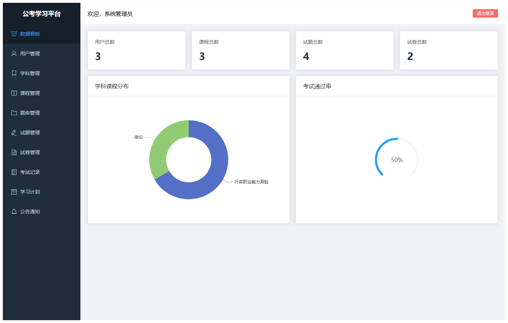

#### admin-02-user

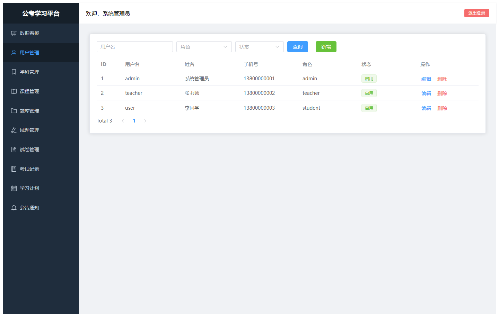

#### admin-03-subject

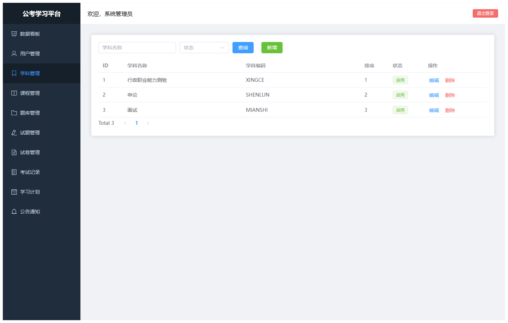

#### admin-04-course

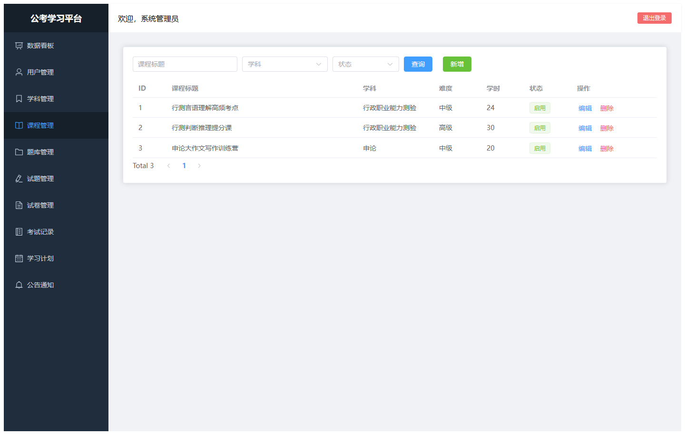

#### admin-05-bank

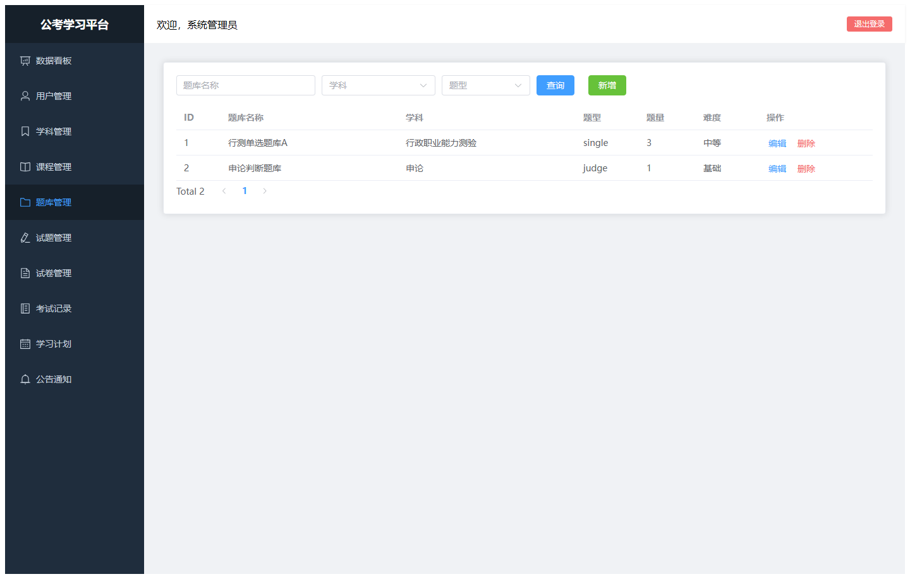

#### admin-06-question

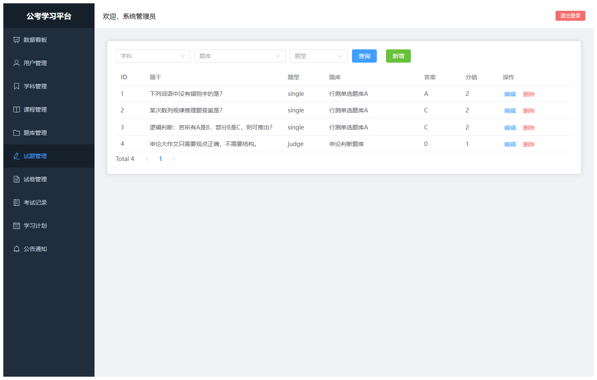

#### admin-07-paper

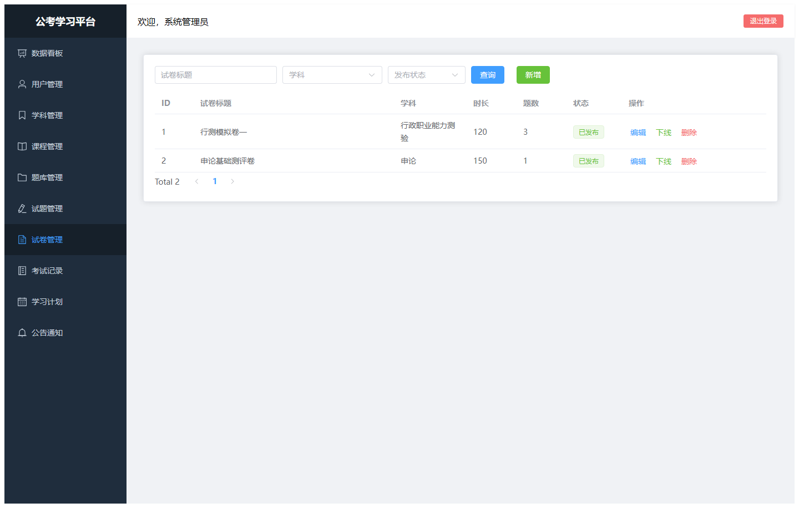

#### admin-08-exam-record

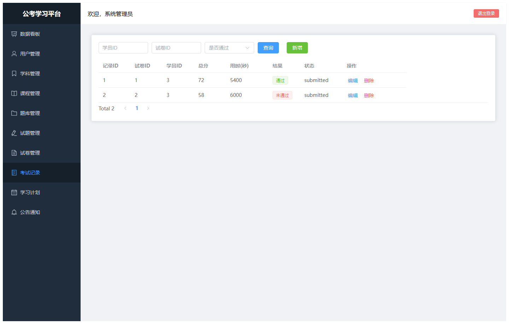

#### admin-09-plan

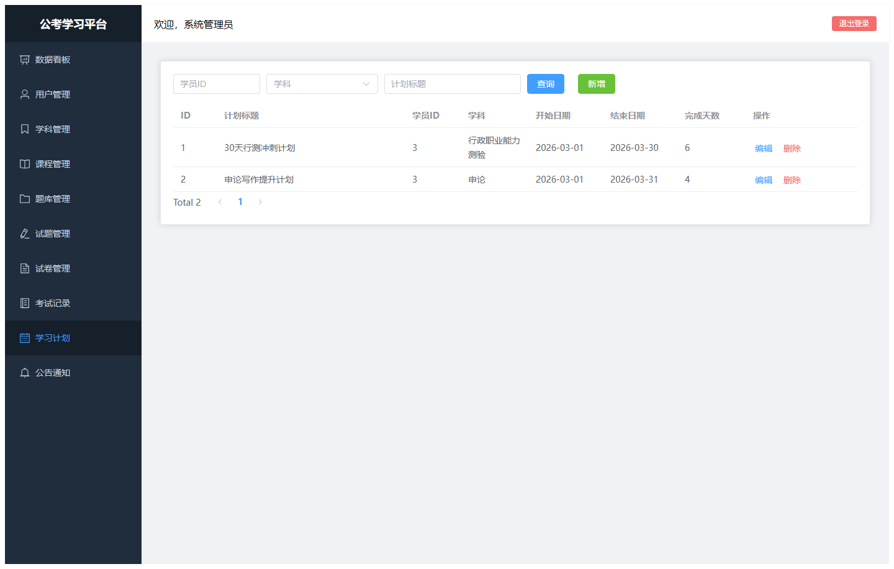

#### admin-10-notice

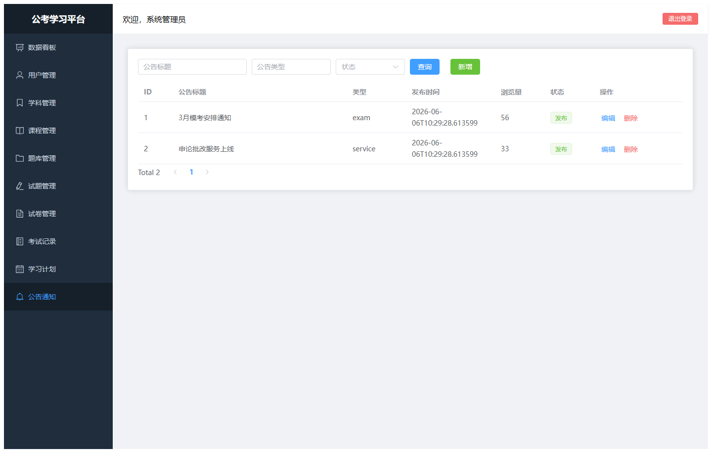

### guest

#### guest-01-login

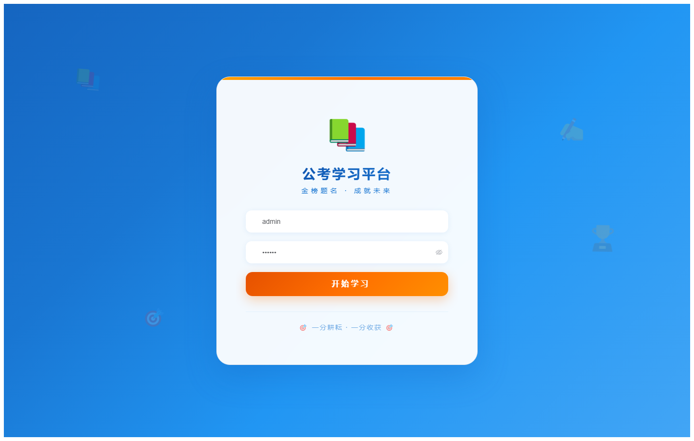

#### guest-02-register

