# 083 - 基于B/S的老年人体检管理系统 🔥最新

## 项目信息

- 项目编号：`083`
- 组件类型：`backend, frontend`
- 后端入口：`http://127.0.0.1:8083`
- 前端入口：`http://127.0.0.1:3083`
- 账号来源：083-backend\README.md
- 已收录截图：`11` 张

## 默认账号

- `管理员`：`admin` / `123456`
- `医生`：`doctor` / `123456`

## 预览截图

### admin

#### admin-01-dashboard

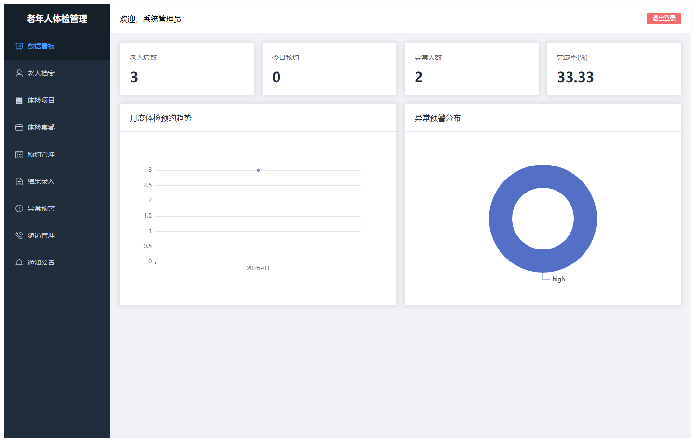

#### admin-02-elder

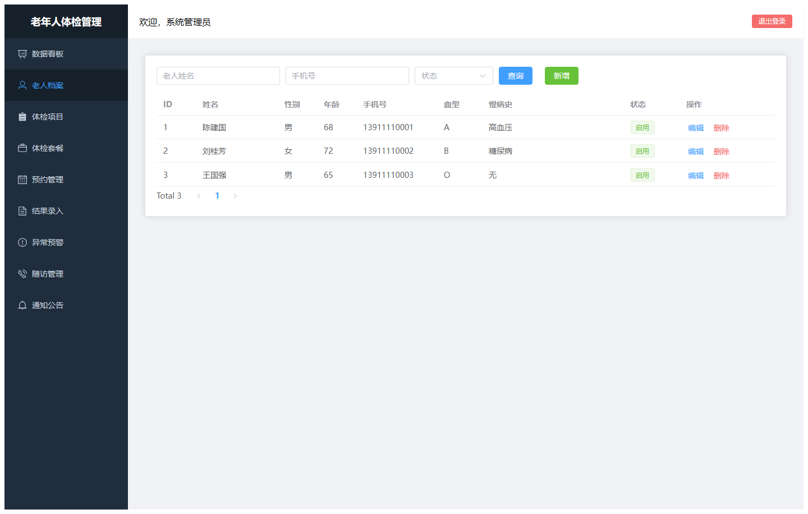

#### admin-03-item

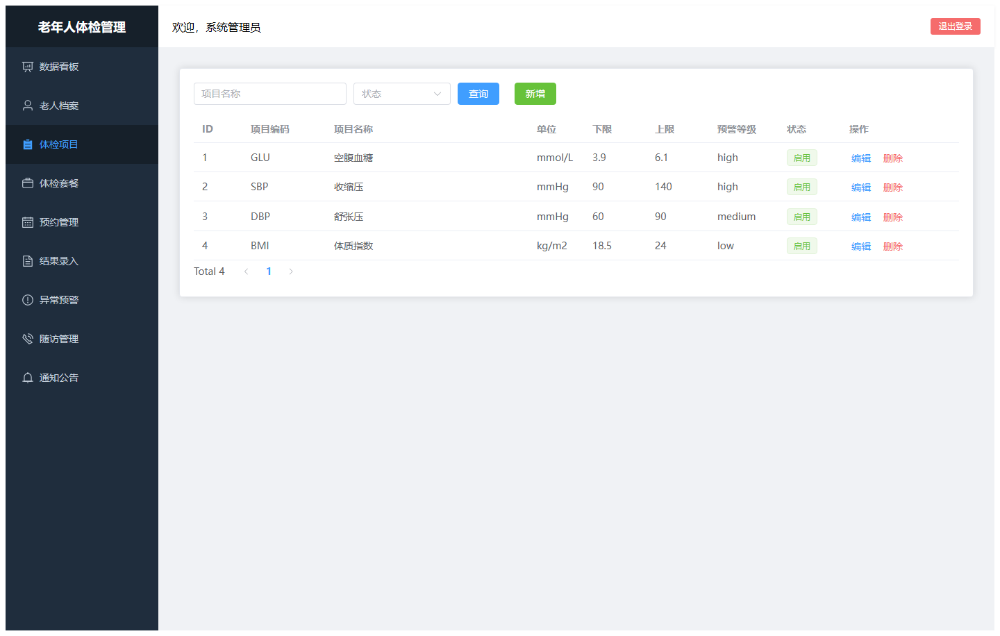

#### admin-04-package

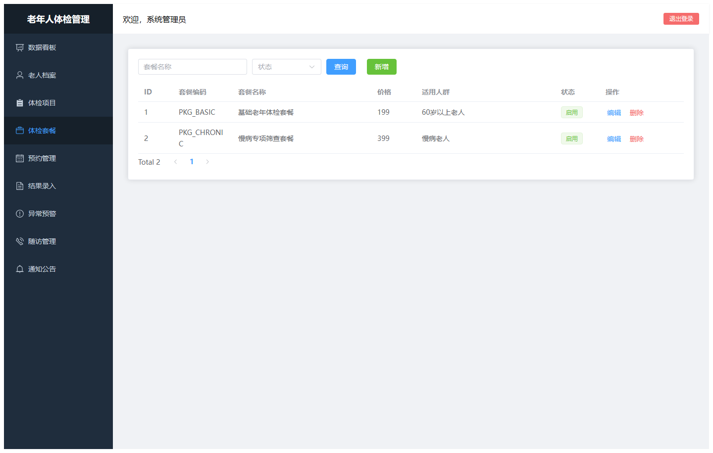

#### admin-05-appointment

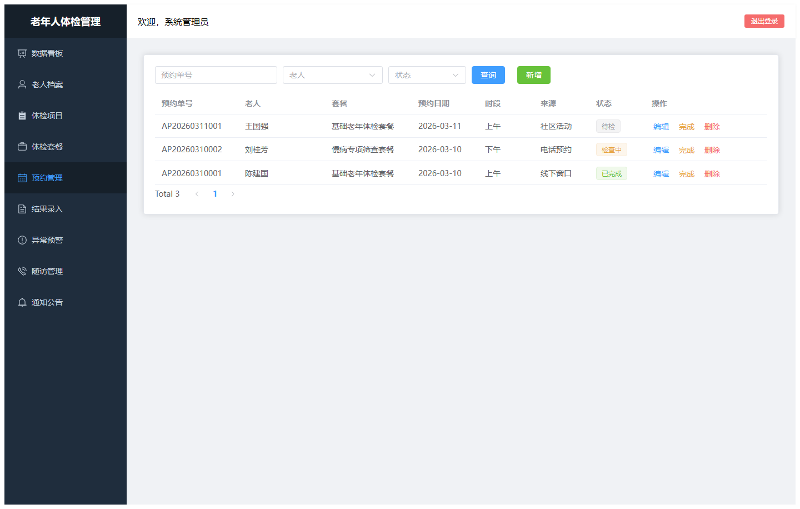

#### admin-06-result

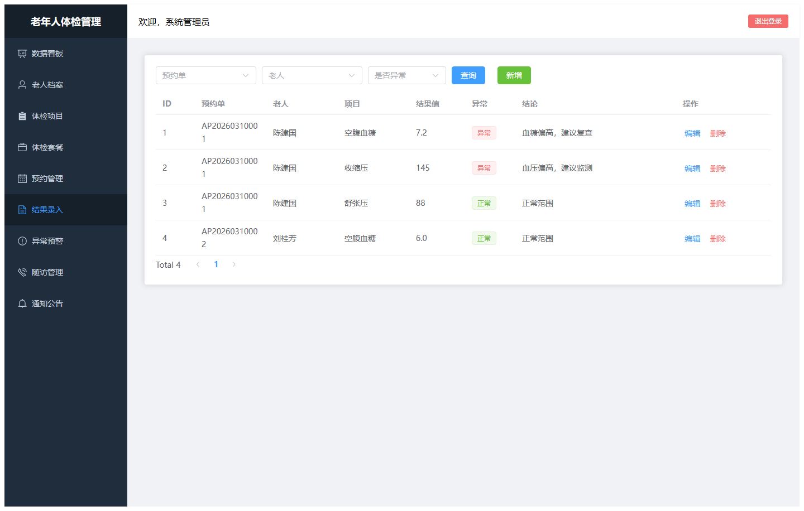

#### admin-07-warning

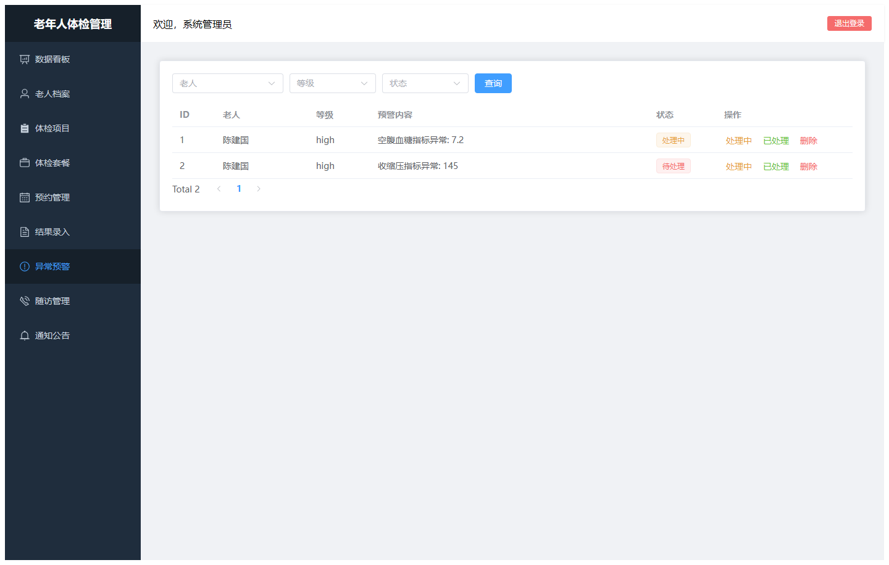

#### admin-08-follow-up

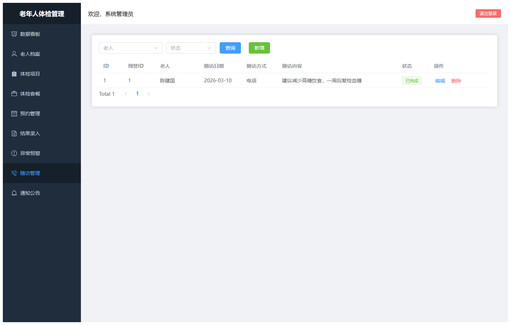

#### admin-09-notice

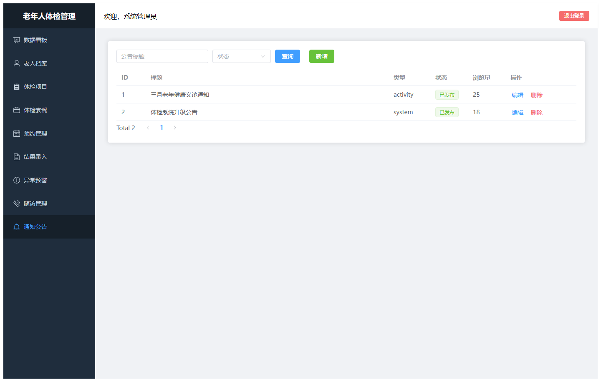

### guest

#### guest-01-login

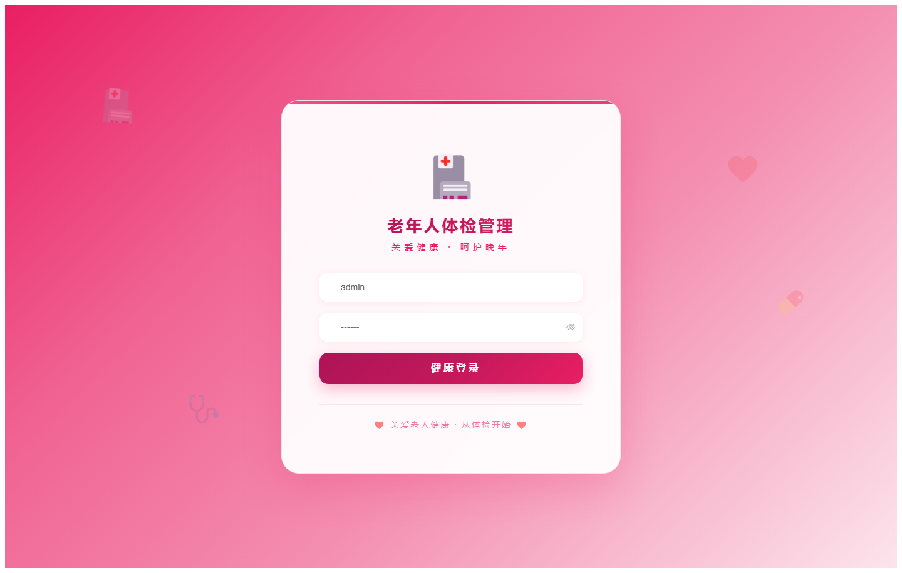

#### guest-02-register

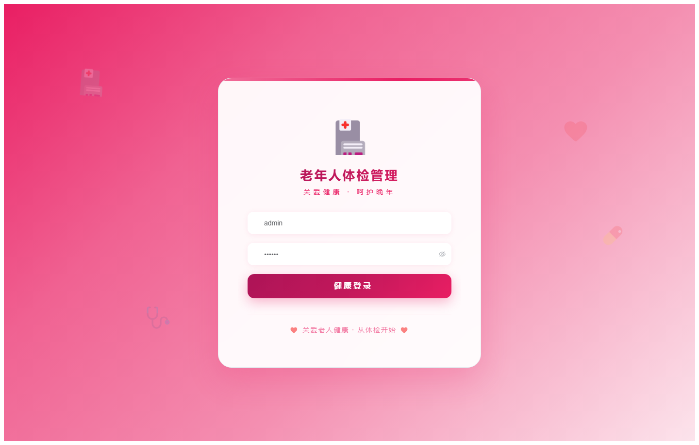
