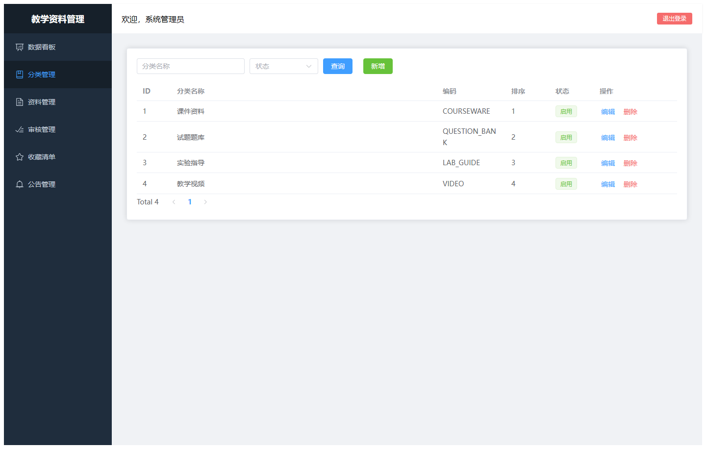
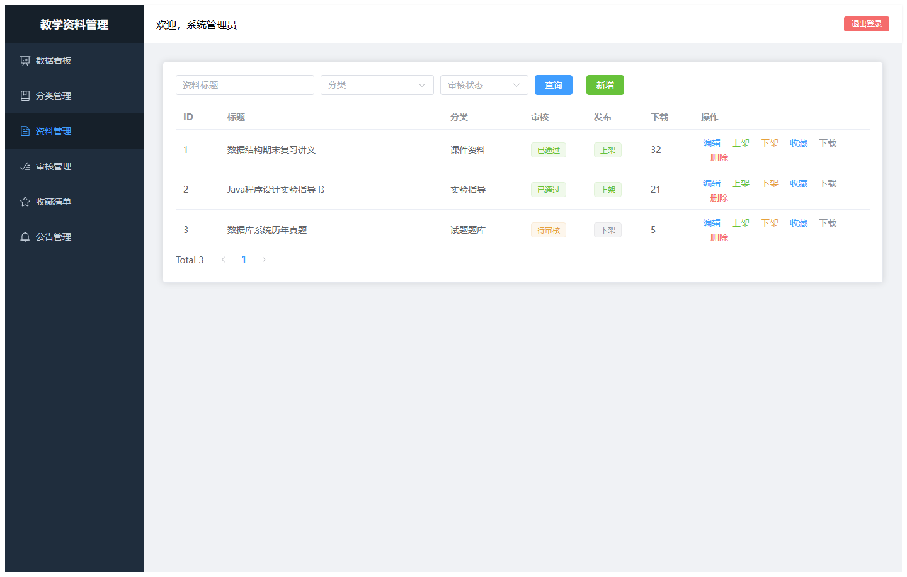
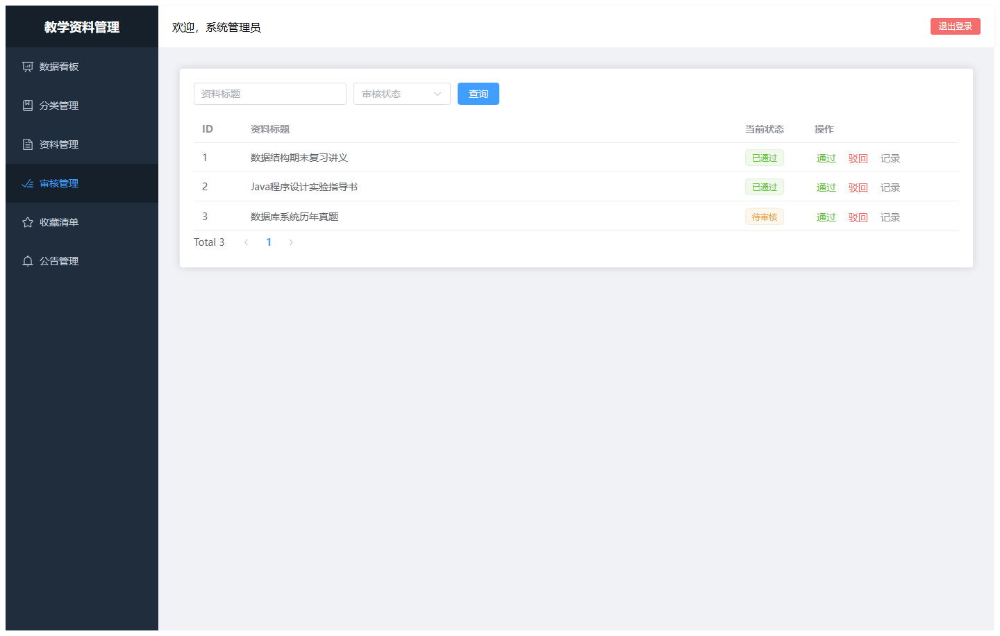
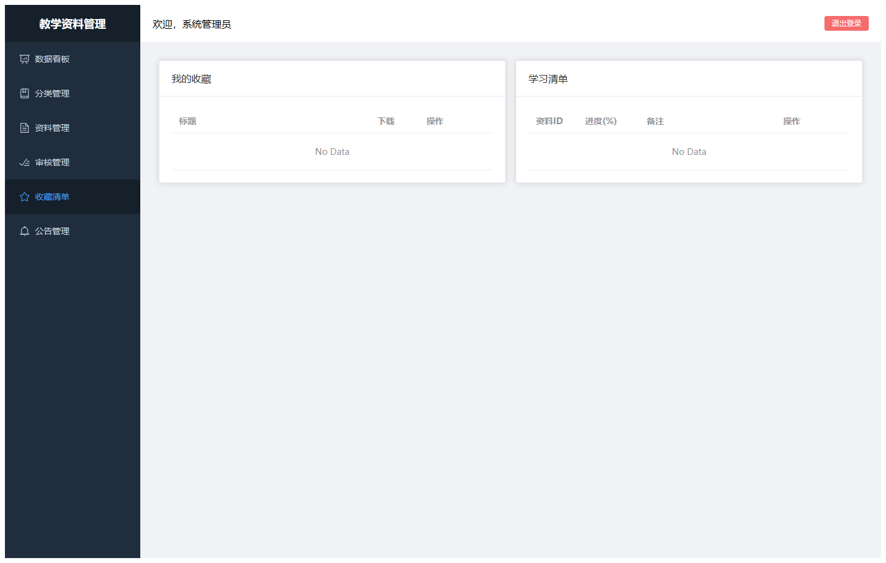
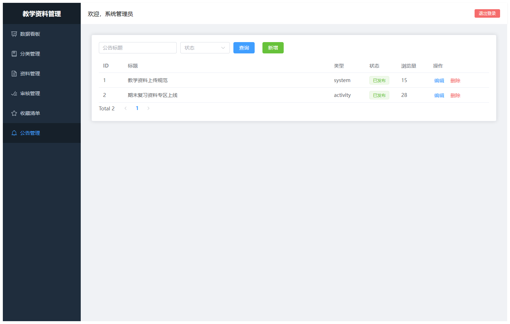
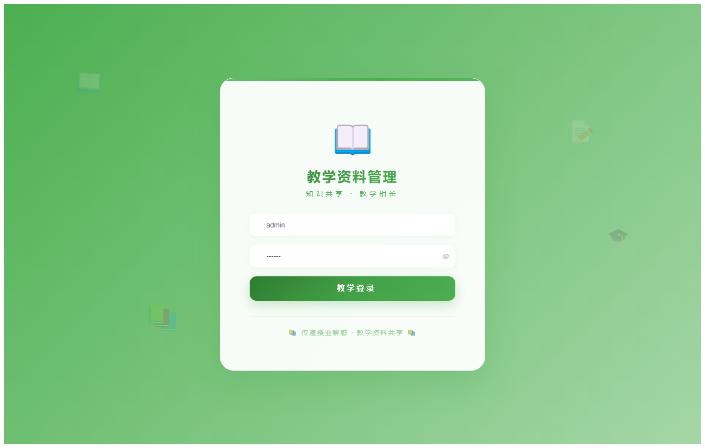
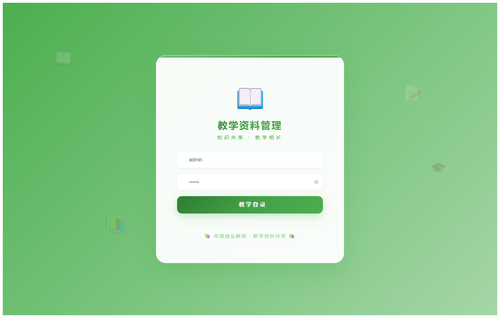

# 084 - 教学资料管理系统 🔥最新

## 项目信息

- 项目编号：`084`
- 组件类型：`backend, frontend`
- 后端入口：`http://127.0.0.1:8084`
- 前端入口：`http://127.0.0.1:3084`
- 账号来源：084-backend\README.md
- 已收录截图：`8` 张

## 默认账号

- `管理员`：`admin` / `123456`
- `教师`：`teacher` / `123456`
- `学生`：`student` / `123456`

## 预览截图

### admin

#### admin-01-dashboard

#### admin-02-category

#### admin-03-material

#### admin-04-audit

#### admin-05-favorite

#### admin-06-notice

### guest

#### guest-01-login

#### guest-02-register

