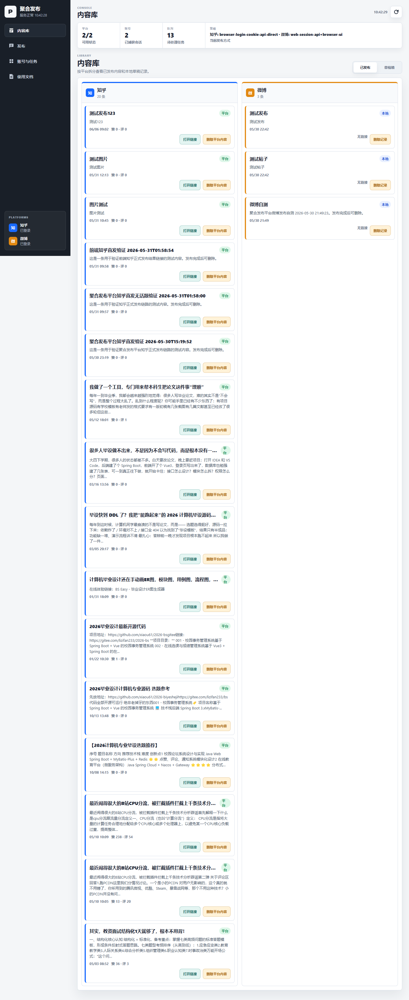

# 087 - 课程管理系统

## 项目信息

- 项目编号：`087`
- 组件类型：`backend, frontend`
- 后端入口：`http://127.0.0.1:8087`
- 前端入口：`http://127.0.0.1:3000`
- 账号来源：未识别
- 已收录截图：`15` 张

## 默认账号

- 暂未自动识别到默认账号

## 预览截图

### guest

#### guest-01-dashboard

#### guest-01-login

#### guest-02-department

#### guest-02-register

#### guest-03-major

#### guest-04-classinfo

#### guest-05-term

#### guest-06-course

#### guest-07-schedule

#### guest-08-selection

#### guest-09-resource

#### guest-10-attendance

#### guest-11-score

#### guest-12-evaluation

#### guest-13-notice

